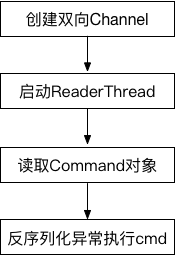
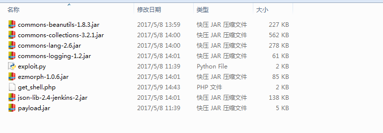
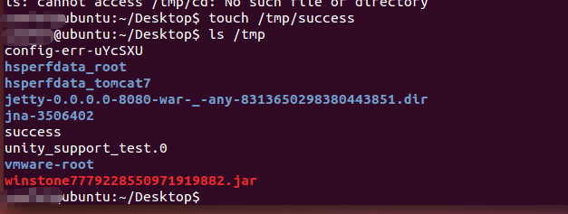
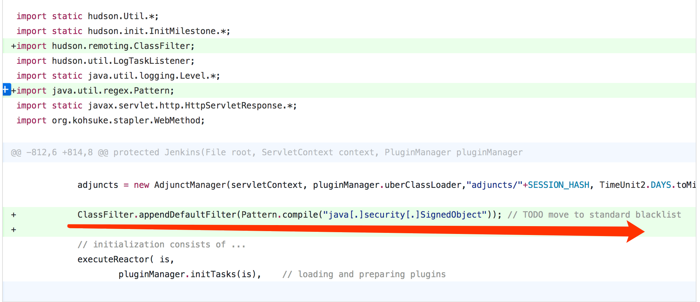

# Jenkins 未授权代码执行漏洞分析 #

## 1.&emsp;漏洞描述 ##

* 漏洞编号： CVE-2017-1000353
* 漏洞简述： Jenkins 未授权远程代码执行漏洞, 允许攻击者将序列化的Java SignedObject对象传输给Jenkins CLI处理，反序列化ObjectInputStream作为Command对象，这将绕过基于黑名单的保护机制, 导致代码执行。
* 影响版本： Jenkins-Ci Jenkins LTS < = 2.46.1 

## 2.&emsp;漏洞分析 ##

### 2.1&emsp;jenkins介绍 ###

&emsp;&emsp;Jenkins是一款持续集成（continuous integration）与持续交付（continuous delivery）系统，可以提高软件研发流程中非人工参与部分的自动化处理效率。作为一个基于服务器的系统，Jenkins运行在servlet容器（如Apache Tomcat）中，支持版本控制工具（包括AccuRev、CVS、Subversion、Git、Mercurial、Perforce、Clearcase以及RTC），能够执行基于Apache Ant、Apache Maven以及sbt的工程，也支持shell脚本和Windows批处理命令。

### 2.2&emsp;漏洞介绍 ###

&emsp;&emsp;Jenkins 未授权远程代码执行漏洞, 允许攻击者将序列化的Java SignedObject对象传输给Jenkins CLI处理，反序列化ObjectInputStream作为Command对象，这将绕过基于黑名单的保护机制, 导致代码执行。

### 2.3&emsp;漏洞环境搭建 ###

1. 安装Ubuntu虚拟机
2. 安装jdk：`apt-get install default-jdk`
3. 下载合适版本的jenkins源码进行安装。**注：**我这边为了方便不使用图形化界面进行UNLOCK操作直接下载的war包
4. 执行命令：`java -Djenkins.install.runSetupWizard=false -jar jenkins.war`
5. 访问网页：`http://your_id:8080`

### 2.4&emsp;漏洞验证 ###

&emsp;&emsp;为了触发Jenkins的Java反序列化漏洞，我们需要向Jenkins发送两个请求。

&emsp;&emsp;该漏洞存在于使用HTTP协议的双向通信通道的具体实现代码中，Jenkins利用此通道来接收命令。大致流程如下图:

通过网上流传的POC进行漏洞验证，主要利用源码如下图所示：

1. 首先通过命令`java -jar payload.jar jenkins_poc.ser "touch /tmp/success"`构造命令执行payload
2. 执行exploit.py文件，文件中利用的jenkins_poc.ser文件就是要执行的命令
3. 由于该命令执行漏洞没有明确的回显数据，所以我们可以查看靶机中tmp目录中有没有生成success文件，以判断命令执行是否成功。

可以看到文件成功生成。命令执行成功。

**注：** 这里的作者编写的payload.jar执行远程命令执行操作，由于操作并没有回显，所以最好的方法是反弹shell，由于作者编写的jar包不能直接执行反弹shell命令，我们需要先进行getshell操作再进行连接。

## 3.&emsp;CVE-2017-1000353漏洞分析 ##

### 3.1&emsp;漏洞触发流程分析 ###

#### 3.1.1&emsp;建立双向Channel ####

&emsp;&emsp;基于HTTP建立双向Channel的入口函数位于jenkins-2.46.1/core/src/main/java/hudson/cli/CLIAction.java文件中:

	@Extension @Symbol("cli")
	@Restricted(NoExternalUse.class)
	public class CLIAction implements UnprotectedRootAction, StaplerProxy {
	
	    private transient final Map<UUID,FullDuplexHttpChannel> duplexChannels = new HashMap<UUID, FullDuplexHttpChannel>();
	
	     ......
	
	    @Override
	    public Object getTarget() {
	        StaplerRequest req = Stapler.getCurrentRequest();
	        if (req.getRestOfPath().length()==0 && "POST".equals(req.getMethod())) {
	            // CLI connection request
	            throw new CliEndpointResponse();
	        } else {
	            return this;
	        }
	    }
	
	    private class CliEndpointResponse extends HttpResponseException {
	        @Override
	        public void generateResponse(StaplerRequest req, StaplerResponse rsp, Object node) throws IOException, ServletException {
	            try {
	                // do not require any permission to establish a CLI connection
	                // the actual authentication for the connecting Channel is done by CLICommand
	
	                UUID uuid = UUID.fromString(req.getHeader("Session"));
	                rsp.setHeader("Hudson-Duplex",""); // set the header so that the client would know
	
	                FullDuplexHttpChannel server;
	                if(req.getHeader("Side").equals("download")) {
	                    duplexChannels.put(uuid,server=new FullDuplexHttpChannel(uuid, !Jenkins.getActiveInstance().hasPermission(Jenkins.ADMINISTER)) {
	                        @Override
	                        protected void main(Channel channel) throws IOException, InterruptedException {
	                            // capture the identity given by the transport, since this can be useful for SecurityRealm.createCliAuthenticator()
	                            channel.setProperty(CLICommand.TRANSPORT_AUTHENTICATION, Jenkins.getAuthentication());
	                            channel.setProperty(CliEntryPoint.class.getName(),new CliManagerImpl(channel));
	                        }
	                    });
	                    try {
	                        server.download(req,rsp);
	                    } finally {
	                        duplexChannels.remove(uuid);
	                    }
	                } else {
	                    duplexChannels.get(uuid).upload(req,rsp);
	                }
	            } catch (InterruptedException e) {
	                throw new IOException(e);
	            }
	        }
	    }
	}

从上述代码可知，建立一对双向通道(download/upload), 需要发送两次POST请求，根据请求头Session字段的值uuid识别不同的双向通道，Side字段的值识别download或upload通道，请求发送的顺序是先发送download请求再发送upload请求，跟进**download**函数(/Users/js/IdeaProjects/vulnhub/jenkins-2.46.1/core/src/main/java/hudson/model/FullDuplexHttpChannel.java), 当服务器收到download请求时会阻塞请求，等待upload请求，收到upload请求后，新建Channel对象处理upload请求和返回响应，代码如下:

	 public synchronized void download(StaplerRequest req, StaplerResponse rsp) throws InterruptedException, IOException {
	            ......
	
	        {// wait until we have the other channel
	            long end = System.currentTimeMillis() + CONNECTION_TIMEOUT;
	            while (upload == null && System.currentTimeMillis()<end)
	                wait(1000);
	
	            if (upload==null)
	                throw new IOException("HTTP full-duplex channel timeout: "+uuid);
	        }
	
	        try {
	            channel = new Channel("HTTP full-duplex channel " + uuid,
	                    Computer.threadPoolForRemoting, Mode.BINARY, upload, out, null, restricted);
	             ......
	        } finally {
	            // publish that we are done
	            completed=true;
	            notify();
	        }
	    }
	
	  public synchronized void upload(StaplerRequest req, StaplerResponse rsp) throws InterruptedException, IOException {
	        rsp.setStatus(HttpServletResponse.SC_OK);
	        InputStream in = req.getInputStream();
	        if(DIY_CHUNKING)    in = new ChunkedInputStream(in);
	
	        // publish the upload channel
	        upload = in;
	        notify();
	
	        // wait until we are done
	        while (!completed)
	            wait();
	    }

以上就是建立双向通道的基本过程。

#### 3.1.2&emsp;Channel对象启动ReaderThread ####

upload请求作为输入流实例化Channel对象(~/.m2/repository/org/jenkins-ci/main/remoting/3.7/remoting-3.7-sources.jar!/hudson/remoting/Channel.java), Channel类的构造链比较繁琐如下图:

最终调用的构造方法为Channel(ChannelBuilder settings, CommandTransport transport), 该构造方法的transport参数，由ChannelBuilder类的negotiate()方法获得。

	protected CommandTransport negotiate(final InputStream is, final OutputStream os) throws IOException {  
	          ......
	        {// read the input until we hit preamble
	            Mode[] modes={Mode.BINARY,Mode.TEXT};
	            byte[][] preambles = new byte[][]{Mode.BINARY.preamble, Mode.TEXT.preamble, Capability.PREAMBLE};
	            int[] ptr=new int[3];
	            Capability cap = new Capability(0); // remote capacity that we obtained. If we don't hear from remote, assume no capability
	
	            while(true) {
	                int ch = is.read();
	                ......
	                for(int i=0;i<preambles.length;i++) {
	                    byte[] preamble = preambles[i];
	                    if(preamble[ptr[i]]==ch) {
	                        if(++ptr[i]==preamble.length) {
	                            switch (i) {
	                            case 0:
	                            case 1:
	                                ......
	                                return makeTransport(is, os, mode, cap);
	                            case 2:
	                                cap = Capability.read(is);

negotiate()会检查输入(upload请求)的前导码, 所有发往Jenkins CLI的命令中都包含某种格式的前导码（preamble），前导码格式通常为：**<===[JENKINS REMOTING CAPACITY]===>rO0ABXNyABpodWRzb24ucmVtb3RpbmcuQ2FwYWJpbGl0eQAAAAAAAAABAgABSgAEbWFza3hwAAAAAAAAAH4=**, 该前导码包含一个经过base64编码的序列化对象。“Capability”类型的序列化对象的功能是告诉服务器客户端具备哪些具体功能（比如HTTP分块编码功能）。

最后调用makeTransport()方法返回CommandTransport对象, 根据cap是否支持Chunking返回不同的对象ChunkedCommandTransport或ClassicCommandTransport。

	protected CommandTransport makeTransport(InputStream is, OutputStream os, Mode mode, Capability cap) throws IOException {  
	    FlightRecorderInputStream fis = new FlightRecorderInputStream(is);
	
	    if (cap.supportsChunking())
	        return new ChunkedCommandTransport(cap, mode.wrap(fis), mode.wrap(os), os);
	    else {
	        ObjectOutputStream oos = new ObjectOutputStream(mode.wrap(os));
	        oos.flush();    // make sure that stream preamble is sent to the other end. avoids dead-lock
	
	        return new ClassicCommandTransport(
	                new ObjectInputStreamEx(mode.wrap(fis),getBaseLoader(),getClassFilter()),
	                oos,fis,os,cap);
	    }
	}

利用SSD的PoC脚本发送的upload请求返回的是ClassicCommandTransport对象，其继承关系如下图所示。

Channel构造函数Channel(ChannelBuilder settings, CommandTransport transport)中, transport.setup()调用SynchronousCommandTransport类的setup()方法来启动一个ReaderThread线程。

	public void setup(Channel channel, CommandReceiver receiver) {
	        this.channel = channel;
	        new ReaderThread(receiver).start();
	    }

#### 3.1.3&emsp;读取Command对象 ####

通过上面的ReaderThread.start()方法启动一个线程，ReaderThread为SynchronousCommandTransport类的内部类，在run()方法中，调用ClassicCommandTransport类的read()方法读取输入，read()方法实际是调用Command类的readFrom()方法读取，通过反序列化输入返回一个Command对象。

	private final class ReaderThread extends Thread {  
	        ......
	        public ReaderThread(CommandReceiver receiver) {
	            super("Channel reader thread: "+channel.getName());
	            this.receiver = receiver;
	        }
	
	        @Override
	        public void run() {
	            final String name =channel.getName();
	            try {
	                while(!channel.isInClosed()) {
	                    Command cmd = null;
	                    try {
	                        cmd = read();
和

	public final Command read() throws IOException, ClassNotFoundException {
	        try {
	            Command cmd = Command.readFrom(channel, ois);

在反序列化输入返回一个Command对象时就执行了cmd命令，而不是通过正常的回调handle()方法执行cmd命令，反序列化导致的执行代码触发的相关异常如下:

类型转换异常ClassCastException: org.apache.commons.collections.map.ReferenceMap cannot be cast to hudson.remoting.Command.

### 3.2&emsp;漏洞利用点 ###

**绕过黑名单保护机制**

上面过程主要讲述的是漏洞触发的流程，而该漏洞的核心是反序列化Java SignedObject对象会绕过黑名单保护机制，从而导致的代码执行漏洞。

ClassFilter类定义的默认的黑名单如下：

	private static final String[] DEFAULT_PATTERNS = {  
	        "^bsh[.].*",
	        "^com[.]google[.]inject[.].*",
	        "^com[.]mchange[.]v2[.]c3p0[.].*",
	        "^com[.]sun[.]jndi[.].*",
	        "^com[.]sun[.]corba[.].*",
	        "^com[.]sun[.]javafx[.].*",
	        "^com[.]sun[.]org[.]apache[.]regex[.]internal[.].*",
	        "^java[.]awt[.].*",
	        "^java[.]rmi[.].*",
	        "^javax[.]management[.].*",
	        "^javax[.]naming[.].*",
	        "^javax[.]script[.].*",
	        "^javax[.]swing[.].*",
	        "^org[.]apache[.]commons[.]beanutils[.].*",
	        "^org[.]apache[.]commons[.]collections[.]functors[.].*",
	        "^org[.]apache[.]myfaces[.].*",
	        "^org[.]apache[.]wicket[.].*",
	        ".*org[.]apache[.]xalan.*",
	        "^org[.]codehaus[.]groovy[.]runtime[.].*",
	        "^org[.]hibernate[.].*",
	        "^org[.]python[.].*",
	        "^org[.]springframework[.](?!(\\p{Alnum}+[.])*\\p{Alnum}*Exception$).*",
	        "^sun[.]rmi[.].*",
	        "^javax[.]imageio[.].*",
	        "^java[.]util[.]ServiceLoader$",
	        "^java[.]net[.]URLClassLoader$"
	    };

黑名单机制绕过可以通过分析补丁得到印证。

## 4.&emsp;参考资料 ##

* [Jenkins 未授权远程代码执行漏洞分析(CVE-2017-1000353)](http://paper.seebug.org/295/ "http://paper.seebug.org/295/")
* [Jenkins 未授权代码执行漏洞分析](http://bobao.360.cn/learning/detail/3800.html "http://bobao.360.cn/learning/detail/3800.html")
* [SSD Advisory – CloudBees Jenkins Unauthenticated Code Execution](https://blogs.securiteam.com/index.php/archives/3171 "https://blogs.securiteam.com/index.php/archives/3171")
* [Jenkins-CI 远程代码执行漏洞（CVE-2017-1000353）](https://github.com/phith0n/vulhub/tree/master/jenkins/CVE-2017-1000353 "https://github.com/phith0n/vulhub/tree/master/jenkins/CVE-2017-1000353")

