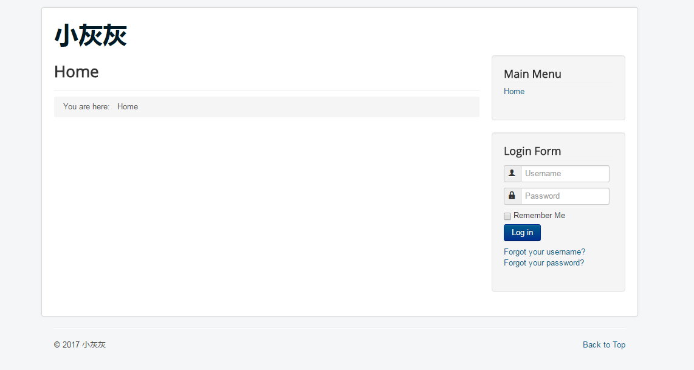
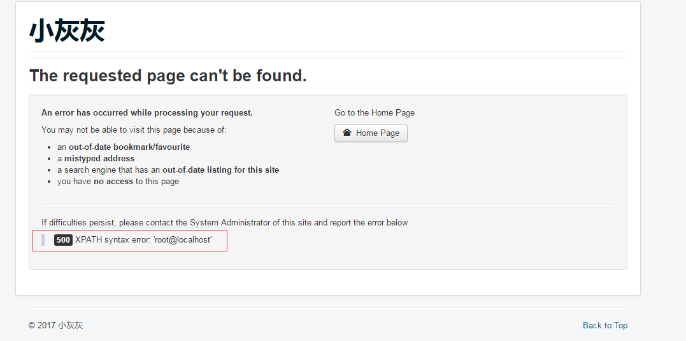
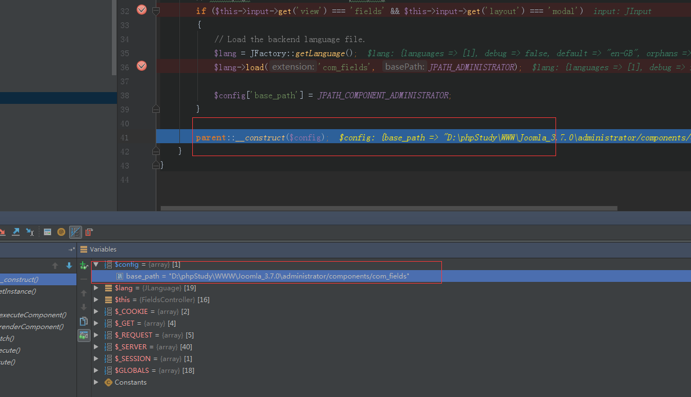
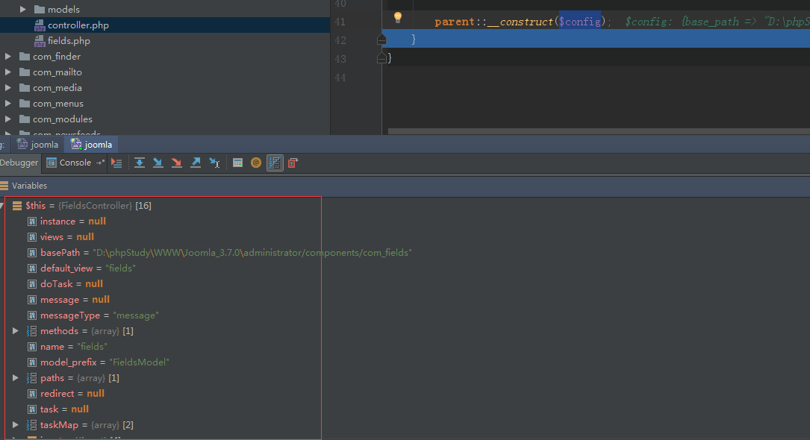
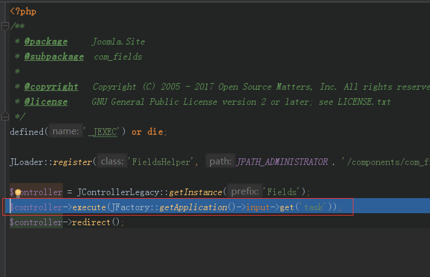
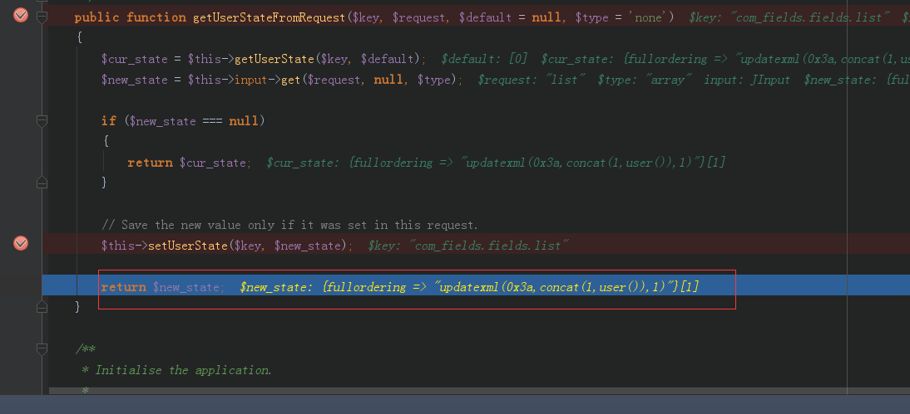
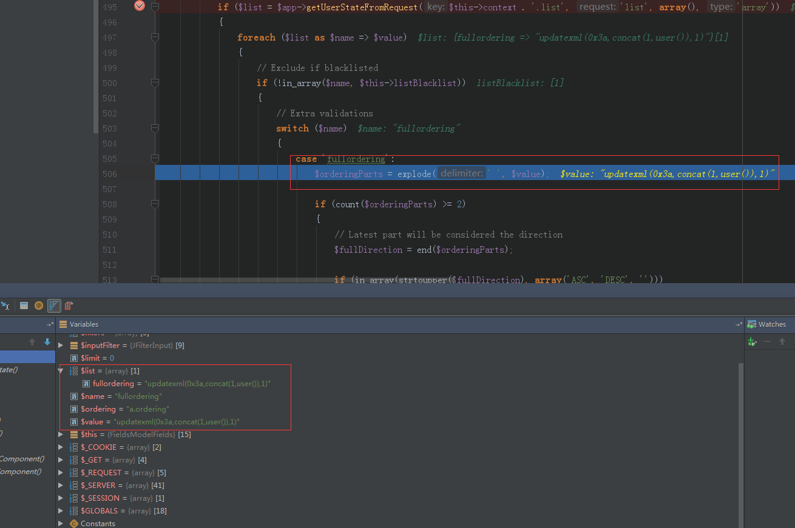
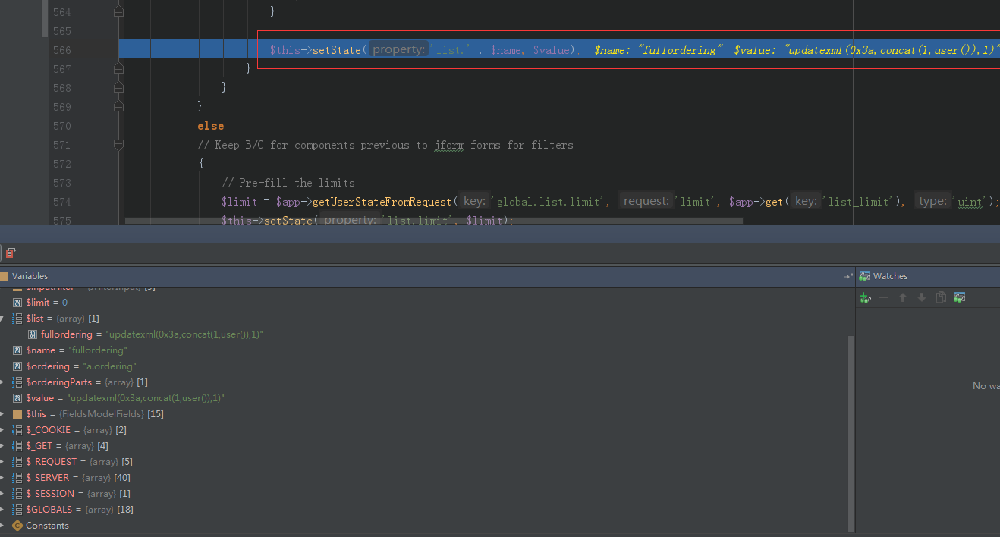
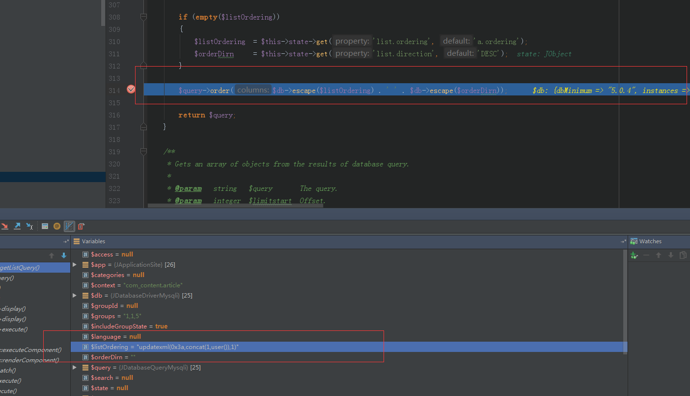
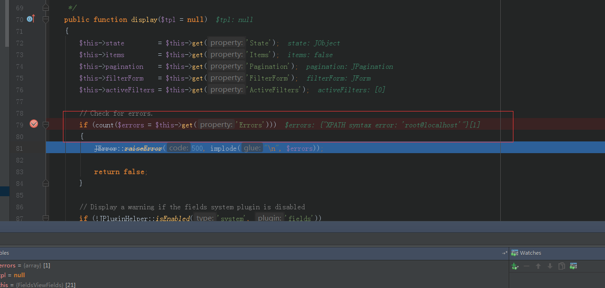

# Joomla!3.7.0 Core com_fields组件SQL注入漏洞分析 #

## 1.&emsp;漏洞描述 ##

* 漏洞编号： CVE-2017-8917
* 危害等级：危急
* 漏洞简述：：本漏洞出现在3.7.0新引入的一个组件“com_fields”，这个组件任何人都可以访问，无需登陆验证。由于对请求数据过滤不严导致sql注入，sql注入对导致数据库中的敏感信息泄漏。
* 影响版本： Joomla!3.7.0 Core

## 2.&emsp;漏洞分析 ##

### 2.1&emsp;Joomla介绍 ###

&emsp;&emsp;Joomla！是世界上最受欢迎的内容管理系统（CMS）解决方案之一。它可以让用户自定义构建网站实现强大的在线应用程序。据不完全统计互联网上超过3％的网站运行Joomla！，同时它占有全球9%以上的CMS市场份额。

&emsp;&emsp;截止至2016年11月，Joomla！的总下载量超过7800万次。目前Joomla！官方还提供了超过7800个扩展插件（含免费、收费插件）及其他的可用资源可供下载。

### 2.2&emsp;漏洞介绍 ###

&emsp;&emsp;这个漏洞出现在3.7.0新引入的一个组件“com_fields”，这个组件任何人都可以访问，无需登陆验证。由于对请求数据过滤不严导致sql 注入，sql注入对导致数据库中的敏感信息泄漏，例如用户的密码hash以及登陆后的用户的session（如果是获取到登陆后管理员的session，那么整个网站的后台系统可能被控制）。

### 2.3&emsp;漏洞环境搭建 ###

1. 安装phpStudy
2. 下载Joomla!3.7.0 Core源码（[下载地址](https://github.com/joomla/joomla-cms/releases/download/3.7.0/Joomla_3.7.0-Stable-Full_Package.zip "https://github.com/joomla/joomla-cms/releases/download/3.7.0/Joomla_3.7.0-Stable-Full_Package.zip")）,解压源码并把源码拷贝进PHPStudy的www目录下
3. 直接访问地址进行安装即可
4. 安装成功如图所示

### 2.4&emsp;漏洞验证 ###

&emsp;&emsp;利用payload：

	http://192.168.1.79/Joomla_3.7.0/index.php?option=com_fields&view=fields&layout=modal&list[fullordering]=updatexml(0x3a,concat(1,user()),1)
进行攻击，查看页面信息：

可以看到通过payload进行攻击，成功回显出数据库基本信息。由payload我们可以看到漏洞注入点是list[fullordering]参数，页面回显看出该SQL注入属于基于error的MySQL注入。

漏洞验证成功。

## 3.&emsp;CVE-2017-7494漏洞分析 ##

### 3.1&emsp;漏洞触发及攻击流程分析 ###

&emsp;&emsp;首先我们知道该漏洞的主要触发由于Joomla!3.7.0 Core的com_fields组件，“com_fields ”组件从相同名称的管理端组件继承了一些视图，这样可以缩减大量相同功能的代码，提高代码的复用性。

文件路径：\components\com_fields\contrller.php

	class FieldsController extends JControllerLegacy
	{
		/**
		 * Constructor.
		 *
		 * @param   array  $config  An optional associative array of configuration settings.
		 *                          Recognized key values include 'name', 'default_task', 'model_path', and
		 *                          'view_path' (this list is not meant to be comprehensive).
		 *
		 * @since   3.7.0
		 */
		public function __construct($config = array())
		{
			$this->input = JFactory::getApplication()->input;

			// Frontpage Editor Fields Button proxying:
			if ($this->input->get('view') === 'fields' && $this->input->get('layout') === 'modal')
			{
				// Load the backend language file.
				$lang = JFactory::getLanguage();
				$lang->load('com_fields', JPATH_ADMINISTRATOR);

				$config['base_path'] = JPATH_COMPONENT_ADMINISTRATOR;
			}

			parent::__construct($config);
		}
	}
从上面的代码片段可以看到，$config['base_path']变量的值是JPATH_COMPONENT_ADMINISTRATOR常量传过去的，这个常量值代表管理员组件目录的本地路径，这样做会造成 Joomla! 从这个路径获取视图views和模块models，要成功的操作需要构造相关参数和值，view 参数的值是fields ，layout 参数的值是modal。

在此处打断点，利用已知POC进行debug：

1. public function __construct($config = array()) 方法获取传入的view、layout的值进行逻辑判断,给base_path赋值：

2. 跟进__construct方法，可以看到该方法主要对$this数组进行赋值。

3. 继续跟进，进入文件：\components\com_fields\fields.php

4. F7进入函数，一直debug，直到进入文件：\libraries\legacy\model\list.php,这个漏洞最核心的地方是list[fullordering]这个参数如何进行数据传递的！！！libraries/legacy/model/list.php这个文件中getUserStateFromRequest方法，它将url中的list[fullordering]值提取进行保存,该方法主要在：\libraries\cms\application\cms.php文件中进行申明，源码如下：

	public function getUserStateFromRequest($key, $request, $default = null, $type = 'none')
		{
			$cur_state = $this->getUserState($key, $default);
			$new_state = $this->input->get($request, null, $type);

			if ($new_state === null)
			{
				return $cur_state;
			}

			// Save the new value only if it was set in this request.
			$this->setUserState($key, $new_state);

			return $new_state;
		}

5. 继续断点看到list[fullordering]的值：

6. 经过对于fullordering值得简单判断，并没有做值的白名单校验，程序即将进入第一部分的关键也就是通过566行的$this->setState('list.' . $name, $value);方法保存我们的SQL注入报错代码进入list.fullordering保存的前后过程如图所示。

7. 第一部分将我们的payload存进list.fullordering中，那么如何获取呢？直接进入最关键的部分./administrator/components/com_fields/models/fields.php文件中$listOrdering = $this->getState('list.fullordering', 'a.ordering');getState方法获取了之前保存的list.fullordering的值，如图，并进行SQL语句的拼接，escape方法并没有把我们的payload过滤掉。

8. 最后一步，执行SQL语句（\libraries\legacy\model\list.php），拼接的语句完整语句如图所示，在图中也能看到报错的信息已经泄露，我们的payload已经成功执行了。具体执行语句如图所示：

9. 最终报错的信息输出到返回页面中(\administrator\components\com_fields\views\fields\view.html.php)，如图所示。

### 3.2&emsp;漏洞利用点 ###

这个漏洞是由于list[fullordering]参数用户可控，后端代码并没有进行有效过滤导致SQL语句拼接形成order by的注入，修复方案是执行语句获取list.ordering值进行了白名单过滤，在存储状态的时候就将攻击代码覆盖了，那么在执行语句之前取的值自然就不包含攻击代码了。

## 4.&emsp;参考资料 ##

* [SJoomla!3.7.0 Core SQL注入漏洞](http://bobao.360.cn/learning/detail/3868.html "http://bobao.360.cn/learning/detail/3868.html")
* [Joomla!3.7.0 Core com_fields组件SQL注入漏洞](http://bobao.360.cn/learning/detail/3880.html "http://bobao.360.cn/learning/detail/3880.html")
* [Joomla 框架的程序执行流程及目录结构分析](http://bobao.360.cn/learning/detail/3909.html "http://bobao.360.cn/learning/detail/3909.html")

