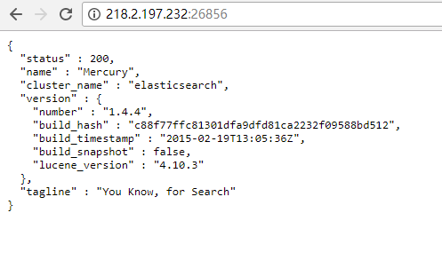
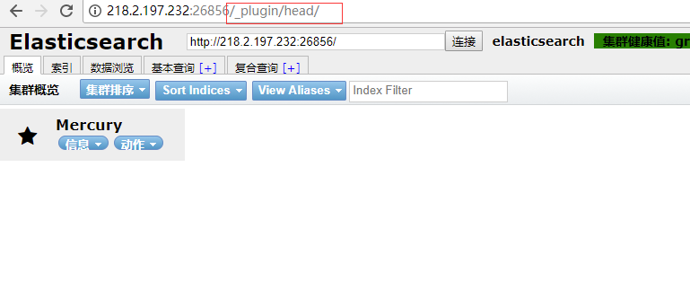
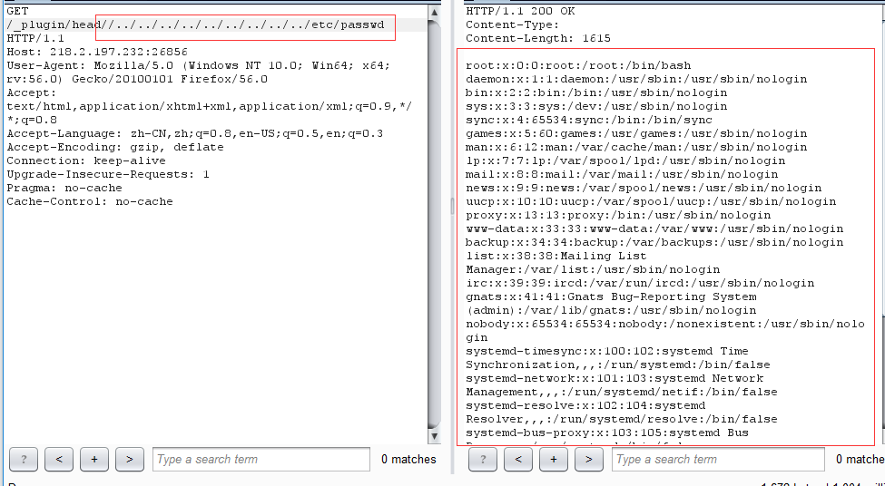
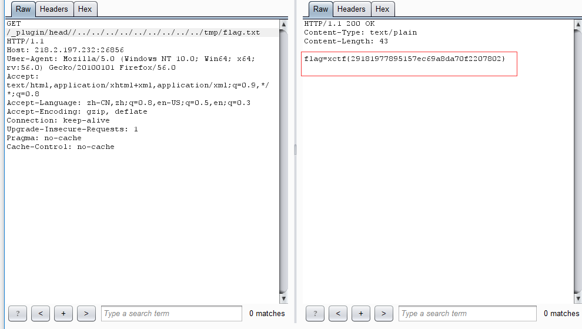

# ElasticSearch 目录遍历漏洞（CVE-2015-3337）


## 1.&emsp;漏洞描述

* 漏洞描述：在安装了具有“site”功能的插件以后，插件目录使用`../`即可向上跳转，导致目录穿越漏洞，可读取任意文件。没有安装任意插件的elasticsearch不受影响。
* 漏洞编号：CVE-2015-3337
* 漏洞等级：高危
* 影响版本：
  * ElasticSearch < 1.4.5
  * ElasticSearch < 1.5.2

## 2.   漏洞简介

​	1.5.2和1.4.5之前的所有Elasticsearch版本都容易受到目录遍历攻击的攻击，允许攻击者在安装一个或多个站点插件时运行Elasticsearch的服务器，或者Windows是服务器操作系统时检索文件。
用户应升级到1.4.5或1.5.2。不想升级的用户可以通过禁用站点插件来解决漏洞。有关其他选项，请参阅CVE说明。

## 3.&emsp;漏洞分析

原来代码是：

```java
if (!Files.exists(file) || Files.isHidden(file)) {
```

修改后加了验证

```java
if (!Files.exists(file) || Files.isHidden(file) || !file.toAbsolutePath().normalize().startsWith(siteFile.toAbsolutePath())) {
```

```java
/**
+     * Test normalizing of path
+     */
+    @Test
+    public void testThatPathsAreNormalized() throws Exception {
+        // more info: https://www.owasp.org/index.php/Path_Traversal
+        List<String> notFoundUris = new ArrayList<>();
+        notFoundUris.add("/_plugin/dummy/../../../../../log4j.properties");
+        notFoundUris.add("/_plugin/dummy/../../../../../%00log4j.properties");
+        notFoundUris.add("/_plugin/dummy/..%c0%af..%c0%af..%c0%af..%c0%af..%c0%aflog4j.properties");
+        notFoundUris.add("/_plugin/dummy/%2E%2E/%2E%2E/%2E%2E/%2E%2E/index.html");
+        notFoundUris.add("/_plugin/dummy/%2e%2e/%2e%2e/%2e%2e/%2e%2e/index.html");
+        notFoundUris.add("/_plugin/dummy/%2e%2e%2f%2e%2e%2f%2e%2e%2f%2e%2e%2findex.html");
+        notFoundUris.add("/_plugin/dummy/%2E%2E/%2E%2E/%2E%2E/%2E%2E/index.html");
+        notFoundUris.add("/_plugin/dummy/..\\..\\..\\..\\..\\log4j.properties");
+
+        for (String uri : notFoundUris) {
+            HttpResponse response = httpClient().path(uri).execute();
+            String message = String.format(Locale.ROOT, "URI [%s] expected to be not found", uri);
+            assertThat(message, response.getStatusCode(), equalTo(RestStatus.NOT_FOUND.getStatus()));
+        }
+
+        // using relative path inside of the plugin should work
+        HttpResponse response = httpClient().path("/_plugin/dummy/dir1/../dir1/../index.html").execute();
+        assertThat(response.getStatusCode(), equalTo(RestStatus.OK.getStatus()));
+        assertThat(response.getBody(), containsString("<title>Dummy Site Plugin</title>"));
+    }

```

最后会这样被调用：

```java
try {
            byte[] data = Files.readAllBytes(file);
            channel.sendResponse(new BytesRestResponse(OK, guessMimeType(sitePath), data));
        } catch (IOException e) {
            channel.sendResponse(new BytesRestResponse(INTERNAL_SERVER_ERROR));
        }
```

JDK7的Files把一个文件的内容读取后返回给客户端.

## 4.&emsp;漏洞复现

1. 在oj上申请该题目，申请完成访问页面：



2. 访问url，查看安装了“site”功能的插件：



3. 利用burpsuite进行数据包拦截，构造恶意payload进行数据包转发：



4. 可以看到成功返回passwd文件中内容，构造相似payload，获取flag



## 5.&emsp;修复方案

升级ElasticSearch 版本到1.5.2或以上版本。
