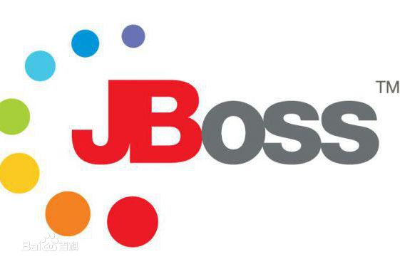
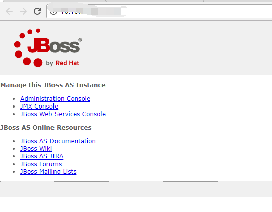
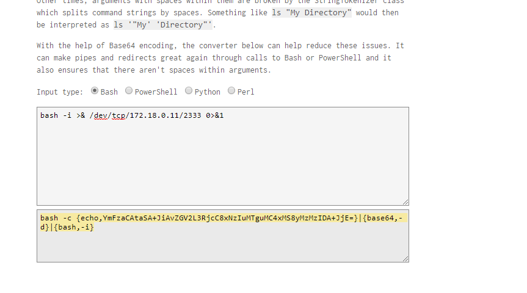
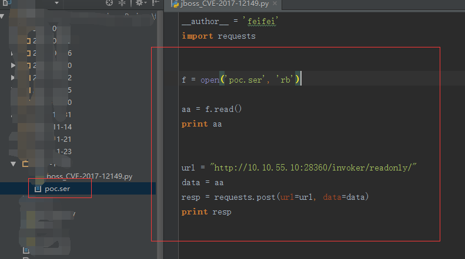
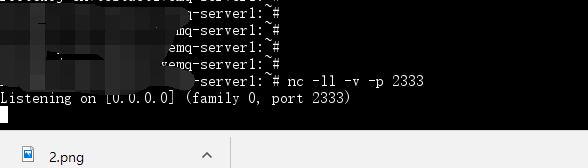
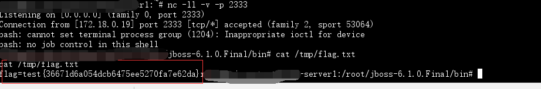

# JBOSS AS 5.x/6.x 反序列化命令执行漏洞（CVE-2017-12149）



## 1. 漏洞描述

* 漏洞描述：该漏洞为 Java反序列化错误类型，存在于 Jboss 的 HttpInvoker 组件中的 ReadOnlyAccessFilter 过滤器中。该过滤器在没有进行任何安全检查的情况下尝试将来自客户端的数据流进行反序列化，从而导致了漏洞。
* 漏洞编号：CVE-2017-12149
* 漏洞等级：高危
* 漏洞版本：
  * Jboss AS 5.x
  * JbossAS 6.x

## 2. 漏洞简介

​	2017年8月30日，Redhat公司发布了一个JbossAS 5.x系统的远程代码执行严重漏洞通告，相应的漏洞编号为CVE-2017-12149。近期有安全研究者发现JbossAS 6.x也受该漏洞影响，攻击者可能利用此漏洞无需用户验证在系统上执行任意命令。

| **漏洞名称**       | JBOSS AS 5.x/6.x 反序列化命令执行漏洞 |
| -------------- | --------------------------- |
| **威胁类型**       | 远程命令执行                      |
| **威胁等级**       | 高                           |
| **漏洞ID**       | CVE-2017-12149              |
| **受影响系统及应用版本** | Jboss AS 5.x   Jboss AS 6.x |

## 3. 漏洞分析

该漏洞存在于http invoker 组件的 ReadOnlyAccessFilter 的 doFilter 中。如下图所示：


方法中的代码在没有进行任何安全检查的情况下，将来自客户端的数据流（request.getInputStream()）进行了反序列化操作（红色箭头所示），从而导致了反序列化漏洞。

## 4. 漏洞复现

环境生成后，访问页面，可以看到jboss的首页：



我们使用bash来反弹shell，但由于`Runtime.getRuntime().exec()`中不能使用管道符等bash需要的方法，我们需要用进行一次编码。

编码网址[http://jackson.thuraisamy.me/runtime-exec-payloads.html](http://jackson.thuraisamy.me/runtime-exec-payloads.html "http://jackson.thuraisamy.me/runtime-exec-payloads.html")

将构造好的反弹shell的payload(将ip端口设置为你自己想要反弹的ip和端口)：



使用网上公布的java反序列化的payload构造工具ysoserial-0.0.6-SNAPSHOT-all.jar来构造payload，


将生成的poc.ser拷贝到我们写好的poc脚本中，将url替换成你自己的url，运行脚本，在你自己的服务器上通过nc监听反弹的端口






运行脚本，可以看到成功反弹shell，获取flag：



## 5. 修复建议

1.  不需要 http-invoker.sar 组件的用户可直接删除此组件。

2.  添加如下代码至 http-invoker.sar 下 web.xml 的 security-constraint 标签中，对 http invoker 组件进行访问控制：

   ```java
   <url-pattern>/*</url-pattern>
   ```