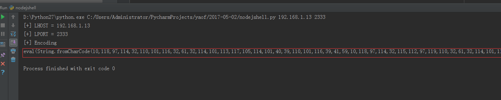
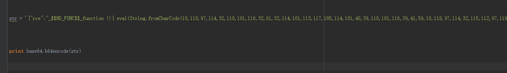
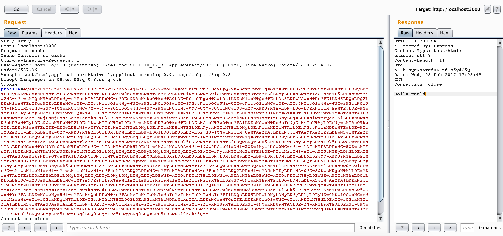
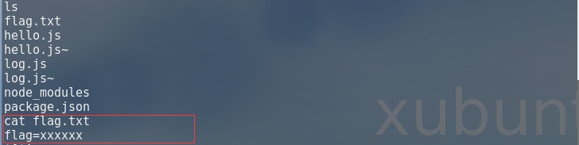

# node.js 反序列化

## **【实验原理】**
node.js 反序列化原理由不可信的数据传入 unserialize() 函数，通过传递立即调用函数表达式（IIFE）的 JavaScript 对象可以实现任意代码执行。.

## **【实验目的】**
提高学员的综合实战能力。以及对提升学员对node.js 反序列化漏洞的利用与防护的理解。

## **【实验环境】**
Ubuntu 64位操作系统。

## **【实验工具】**

浏览器， burpsuite，python，自己的服务器

## **【实验步骤】**

**步骤1：** 访问环境url，点击进行测试环境

**步骤2：** 通过Python脚本构造反弹shell的payload

**步骤3：** 通过burpsuite对数据进行截获和修改，把经过base64编码过的payload放入cookie字段

**步骤4：** 通过burpsuite对数据进行重新发送，通过对反弹shell的端口进行监听

**步骤5：** 反弹shell成功对目录进行扫描，查看flag.txt，通过命令执行查看flag.txt获取flag。

执行结果：
先通过Python脚本获取反弹shell的命令payload：

把命令执行payload插入攻击payload中并通过base64编码：

通过burpsuite把cookie中数据替换成攻击payload进行反弹shell：

查看flag

　　实验结束

## **【实验总结】**
　　本次实验主要是模拟真实环境中对node.js 反序列化的利用和提取有效信息。
