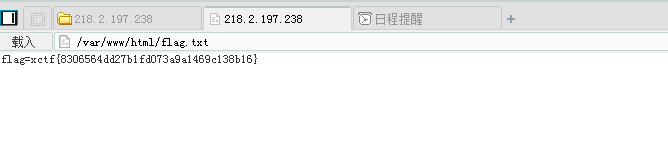

# PHPMailer < 5.2.18 远程命令执行漏洞

## 【实验原理】

这个致命的漏洞是由class.phpmailer.php没有正确处理用户的请求导致的。结果远程攻击者能够在有弱点的服务器上远程执行代码。

## 【实验目的】

提高学员的综合实战能力。以及对提升学员对phpmailer邮件系统的理解。

## 【实验环境】

Ubuntu 64位操作系统。

## 【实验工具】

浏览器，菜刀

## 【实验步骤】

**步骤1：** 访问环境url，查看首页面

**步骤2：** 可以看到一个邮箱发送页面，构造恶意攻击payload

**步骤3：** 通过构造的恶意payload上传一句话木马

**步骤4：** 通过菜刀连接一句话木马，查看flag.txt获取flag信息。

执行结果：

查看flag

　　实验结束

## 【实验总结】

　　本次实验主要是模拟真实环境中对phpmailer邮件系统的理解以及利用提取有效信息。
