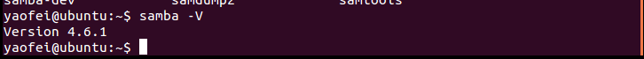
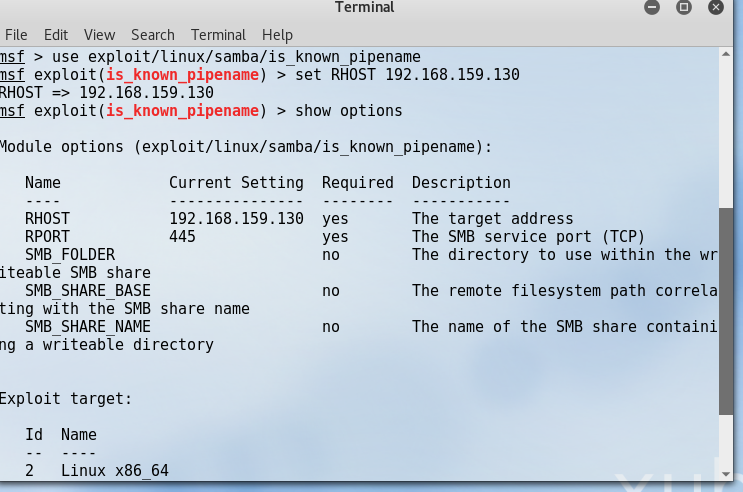
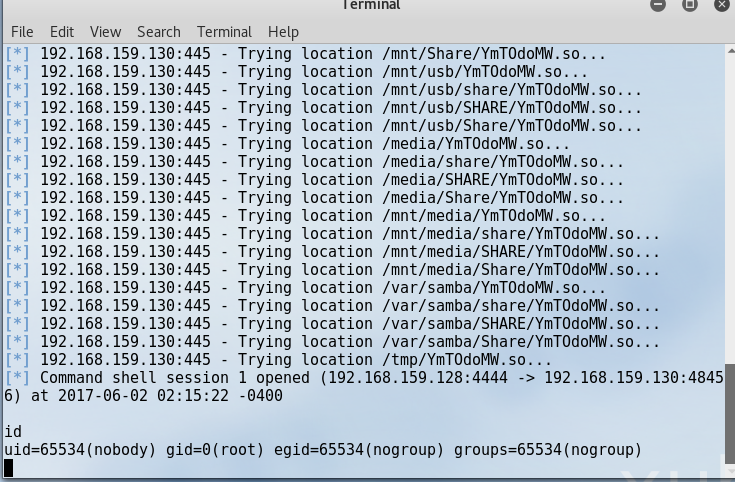
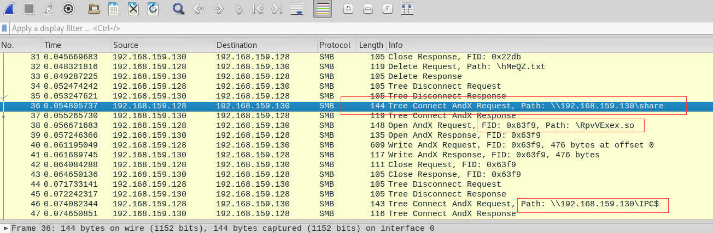
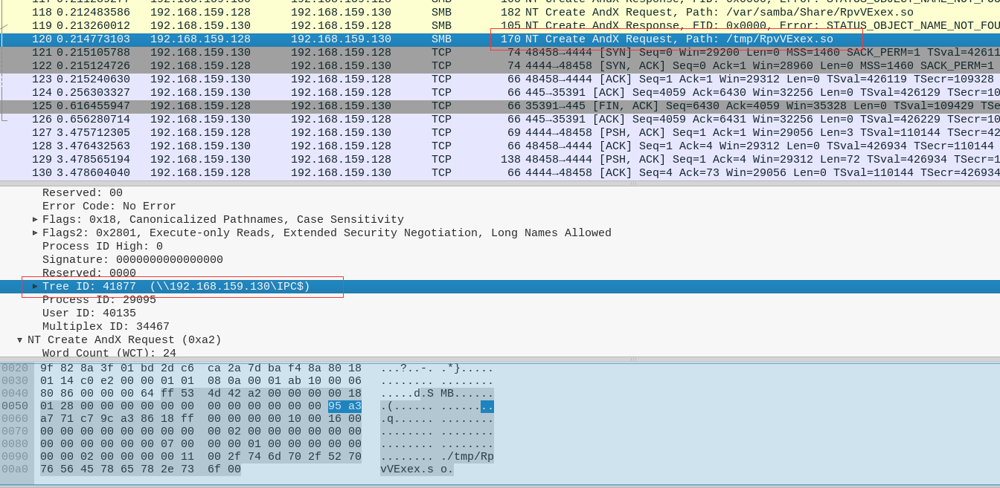
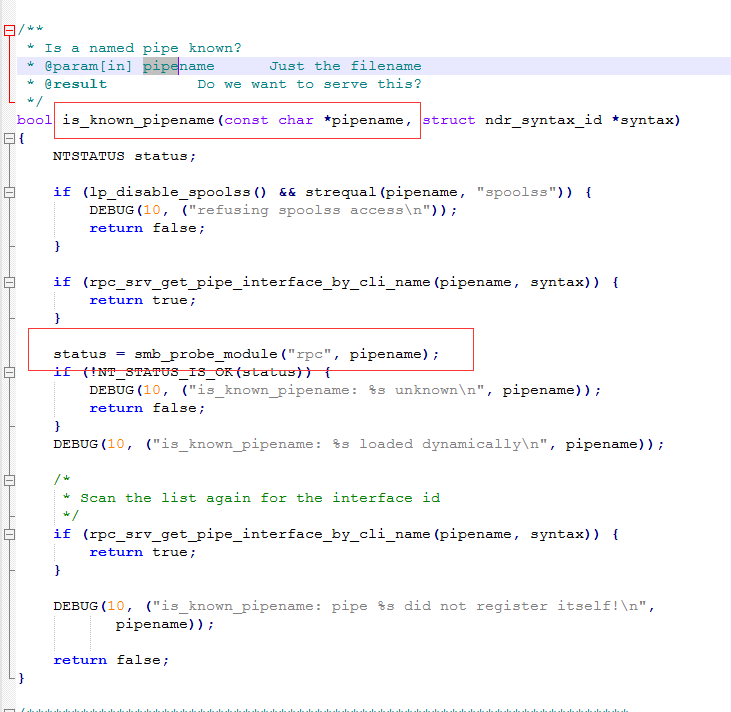
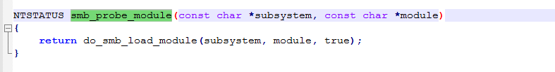
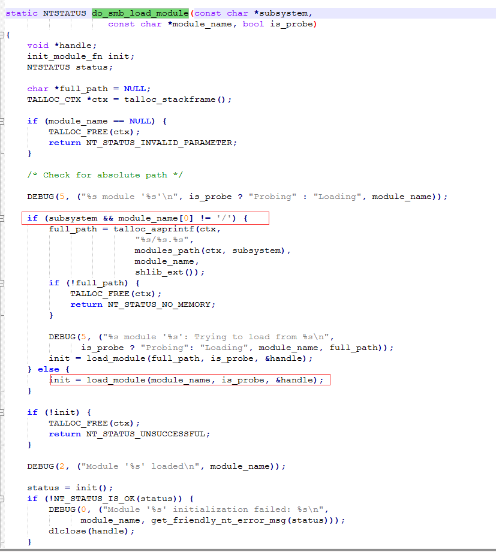
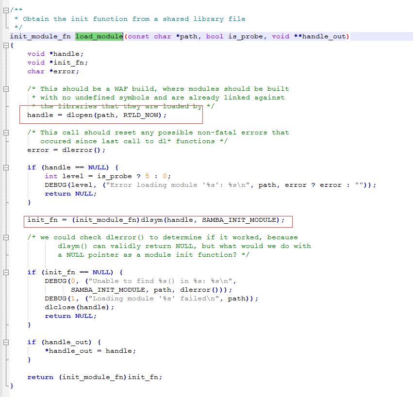

# Samba 远程代码执行漏洞分析 #

## 1.&emsp;漏洞描述 ##

* 漏洞编号： CVE-2017-7494
* 危害等级：严重
* 漏洞简述：：2017年5月24日Samba发布了4.6.4版本，修复了一个严重的远程代码执行漏洞，该漏洞影响了Samba 3.5.0 之后到4.6.4/4.5.10/4.4.14中间的所有版本。
* 影响版本： Samba 3.5.0 和包括4.6.4/4.5.10/4.4.14中间版本 

## 2.&emsp;漏洞分析 ##

### 2.1&emsp;Samba介绍 ###

&emsp;&emsp;Samba，是种用来让UNIX系列的操作系统与微软Windows操作系统的SMB/CIFS网络协议做链接的自由软件。很多企业或个人的 NAS(Network Attached Storage)，路由器和其他IOT设备存储解决方案会选择开源软件Samba提供数据访问服务。IPC$(Internet Process Connection) 是共享 “命名管道” 的资源，能使用户匿名访问Samba服务器的共享资源。

### 2.2&emsp;漏洞介绍 ###

&emsp;&emsp;2017年5月24日Samba官方发布了安全公告，新发布的Samba 4.6.4修复了一个严重的代码执行漏洞(CVE-2017-7494)，该漏洞影响了Samba 3.5.0 之后到4.6.4/4.5.10/4.4.14中间的所有版本。在rpc_server/srv_pipe.c中的存在一个验证BUG，攻击者可以利用客户端上传恶意动态库文件到具有可写权限的共享目录中，之后发出请求，使服务器加载Samba运行目录以外的非法模块，导致恶意代码执行。

&emsp;&emsp;攻击者利用漏洞可以进行远程代码执行，具体执行条件如下：

1. 系统开启了文件/打印机共享端口445
2. 共享文件夹拥有写入权限
3. 恶意攻击者需猜解 Samba 服务端共享目录的物理路径

&emsp;&emsp;满足以上条件时，由于 Samba 能够为选定的目录创建网络共享，当恶意的客户端连接上一个可写的共享目录时，通过上传恶意的共享库文件，触发漏洞使 Samba 服务端加载并执行它，从而实现了远程代码执行。根据服务器的配置情况，恶意代码还有可能以 root 权限执行。

### 2.3&emsp;漏洞环境搭建 ###

1. 安装Ubuntu虚拟机
2. 下载含有漏洞的samba版本源码包进行源码安装
3. 通过源码前可以执行`sudo apt-get build-dep samba`命令预先安装samba的一些依赖。
4. 源码安装完成查看samba版本

&emsp;5.&emsp;配置共享文件夹，在smb.conf文件中添加相应配置进行文件共享

	[share]
	comment=this is Linux share directory
	path=/tmp/
	public=yes
	writable=yes

&emsp;6.&emsp;重启samba服务，在自己Windows主机中访问该文件夹查看共享文件夹是否配置成功。

### 2.4&emsp;漏洞验证 ###

&emsp;&emsp;Samba 远程代码执行漏洞验证我们需要利用metasploit framework的is_known_pipename模块的payload进行攻击验证。

&emsp;&emsp;利用Kali自带的msf进行攻击:

&emsp;&emsp;设置好IP以及端口直接输入exploit命令进行攻击查看能否成功反弹shell

&emsp;&emsp;可以看到能够成功执行命令。

## 3.&emsp;CVE-2017-7494漏洞分析 ##

### 3.1&emsp;漏洞触发及攻击流程分析 ###

&emsp;&emsp;漏洞通过一个具有可以权限的 Samba 账号上传一个恶意共享动态库上去，并触发恶意功能。

1.	向具有写权限的Samba服务器共享目录中上传恶意动态库，这里命名为evil.so;

2.	攻击者暴力猜解共享目录的绝对路径，同时以IPC$(命名管道)资源的方式请求步骤1上传的恶意动态库，使文件名变为服务器上的绝对路径” /path/to/evil.so”;

3.	服务器端误将文件资源 ” /path/to/evil.so” 当作IPC$(命名管道)资源加载运行，漏洞触发。

	1 )上传恶意动态库文件到服务器共享目录share
    
	

	第40个包Write AndX Request写操作请求数据，如下所示:

		SMB (Server Message Block Protocol)
	    SMB Header
	        Server Component: SMB
	        [Response in: 41]
	        SMB Command: Write AndX (0x2f)
	        Error Class: Success (0x00)
	        Reserved: 00
	        Error Code: No Error
	        Flags: 0x18, Canonicalized Pathnames, Case Sensitivity
	        Flags2: 0x2801, Execute-only Reads, Extended Security Negotiation, Long Names Allowed
	        Process ID High: 0
	        Signature: 0000000000000000
	        Reserved: 0000
	        Tree ID: 28257  (\\192.168.159.130\share)  #访问靶机共享文件路径Tree ID
	        Process ID: 29095
	        User ID: 40135
	        Multiplex ID: 34467
	    Write AndX Request (0x2f)
	        Word Count (WCT): 14
	        AndXCommand: No further commands (0xff)
	        Reserved: 00
	        AndXOffset: 0
	        FID: 0x63f9 (\RpvVExex.so)
	            [Opened in: 39]
	            [Closed in: 42]
	            [File Name: \RpvVExex.so]
	            [Create Flags: 0x00000000]
	            [Access Mask: 0x00000000]
	            [File Attributes: 0x00000000]
	            [Share Access: 0x00000000]
	            [Create Options: 0x00000000]
	            [Disposition: Supersede (supersede existing file (if it exists)) (0)]
	        Offset: 0
	        Reserved: ffffffff
	        Write Mode: 0x0008
	        Remaining: 476
	        Data Length High (multiply with 64K): 0
	        Data Length Low: 476
	        Data Offset: 63
	        High Offset: 0
	        [File Offset: 0]
	        [File RW Length: 476]
	        Byte Count (BCC): 476
		Data (476 bytes) #上传二进制数据
		    Data: 7f454c4602010100000000000000000003003e0001000000...
		    [Length: 476]

	2 ) 以命名管道方式请求恶意动态库

	
	
	第120个包NT Create AndX Request 请求命名管道资源数据，如下所示：

		SMB (Server Message Block Protocol)
	    SMB Header
	        Server Component: SMB
	        SMB Command: NT Create AndX (0xa2)
	        Error Class: Success (0x00)
	        Reserved: 00
	        Error Code: No Error
	        Flags: 0x18, Canonicalized Pathnames, Case Sensitivity
	        Flags2: 0x2801, Execute-only Reads, Extended Security Negotiation, Long Names Allowed
	        Process ID High: 0
	        Signature: 0000000000000000
	        Reserved: 0000
	        Tree ID: 41877  (\\192.168.159.130\IPC$) #使用IPC$命名管道方式
	        Process ID: 29095
	        User ID: 40135
	        Multiplex ID: 34467
	    NT Create AndX Request (0xa2)
	        Word Count (WCT): 24
	        AndXCommand: No further commands (0xff)
	        Reserved: 00
	        AndXOffset: 0
	        Reserved: 00
	        File Name Len: 16
	        Create Flags: 0x00000016
	        Root FID: 0x00000000
	        Access Mask: 0x02000000
	        Allocation Size: 0
	        File Attributes: 0x00000000
	        Share Access: 0x00000007, Read, Write, Delete
	        Disposition: Open (if file exists open it, else fail) (1)
	        Create Options: 0x00000000
	        Impersonation: Impersonation (2)
	        Security Flags: 0x00
	        Byte Count (BCC): 17
	        File Name: /tmp/RpvVExex.so  # 管道名称即为前面上传文件的绝对路径

### 3.2&emsp;漏洞利用点 ###

我们这里阐述的是如何加载的恶意动态库。 漏洞触发位置：

文件路径：`\samba-4.6.1\source3\rpc_server\srv_pipe.c`

在这里可以看到 pipename ，这个是管道名，需要利用这个管道名是恶意共享库so文件参数，比如/tmp/xxx.so , 这个参数在传递进 smb_probe_module 里，跟进下这个函数：

文件路径：`\samba-4.6.1\lib\util\modules.c`

又把参数传递进入了do_smb_load_module()函数里，再跟进

文件路径：`\samba-4.6.1\lib\util\modules.c`

可以看到如果管道名字存在/, 会进入else 里调用load_module()函数，把管道名传递进来，再继续跟进：

文件路径：`\samba-4.6.1\lib\util\modules.c`

可以看到把管道名传递进入到 dlopen 函数也就是打开恶意构造的共享库文件，接着把句柄给了 dlsym 加载**`SAMBA\_INIT\_MODULE`**,也就是说恶意共享库的功能要写入到 Samba 初始化函数里才能被加载，这样就触发了恶意构造的函数功能呢。

## 4.&emsp;参考资料 ##

* [Samba远程代码执行漏洞(CVE-2017-7494)-SambaCry分析报告](http://bobao.360.cn/learning/detail/3915.html "http://bobao.360.cn/learning/detail/3915.html")
* [Samba远程代码执行漏洞(CVE-2017-7494)分析](http://bobao.360.cn/learning/detail/3900.html "http://bobao.360.cn/learning/detail/3900.html")
* [Linux版“永恒之蓝”远程代码执行漏洞技术分析](http://paper.seebug.org/307/ "http://paper.seebug.org/307/")

