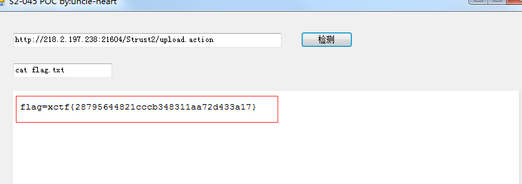

# Struts2-S2-045

## 【实验原理】

利用struts2框架的Jakarta插件处理文件上传操作时由于源代码缺陷，攻击者可以通过构造HTTP请求头中的Content-Type值可造成远程代码执行。

## 【实验目的】

提高学员的综合实战能力。以及对struts2框架的理解

## 【实验环境】

Ubuntu 64位操作系统。

## 【实验工具】

浏览器访问，漏洞POC进行命令执行

## 【实验步骤】

**步骤1：** 访问环境url，点击进行测试环境

**步骤2：** 进行文件上传操作，找到操作执行的action

**步骤3：** 通过漏洞检测POC对action进行扫描，进行命令执行操作

**步骤4：** 通过命令执行找到存储flag的文件，flag.txt，查看flag.txt内容找出flag

执行结果：

　　实验结束

## 【实验总结】

　　本次实验主要是模拟真实环境中Struts2漏洞命令执行操作，提取有效信息。
