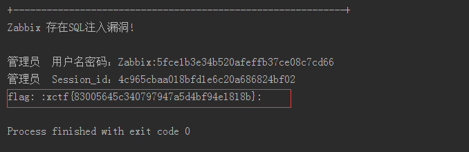

# Zabbix jsrpc 参数 profileIdx2 SQL 注入漏洞

##1.&emsp;漏洞描述

* CVE编号：暂无
* 漏洞名称：Zabbix jsrpc 参数 profileIdx2 SQL 注入漏洞
* 受影响的软件及系统：2.2.x，3.0.0-3.0.3
* 漏洞概述：Zabbix jsrpc 参数 profileIdx2 SQL 注入漏洞,zabbix的jsrpc的profileIdx2参数存在insert方式的SQL注入漏洞，攻击者无需授权登陆即可登陆zabbix管理系统，也可通过script等功能轻易直接获取zabbix服务器的操作系统权限。

##2.   漏洞原理分析

 zabbix是一个开源的企业级性能监控解决方案。近日，zabbix的jsrpc的profileIdx2参数存在insert方式的SQL注入漏洞，攻击者无需授权登陆即可登陆zabbix管理系统，也可通过script等功能轻易直接获取zabbix服务器的操作系统权限。 但是无需登录注入这里有个前提，就是zabbix开启了guest权限。而在zabbix中，guest的默认密码为空。需要有这个条件的支持才可以进行无权限注入。

​        攻击者可以通过进一步构造语句进行错误型sql注射，无需获取和破解加密的管理员密码。

有经验的攻击者可以直接通过获取admin的sessionid来根据结构算法构造sid，替换cookie直接以管理员身份登陆。

## 3. 漏洞验证

利用[exp](exp/zabbix.py)攻击我们的靶场环境：

##4.&emsp;修复意见
* 版本升级
* 打补丁
* 关闭guest